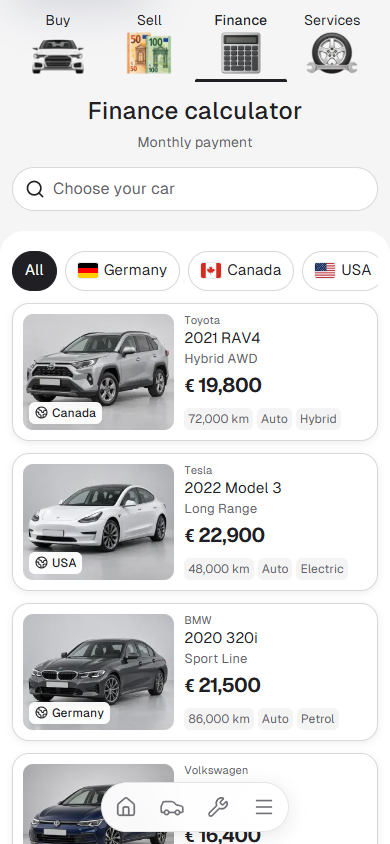
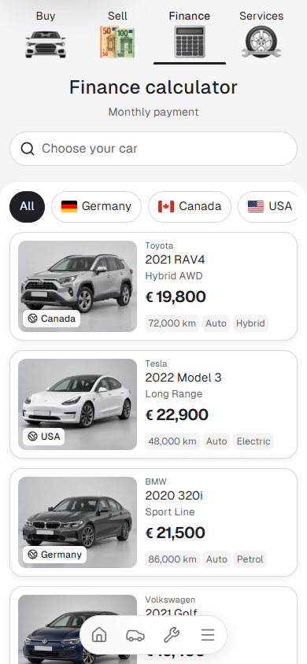

# Finance pill alignment

The Finance country row used 8px of extra mobile panel padding. Finance and Services now share the same contained filter-row spacing: the painted pills start 12px below the rounded panel edge, with a 20px gap from the Finance search entry to the panel.

| Before, 390px | After, 390px |
| --- | --- |
|  |  |

Checked the live preview at 320px and 390px: both routes have a 12px pill inset, 40px painted pills, 44px touch targets and no page overflow. Country selection/reset and the car-picker/calculator/Escape flow passed. The 1440px Finance and Services measurements match the baseline. No browser errors; focused ESLint passed.

Measurements: [before](before-checks.json), [after](after-checks.json).
