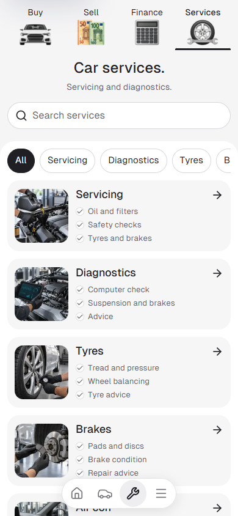
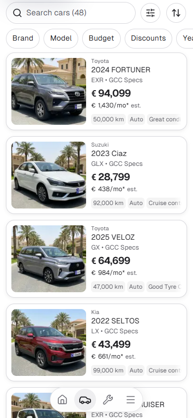
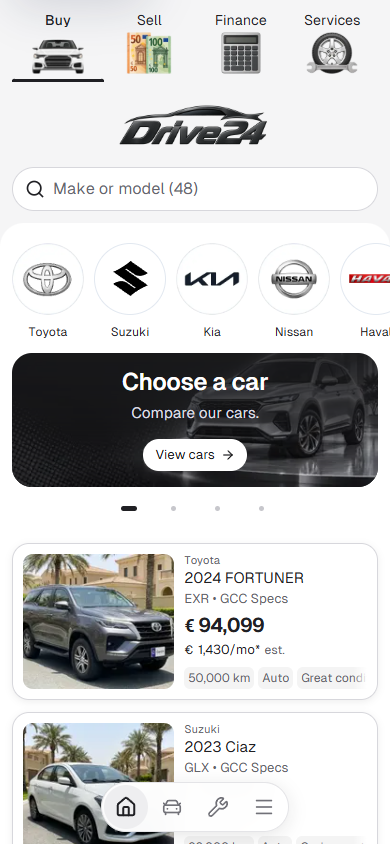
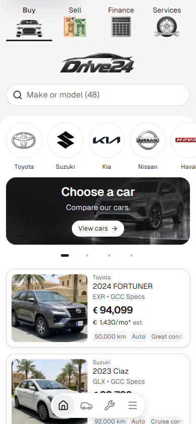

# Final mobile navigation and quick pills — 10 October 2026

Preview: `http://127.0.0.1:6506`. Canonical source: `L:/CODEX/cars/templates/app`, Cars `main`. Node 22.20.0; existing Next.js 16.3.8 webpack preview and installed dependencies reused.

Sell uses the image-generated straight euro-note artwork, with upright sides and aligned flat lower edges. The other three artwork files remain unchanged. All four illustrations share the same 64 × 42px mobile frame and visible bottom baseline through individual source view boxes. Following the owner's visual correction, Buy is optically scaled to 86% from its bottom center, bringing the wide car back close to its previous painted size without raising its bottom edge. The previous Sell scaling workaround is removed. Tab heights, labels, selected underline and compact-on-scroll behavior remain intact.

Cars and Services quick pill labels use regular 15px type on mobile, up from 14px, with 40px painted surfaces and 44px hit targets. Brand/Model drawer tabs use 14px labels, 36px painted surfaces and the same 44px hit targets. Cars search is now 44px tall, matching Services, with 16px text. Home and Services use the same 20px gap from search to the rounded white panel and the same 12px inset to the painted circles/pills. The home banner retains its original lower padding; the adjustment removes 8px of redundant inner spacing on each route. Services contains its first child margin within the panel to prevent CSS margin collapse. Tablet and desktop styles remain unchanged.

The four dock icons now use the existing Lucide library throughout, replacing the separately copied Phosphor paths with consistent rounded strokes. The car alone uses the side-profile Lucide Car at 26px for a clearer painted silhouette; the other icons remain 22px. The compact dock layout, active state and 44px links remain intact; no dependency was added. Home's first card feed now starts 4px below the carousel pagination row, reducing its previous 12px gap by 8px while retaining the promotion buttons' 44px touch targets and the existing 12px gaps between cards.

## Matched 390px comparison

| Before | After |
| --- | --- |
|  |  |
|  |  |
|  |  |

Six comparison captures are retained here: the original Cars/Services pairs cover the full tab, underline, dock and pill polish; the additional Home pair records the owner-requested panel correction. The extra pair has a distinct spacing comparison purpose. Compact geometry and interaction results are retained alongside them. The generated original and one web derivative are source artwork, not QA intermediates.

## Focused validation

ESLint for the changed code files and TypeScript without emit passed on Node 22.20.0. Browser checks cover 320px Buy/Sell/Finance/Services and Bulgarian Services; 390px Cars/Services; common artwork frame baseline; service category filtering/reset; compact header on scroll; Sell navigation; Cars dock navigation; Brand drawer and Escape dismissal; 44px dock links; no document overflow or browser errors. Final Brand/Model and service drawer checks include selection/reset, the last horizontally scrolling service pill and 320px/390px target geometry. Wider 768px/1440px checks confirm the mobile SVG artwork is hidden and previous image paths retained. The existing root HTML produces Next's advisory about declaring smooth scroll behavior during route transitions; the exact warning is retained in the browser result.

The focused final panel measurements at 320px and 390px pass with 20px search-to-panel gaps and 12px painted-control insets on both Home and Services. See `after-panel-checks.json`, `before-panel-checks.json`, `drawer-checks.json`, `verification.json`, `after-checks.json` and `before-checks.json`. Source commit/push is separate from deployment and dealer release selection; this task does not change the approved template lock.
