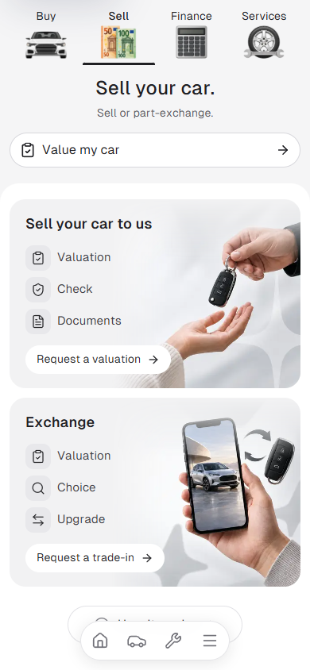
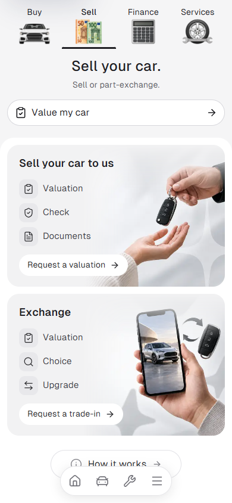

# Mobile spacing and dock audit

Reviewed all 30 page layouts at 390px: the regular and alternative journeys, collection, policy pages and a representative car's detail, features, inspection and gallery pages. The audit sheets retain the rendered baseline for this broad review.

Changes:

- Sell's first card now sits 12px inside its panel, matching the landing spacing. It previously sat 20px inside the regular panel; the alternative panel's margin collapsed to a 0px inset.
- Both docks now use Lucide's `CarFront` at 24px. The previous 26px side profile had a much flatter silhouette. All four dock links keep 44px square touch targets and their existing active state.
- Select collection's mobile search button now has a 44px touch target, increased from 40px.

| Before, Sell at 390px | After, Sell at 390px |
| --- | --- |
|  |  |

All 30 routes returned HTTP 200 at 320px with no page overflow or browser errors. Sell/Finance/Services were also checked in Bulgarian at 320px and 390px. Both Sell card actions opened their car-details drawer and closed with Escape, and the cards remained clear of the dock after scrolling. Dock Cars navigation and its active state passed. Desktop Sell spacing remains a 28px card inset, with the dock hidden. The collection search follow-up passed at 320px/390px/1440px, including open/close behavior. Focused ESLint passed for the three affected components.

Evidence: [spacing and dock checks](final-checks.json), [collection target follow-up](luxe-target-checks.json), [alternative baseline measurements](route-checks.json), [regular visual audit](audit-regular.png), [alternative visual audit](audit-alternative.png).
