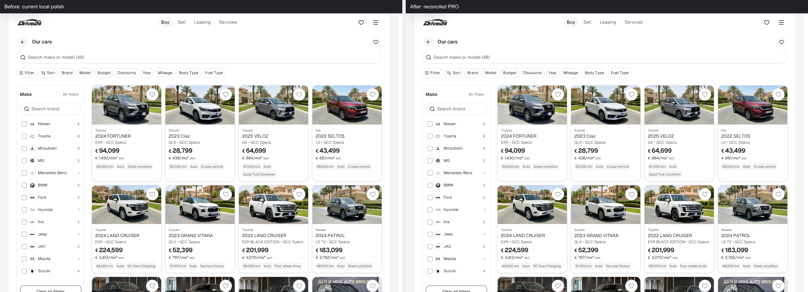
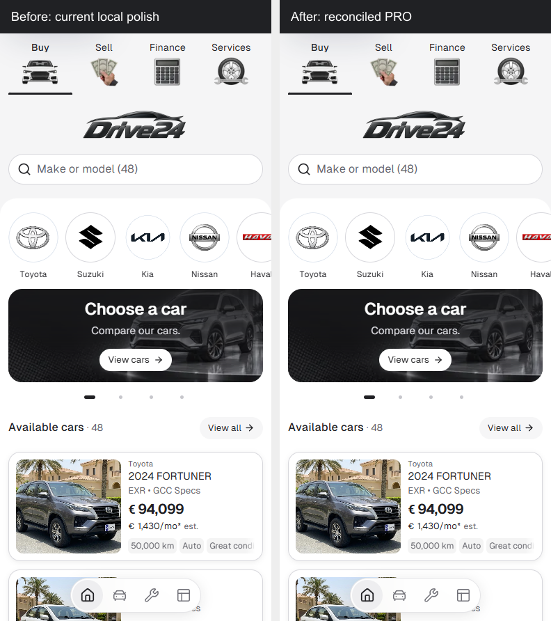
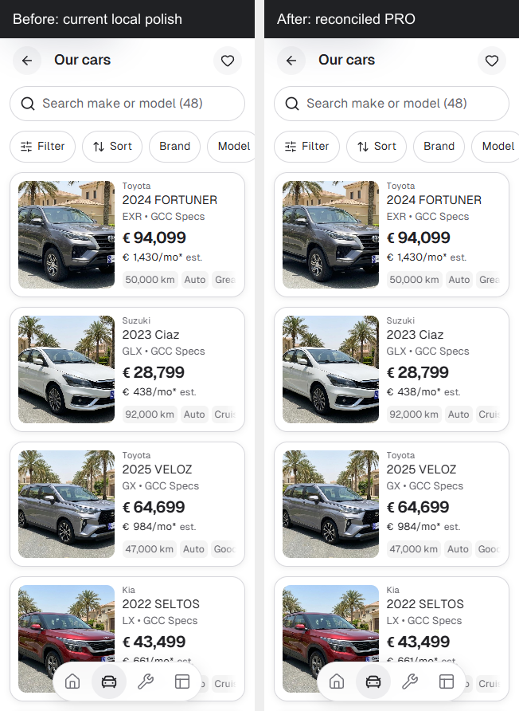
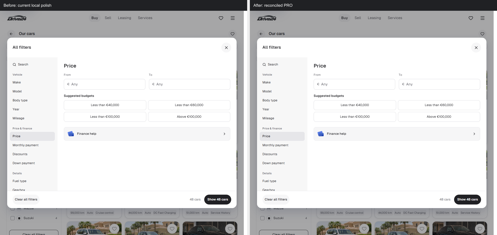

# App PRO reconciliation — 9 October 2026

The App architecture changes from standalone `fa78a47d770fe27b7004e4a201eaac89672ff9d6` to `06164f92a9cc4e5a5d8cec099872f2cebd830d34` were reconciled into the existing Cars `templates/app` master on `main`. The local frontend at the start of reconciliation is separately preserved in Cars commit `8ac04243bdf596d79cdefd0b6733e9194163b43c`.

The standalone repository root was not merged into Cars. Existing dealer copies, deployment configuration and `templates.lock.json` retain their separate release workflow. The maintained Cars App instructions were kept, including the current desktop and mobile composition requirements.

## Reviewed changes

Public dealer and stock contracts are validated before development/build. Unknown prices and mileage remain unpublished, unknown sort values stay last, and listing dates drive Recently added. Inventory bounds expand for real stock, with shared sorting and extracted filter responsibilities. Server-only request/detail boundaries and strict public fields prevent accidental client imports and private data leakage. Next.js and its ESLint configuration are pinned to 16.3.8 while retaining StyleX, Babel and webpack.

Reconciliation preserves the latest concise filter labels and compact finance card. All 65 extracted StyleX declarations match the current local declarations, including `desktopHidden`, `desktopFinanceCard` and `desktopFinanceLabel`. The architectural diff changes no global styles, tokens, public photos or fonts.

Additional review fixes normalize make/model selection identity consistently across option generation and matching; reject directory/root/null-byte asset paths; check that local assets are files; and derive localized engine-range help from actual stock bounds. The template's normal 0–7 litre hint retains its wording on phones. The mounted 8.4 litre fixture receives an accurate hint.

Configured dealer icons are emitted in the initial document head, independently of streamed localized metadata. This prevents Chrome's provisional unmounted `/favicon.ico` request during mounted navigation. The browser error gate remains enabled.

The maintained browser suite now waits for newly visible filter images before visual capture. The initial pass had one missing lazy-loaded Finance help icon at 390px, with 71 cases matching. Its original failure and images remain in the evidence directory. No baseline was overwritten, no region masked, and the screenshot threshold was not relaxed.

## Validation

| Check | Result |
| --- | --- |
| `npm run check` on Node 22.20.0 | Passed: lint, TypeScript, 126 tests, validation and production build |
| Before/after visual suite | 72 passed, unchanged baselines |
| Template browser journeys | 36 passed |
| Template production routes | 50 passed |
| Mounted EN-only dealer check | Passed: lint, TypeScript, 126 tests, validation and production build |
| Mounted dealer browser journeys | 28 passed |
| Mounted dealer production routes | 25 passed |
| Mounted stock, range, icon and routing assertions | 15 passed |
| Cars workflow documentation check | Passed |
| Full Cars workflow suite | 349 passed |
| Production-only dependency audit | 0 known vulnerabilities |

The mounted fixture uses `/review-client`, a single enabled locale, a €2,500 1967 classic with 800,001 km and an 8.4 litre engine, a €1,200,001 2028 vehicle, and a vehicle with unpublished price/mileage. Checks cover unknown-last sorting, cheap-stock discovery, honest facts, expanded engine/cylinder controls, disabled-locale redirects, missing-stock 404s and rejected POST requests. The default Cars preview-switcher integration is retained; the independent fixture explicitly disables it.

## Matched visual evidence

Before images come from the current Cars frontend captured before reconciliation; after images come from the reconciled production build. Both use Chrome, identical route/state, viewport, locale, reduced-motion setting and device scale. The full suite covers EN/BG, normal and `/2` home/inventory, Sell, Finance, Services, vehicle detail, and open EN Brand/Budget filters at 320, 390, 1100 and 1440px. Playwright uses perceptual threshold 0.2 and zero differing pixels above that threshold; a pass is not a byte-identical image claim.

Selected labelled before/after comparisons are retained alongside this report. Complete screenshots, logs and JSON reports remain in ignored `runtime/pro-integration-2026-10-09`.

### Desktop Cars, 1440px

### Phone Home, 390px

### Alternative Cars, 320px

### Desktop Budget dialog, 1100px

## Recovery and local cleanup

The standalone PRO refactor is retained remotely and in verified `runtime/pro-integration-2026-10-09/PRO-changes.bundle`. The bundle contains the PRO snapshot/refactor commits and requires upstream parent `e2504af29c9e6e86911f3a1e5b61e1b4e1894674`, retained in the standalone repository's history. Original handoff/patch files, historical source evidence, dealer fixtures, screenshots and reports are retained under the same Cars evidence directory, with SHA-256 manifests and content deduplication. Build output and installed dependencies are disposable, not source recovery.

Cleanup is restricted to the five PRO-created locations under `C:/Users/radev`: `cars-template-app-PRO`, `cars-template-app-PRO-dealer-check`, `cars-template-app-PRO-history`, `cars-template-app-PRO-HANDOFF.txt` and `cars-template-app-PRO.refactor.patch`. Paths and junction targets are checked before removal. Other source, sessions, databases, recovery files and preview processes remain outside that scope.

## Remaining acceptance

The production-only dependency audit is clean. The development-tool tree retains nine entries from [the unpatched braces advisory](https://github.com/advisories/GHSA-vfj7-8cjw-p6xm). No advisory suppression, breaking forced downgrade or unverified fork was applied.

Physical iOS/Safari and client-specific content/integration approval remain separate acceptance checks. Enquiries remain editable drafts; this refactor adds no live booking, payment or CRM submission. Source reconciliation and CI do not constitute a template release or dealer deployment.
