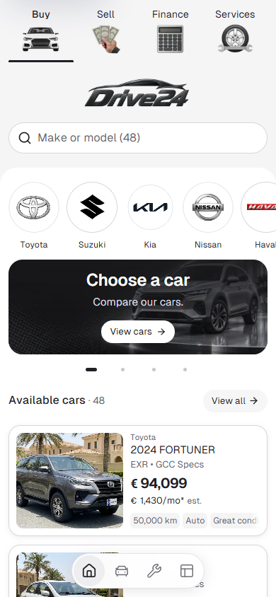
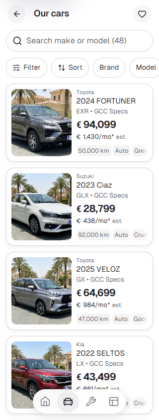
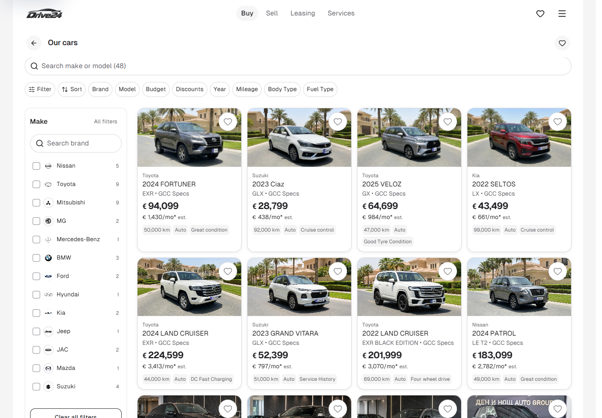
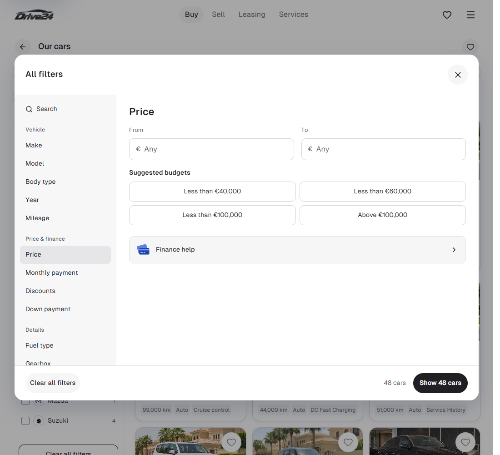

# App publication — 9 October 2026

The reconciled App is live at [cars-template-app.vercel.app](https://cars-template-app.vercel.app/). Vercel production is READY and the public alias resolves to the deployment below. This publishes the standalone App template; dealer copies and the approved release lock are unchanged.

| Identity | Verified value |
| --- | --- |
| Canonical source | `darkapoparka/cars`, `templates/app` |
| Reviewed Cars commit | `cb83c7d11da3a6574dfcb0489ba99f039427f7d2` |
| Cars source tree | `19675e2452456b7e6ebfa6a05e761b0c22d5812f` |
| Export policy | `cars-source-v1` |
| Export digest | `26367ed7705451f917ce82e5943b93225e3d4e818ef4df626ffc5677f525f365` |
| Publishing repository | `darkapoparka/cars-template-app`, `main` |
| Publishing commit | `726bf756c348b0af9500ba1f85e0fbab23384a29` |
| Existing Vercel team | `tyj5`, `team_RTNXBnClGWDdcYFFUW0BnqvJ` |
| Existing Vercel project | `cars-template-app`, `prj_TnD7adaf0u3zjwhmV2xRxx9mWkOu` |
| Deployment | `dpl_AdFuMVGKD7kQgT47yNLuqhDXErAL` |
| Immutable hosted URL | [cars-template-7fcpifcog-tyj5.vercel.app](https://cars-template-7fcpifcog-tyj5.vercel.app/) |
| Production ready | 9 October 2026, 08:01:35 UTC |

The Cars export tool produced 1,608 application/document/asset files. Their source digest equals the publishing commit's digest. The publishing commit preserves both prior publishing `main` (`e2504af`) and PRO (`06164f9`) as parents, so the original polishing snapshot and refactor remain in its ancestry. PRO's root quality workflow is retained. A standalone publishing-source receipt records the current locator; old import receipts remain historical provenance.

The existing Git integration performed one production deployment from the non-force `main` push. No second CLI upload, project relinking, hosting-plan change or dealer rollout was performed. The existing PRO working checkout and the newer uncommitted desktop-filter work in Cars were preserved.

## Verification

| Check | Result |
| --- | --- |
| Exact exported source and both parent histories | Passed |
| Exported lint and TypeScript on Node 22.20.0 | Passed |
| [Publishing App quality workflow](https://github.com/darkapoparka/cars-template-app/actions/runs/37902184846) | Passed on `726bf75`: installation, full check, production audit, browser journeys and routes |
| Production routes against the public alias | 50 passed, EN/BG and both journeys |
| Hosted browser journeys | 36 passed, 320/390/1100/1440px |
| Browser error gate | No hydration, uncaught exception or console errors |
| Recent Vercel runtime log query | No error/fatal entries returned for this deployment in the 30-minute window |

Hosted interactions cover stock sorting/reload, empty searches, filter keyboard dismissal and restored interaction, filtered-list Back navigation, saved cars across reload and editable enquiry drafts. Enquiries do not become live bookings or submissions.

## Matched visual review

Eight hosted screenshots were compared with the original, unchanged reconciliation baselines: EN/BG alternative Cars at 320px, EN/BG Home at 390px, BG Cars and the EN Budget dialog at 1100px, and EN/BG Cars at 1440px. All four desktop comparisons passed the existing zero-difference gate above perceptual threshold 0.2.

The four phone comparisons **did not pass that strict pixel gate**: 125, 128, 274 and 374 pixels differed respectively. The retained difference images show small changes along text glyph edges. Matched local/hosted text measurements agree in colour, font family/size/weight, spacing and position; browser checks found no horizontal page overflow. The reviewed phone composition is preserved. These results are recorded as reviewed rendering differences, not eight passing comparisons. No baseline, threshold or mask was changed.

Full logs, reports, expected/actual/difference images and computed-style measurements are retained in ignored `runtime/pro-integration-2026-10-09/vercel-publish/`. The original 72 local reconciliation comparisons remain separate evidence. Physical iOS/Safari acceptance remains separate.

### Published Home, 390px

### Published alternative Cars, 320px

### Published Cars, 1440px

### Published Budget, 1100px

