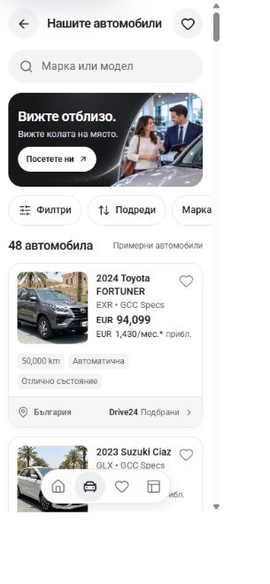
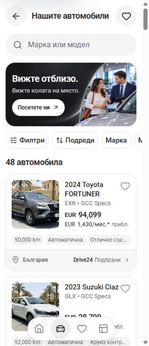
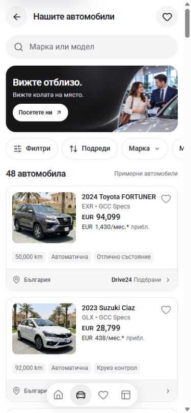
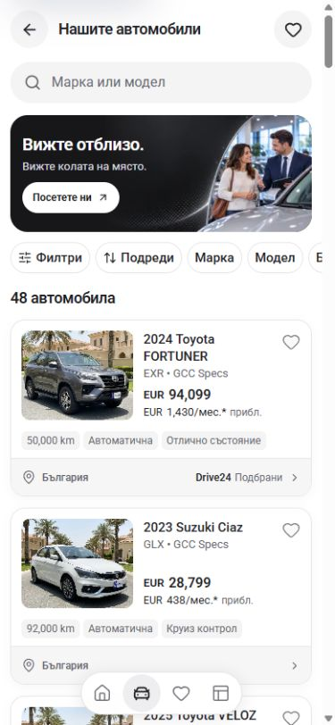

# Mobile pills and card alignment — 30 September 2026

Scope: the shared Home/inventory quick pills, shared vehicle cards, and inventory sample disclosure. Search finance and campaign artwork are unchanged by this pass.

The quick controls now use 36px visible pills inside 44px button/link targets, with 15px text and smaller horizontal padding. Category chevrons and the selected dot no longer lengthen the labels. Selected controls retain their dark surface and accessible “Applied” label.

Card titles use 15px/20px mobile type. Prices sit at the bottom of the photo/text row, so short and two-line titles no longer produce different price placement. Mileage and transmission remain complete; the condition/highlight chip can use an ellipsis, with the complete facts retained in the link's accessible name and chip title. Facts stay in one row.

The count heading contains only the count. The configured, translated inventory notice appears below the results instead of adding “Примерни автомобили” to the heading.

## Captured browser comparison

The in-app browser pass used temporary desktop-browser viewports at 320×740 and 390×844. The desktop scrollbar reduced content width to 305px and 375px respectively. These are viewport checks, not physical-device measurements.

| Viewport | Before | After |
| --- | --- | --- |
| 320px |  |  |
| 390px |  |  |

The full 48-card DOM geometry pass observed 42 wrapping fact rows at 320px and three at 390px before the correction; the corrected cards had one fact row and a 0px gap between the bottom of the photo and the final information line. The final chip pass also confirmed that the first card's mileage and transmission did not truncate at 320px.

The screenshots precede the last adjustment to the quick rail's vertical padding, from 4px to 6px, which leaves room for the existing keyboard outline. The resumed tab initially held a `data:` connection-error page, which the browser policy rejected. After the user returned to the working inventory page, the final layout and interactions were verified through the same in-app browser during the [card-footer pass](../mobile-card-footer-2026-09-30/README.md). No alternate browser automation was used to bypass the earlier restriction.

## Verification

- Node 22.20.0; `npm run check` runs lint, TypeScript, and the webpack production build. The resumed run uses the existing `NEXT_DIST_DIR=.next-build-check` configuration so the dev server can keep its separate `.next` output.
- Source-derived contrast ratios: normal/selected quick-pill text 16.24:1, card-fact text 5.50:1, inventory notice 6.05:1. These calculations do not establish full WCAG conformance.
- HTTP checks after server restart: `/bg`, `/bg/search`, and `/bg/cars` returned 200 without the development error-overlay marker.
- Production HTTP smoke on the completed build: `/bg`, `/bg/search`, `/bg/cars`, and `/bg/saved` returned 200. Home rendered 12 cards and inventory 48, with the complete fact link names present in the generated HTML. The subsequent card-footer pass verified filtering, sorting, saving/removal, Home shortcuts, detail/showroom links, and responsive layout at 320px, 390px, 768px, and 1440px in the browser.
- Dev server: `http://localhost:3001`, Node 22, webpack, bound to loopback.
- Build result: `npm run check` passed with exit code 0: lint, TypeScript, optimized webpack compilation, and all 407 generated pages. Next's expected custom-Babel warnings remained. The build-generated `next-env.d.ts` paths and two `tsconfig.json` include additions were verified and restored to their exact pre-check contents; unrelated changes were preserved.

Owner visual acceptance is separate from build success and the recorded browser checks.
