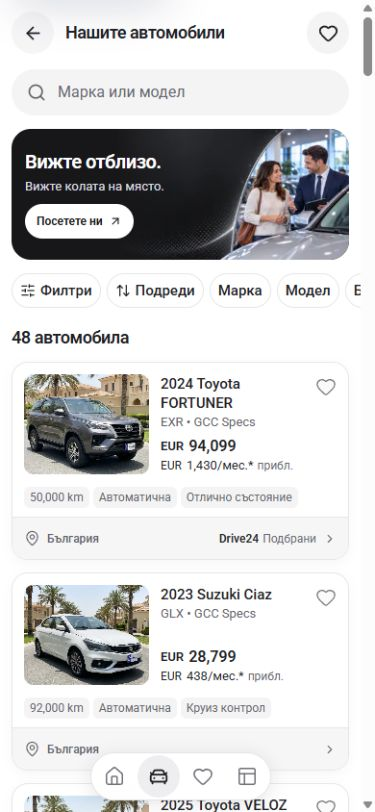
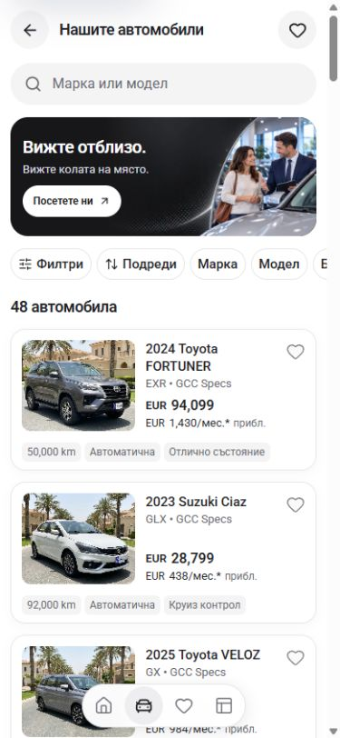

# Single-dealer vehicle cards — 30 September 2026

The shared card no longer repeats the showroom location and dealer badge below every vehicle. This template has no configured city or address, so the row displayed only “България” and sent every card to the same `/bg/stores` destination. The existing visit banner and showroom navigation still provide that destination.

The photo, title, price, monthly estimate, vehicle facts, and Save control remain on the card. Vehicle-tier filtering is unchanged. Removing the row also removes its unused imports/styles and the unused card-only `luxe` prop.

| 390px before | 390px after |
| --- | --- |
|  |  |

In the browser, all 48 mobile inventory cards changed from 206px to 162px: 44px less repeated content per card. All 48 retained one fact row and a 0px gap between the bottom of the photo and the final information line.

## Verification

- In-app browser: 320×740, 390×844, 768×1024, and 1440×1000. No document horizontal overflow. The desktop scrollbar reduced content width by 15px; these are viewport checks, not physical-device tests.
- 320px and 390px: all 48 cards have no country footer; facts remain in one row; Save targets remain 44px. Desktop cards are 184px tall, with the same price/photo alignment.
- Toyota filter produced nine cars; resetting restored 48. Shift+Tab stayed inside the filter dialog; Escape closed it and returned focus to its inventory trigger. Ascending price order was verified, then recommended order restored.
- The visit banner opened `/bg/stores`. The first vehicle photo opened its detail page. The similar-vehicle sheet displayed two shorter cards and closed with Escape.
- Saving the test vehicle displayed its shorter card on Saved. Removing that vehicle restored the original empty list.
- Home rendered 12 shared cards without country footers. Its Brand shortcut opened the brand filter dialog.
- No browser warning/error messages were recorded during the checked flows. The temporary viewport override was reset; the existing inventory tab remains open.
- `npm run check` passed on Node 22.20.0 with `NEXT_DIST_DIR=.next-build-check`: lint, TypeScript, webpack compilation, and all 407 generated pages. Expected custom-Babel build warnings remain. Only the verified generated paths/includes were restored to the exact pre-check contents of `next-env.d.ts` and `tsconfig.json`.

The measured DOM geometry and observed interactions are in [verification.json](verification.json). This focused pass does not establish formal WCAG certification or owner visual acceptance.
