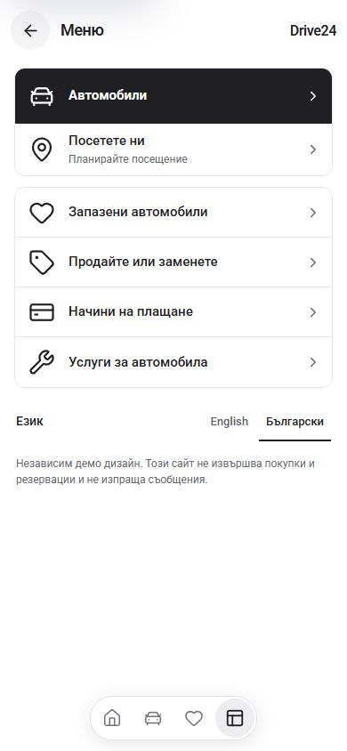
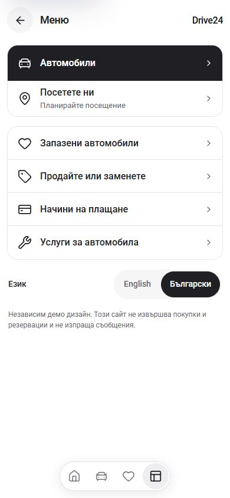

# More menu polish — 30 September 2026

Small StyleX refinement of `app/[locale]/more/page.tsx` in the Cars App master. Menu labels are 16px instead of 15px, symbols are 24px instead of 30px, and their 28px slots give the labels more room. At 320px and 390px, every menu label begins at x=68px, matching the header title. Group corners use the shared 18px token, phone gutters are 12px, and group gaps are 16px.

Primary and visit rows are 60px tall; secondary rows remain 56px. The visit subtitle is 13px. The language selector has a rounded group, 14px labels, 44px links and a charcoal current-language state. Keyboard focus uses a visible inset ring, white on the dark selected controls.

| Before, 390px | After, 390px |
| --- | --- |
|  |  |

## Verification

- In-app browser: BG at 320×740, 390×844, 320×568, 768×1024 and 1440×1000; EN at 390×844. No document horizontal overflow or overflowing menu links. Secondary labels fit on one line at 320px.
- On the short screen, scrolling to the bottom places the language links at y=368–412 and the notice above y=468. The fixed dock begins at y=506.
- Keyboard Tab follows primary → visit → secondary actions → languages. The primary, visit, English and selected Bulgarian links have visible 2px focus rings. Enter on English opens the EN menu; returning to BG restores the correct selected language.
- The Cars row opens `/bg/cars` with its inventory heading. The visit row opens `/bg/stores` with its showroom heading. Secondary destinations remain configuration-driven. No contact rows were configured in this preview.
- No browser errors or warnings were recorded in the checked flows. A fresh in-app tab was used after the original tab's browser-control connection timed out. The temporary viewport override was reset.
- Final `npm run check` passed on Node 22.20.0 with `NEXT_DIST_DIR=.next-build-check`: lint, TypeScript, webpack build and 407 generated pages. Expected custom-Babel warnings remain.
- One build retry failed with `ENOSPC` and emptied `tsconfig.json`; the exact pre-check config was recovered. The next check passed. Generated route imports and build-check includes were verified before restoring the original `next-env.d.ts` and `tsconfig.json` contents, including their existing unrelated changes. Recovery files are under Cars `runtime/app-more-polish-20260930/`.

Measurements and interaction results are in [verification.json](verification.json). Additional captures cover 320px, the short screen, keyboard focus and desktop. These are browser viewport checks, not physical-device tests or formal WCAG certification. Owner visual acceptance and scoped integration remain separate; the shared Git index was locked during this pass.

Integration handoff: repository `L:/CODEX/cars`, branch `main`, HEAD `0f72b78b7c40e2329045785f3a622e0460be53d2`. The committed More page still matches this pass's pre-edit baseline. Owned paths are `templates/app/app/[locale]/more/page.tsx` and `templates/app/docs/more-mobile-polish-2026-09-30/`. Once the active index lock is released, fetch and inspect drift, make a scoped commit preserving unrelated staged work, and push main without force.
