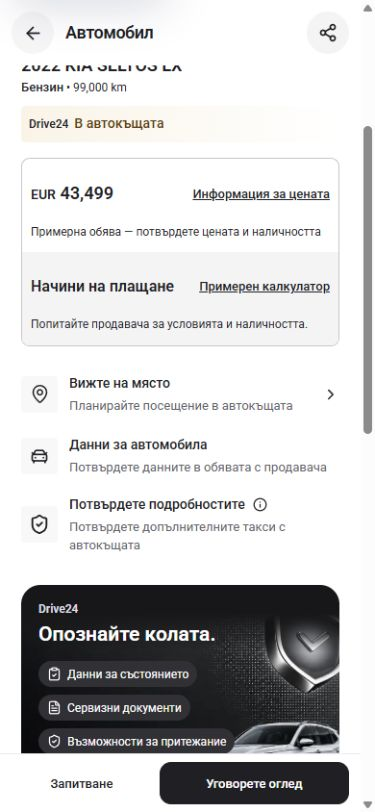
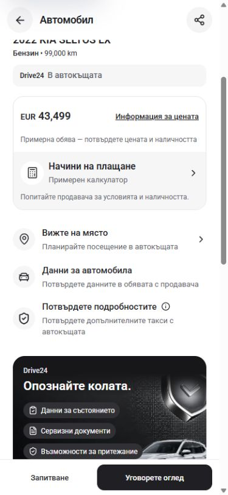
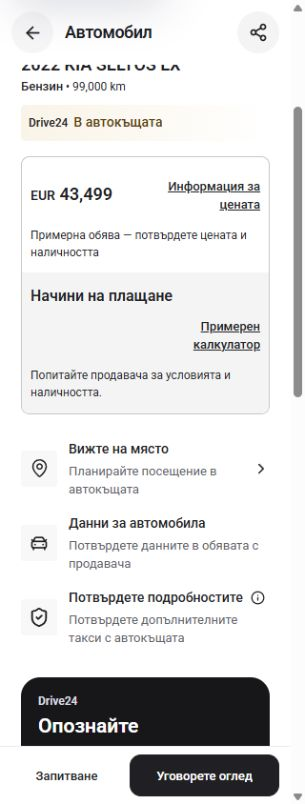
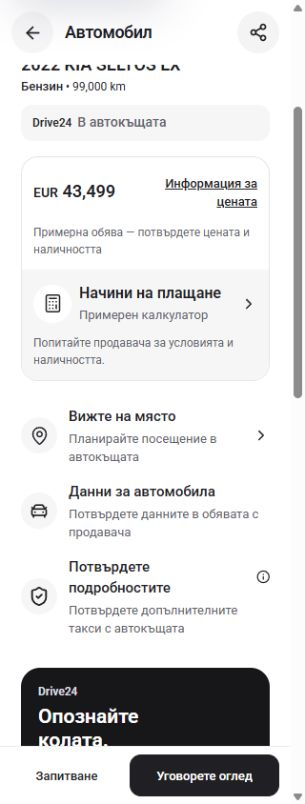

# Car detail payment and icon polish

Local preview: http://localhost:3001/bg/cars/2022-kia-seltos-lx-3696

## Changes

The payment calculator is one full-width button with a circular calculator icon, a 16px title, a 13px subtitle and a chevron. The Bulgarian title and subtitle each stay on one line at 320px and 390px. The button is 48px tall and has an inset keyboard focus ring. The visible text supplies its accessible name; decorative icons are hidden from assistive technology.

Overview icon backgrounds are circular. Photo thumbnails and the showroom strip use 12px corners; the price, specification and condition cards use the shared 18px radius. The showroom strip and feature checks now use the existing neutral palette. Overview titles are 15px and specification values are 13px. Section pills keep their 44px height with fully rounded ends and 14px labels.

The section bar's Similar Cars button previously targeted a missing section on this configuration. It now opens the existing similar-cars sheet when that section is absent. Configurations that include the section retain their scroll behavior.

Source changes are limited to `components/VehicleDetailClient.tsx` and `components/VehicleBelowFold.tsx`. No added effects, data requests, dependencies or finance calculations. Existing reference-claim configuration, inventory and artwork are preserved.

## Original comparison

Compared the preserved `L:/inspiration/cars24/components/VehicleDetailClient.tsx`, `VehicleBelowFold.tsx` and `VehicleFinanceSection.tsx`, plus `reference/cars24/18-vehicle-details.png`. The original had small rectangular overview tiles too; the circular treatment is an adaptation for the charcoal palette. Its short EMI link did not have the Bulgarian wrapping problem.

This configuration does not approve reference finance claims. The active payment/calculator row was polished; the legacy lender-offer banner was not enabled or imported.

## Verification

- In-app browser: Bulgarian at 320x844, 390x844, 768x1024 and 1440x1000; English at 320x844 and 390x844. No document horizontal overflow. The finance button remains 48px tall in each layout.
- Keyboard: Tab gives the payment row a visible 2px focus ring; Enter opens the illustrative calculator. Changing from 5 years/20% deposit to 3 years/21% deposit updates the displayed estimate from EUR 689 to EUR 1,061. Escape closes the sheet and restores focus to the payment row.
- The calculator at 320px has no horizontal overflow. Its inputs, slider, term buttons and close control are at least 44px tall.
- Price information opens with the existing dated-listing and terms copy. The section-bar Similar Cars action opens the existing sheet and Escape closes it.
- Measured payment text contrast: title 15.03:1, secondary text 5.60:1 on the grey surface. Overview titles 16.24:1 and descriptions 6.05:1 on white. These are focused checks, not a complete WCAG conformance audit.
- `npm run check` passed after the final source change: ESLint, TypeScript and production build, including 407 generated pages. Used Node 22.20.0 and `NEXT_DIST_DIR=.next-build-check` to keep the live dev output separate. Existing Babel/SWC configuration notices remain.
- React review: existing hooks, keys and modal behavior preserved; native buttons and decorative-icon semantics checked. The pre-existing Next/TypeScript generated-file content was restored exactly after the build.

`verification.json` contains measured layouts, contrast samples and interaction results. The 15px difference between requested viewport width and document content width in non-modal views is the native vertical scrollbar. Browser logs showed existing ownership-artwork LCP warnings during scrolled inspections, with no JavaScript errors in the inspected entries.

## Screenshots

| Before, 390px | After, 390px |
| --- | --- |
|  |  |

| Before, 320px | After, 320px |
| --- | --- |
|  |  |

Additional evidence: `keyboard-finance-390.jpg`, `calculator-320.jpg`, `specs-features-320.jpg`, `after-768.jpg`, `after-1440.jpg` and `after-en-320.jpg`.

The development server remains available on port 3001. This is local Cars main template work; no dealer release or deployment was requested.

## Integration handoff

Commit/push is pending in `L:/CODEX/cars`, branch `main`, observed HEAD `65f00dc6879d59aec313469d9beebb65f77938eb`. Another task holds `.git/index.lock` (last observed write `2026-09-30T06:20:38.3727074+03:00`). The lock was left intact. The nine unrelated staged entries were verified unchanged throughout this task.

When the active writer releases the index, refresh main with the existing workspace doctor, review any overlapping drift, then commit only `templates/app/components/VehicleDetailClient.tsx`, `templates/app/components/VehicleBelowFold.tsx` and this QA directory. Push main without force and verify the remote. Preserve all other staged, unstaged and untracked work. The source and browser checks are complete locally; Git integration is a separate pending step.
