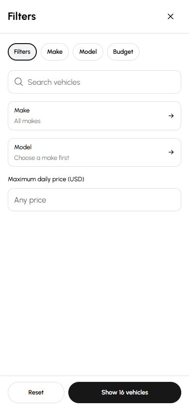

# Signature / Karento standalone deployment

Verified on 10 October 2026.

- Public template: <https://cars-template-karento.vercel.app/>
- Vercel project: `tyj5/cars-template-karento`, ID `prj_l79mMMCI7onndJfgNTUdxIifOQ5r`.
- Existing private publishing repository: <https://github.com/darkapoparka/cars-template-karento>, production branch `main`.
- Published mirror commit: `0224ae76140715356c29e86e3861111c31f9207f`.
- Maintained application source: Cars `templates/karento-best`, commit `0f9c79d28665272bb0041c751ede597642347239` (approved UI commit `b01a053cbc537f523272c2ecf453fe6b904532e0`).
- Production deployment: `dpl_8BoaQKfo2rzUTUEP2NmVbxpVZdMu`, state `READY`, exact mirror commit confirmed by Vercel metadata.

The Git connection is configured for future pushes to the publishing mirror.
Cars remains the editable master; pushing Cars alone does not refresh the
standalone mirror. The mirror records source hashes and provider overrides in
`provenance/standalone-source.json`, with the guarded Vercel recipe frozen in
`provenance/standalone-vercel-adapter.json`. It uses adapter-vercel 7.0.0 and
Node.js 24; local Cars development retains Node 26.10.0. Production is publicly
viewable, while Vercel preview deployment authentication remains enabled.

## Verification

Strict Svelte checks, typography/geometry guards, formatting and all 102 unit
tests pass on the master and the Node 24 mirror. The master production Node
build passed; Vercel completed the production adapter build. All 607 immutable
reference files remain intact, and mirror application hashes match the pinned
Cars source except the declared hosting overrides. GitHub reports a successful
Vercel deployment status; a separate GitHub Actions completion was not asserted.

127 anonymous requests against the public alias pass: 102 canonical/source/HTML
aliases, nine Bulgarian routes, seven locale isolation cases and nine genuine
404s. Checks cover document structure, Signature titles, locale cookies/headers,
translated navigation and private/no-store HTML caching.

Codex @Browser verified the hosted mobile filter, menu and photo viewer. Close
controls measure 44 × 44px with transparent backgrounds. A comma-decimal budget
updates results and restores filter-opener focus. Menu Escape at 320px restores
focus; photo navigation advances and Escape restores its opener. Reviewed
screens have no horizontal page overflow, broken images, or browser warnings
and errors.

The hosted 390 × 844 default filters capture matches the approved local
comparison's after panel: zero pixels above the existing 0.1 threshold across
329,160 pixels. The [three before/after comparisons](mobile-final-20261010/README.md)
and this one hosted capture are retained. Later concurrent edits and the `/2`
experiment remain outside this published snapshot; dealer manifests and release
locks were not changed.

The owner-scoped inactive Node build and generated kit output remain in
`.runtime/evidence/mobile-final-20261010/{build,kit}` because automatic approval
review rejected their removal as blocked by policy. No other owner's output,
dependency installation, preview, reference evidence or pending source was removed.
