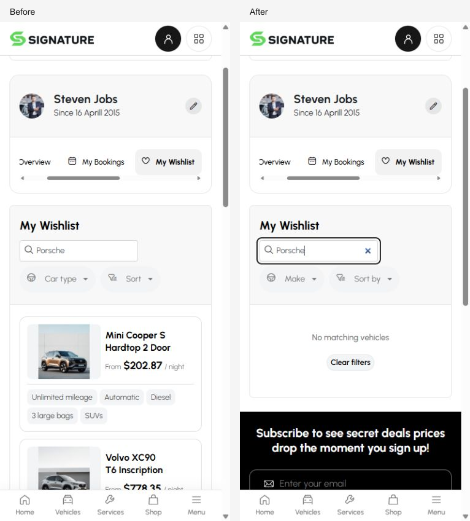
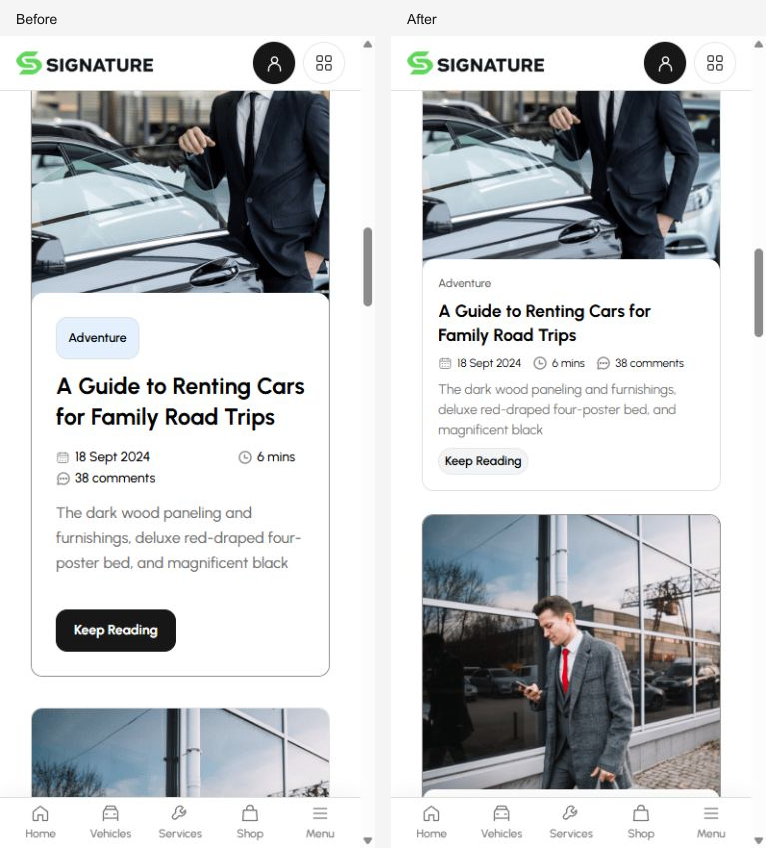

# Karento Best complete mobile pass — 10 October 2026

Local mobile audit of the maintained native Svelte application in Cars. Preserve the approved mobile composition, artwork, Urbanist typography, neutral palette and shared controls. Phone presentation uses the existing `767.98px` boundary. This report records local verification; this pass makes no new commit, publication, deployment, mirror promotion or template-lock release.

**Completed local mobile pass:** the final chart geometry and product quantity corrections passed focused rendered verification and their final source/build checks. The broader route, test and HTTP checkpoints below are recorded separately from those final checks.

## Coverage and preservation

The Browser owner inspected the full pages at a 390px viewport across all 39 compiled source variants and the separate `/2` reference. The final recorded 320px sweep contains 40 distinct routes, each with `ready: "true"`, equal document scroll/client widths and no broken-image entries. This is browser viewport coverage, not physical-device or Safari testing. The sweep records metrics; it does not mean 40 screenshots were saved or every possible interaction was tested on every route.

The complete 390px inspection and 320px sweep preceded the two final chart/quantity corrections. Final verification then covered product quantity controls at 320px and all four earnings chart states: All and Recent at both 320px and 430px. Neither correction changes the route inventory. [The compact route records](../.runtime/evidence/mobile-complete-20261010/browser-320.json) retain the measured sweep result for each route. [Additional Browser records](../.runtime/evidence/mobile-complete-20261010/browser-routes.json) retain selected 390px page observations; [the final focused records](../.runtime/evidence/mobile-complete-20261010/final-browser.json) record closeout behavior.

The following mapping accounts for every source variant. Canonical destinations and the existing source/`.html` aliases remain intact.

| Source variant                | Inspected route          |
| ----------------------------- | ------------------------ |
| `404`                         | `/404`                   |
| `index-3`                     | `/`                      |
| `index-2`                     | `/index-2`               |
| `index`                       | `/index`                 |
| `cars-list-3`                 | `/cars-list-3`           |
| `cars-list-1`                 | `/cars-list-1`           |
| `cars-list-2`                 | `/vehicles`              |
| `cars-details-1`              | `/cars-details-1`        |
| `cars-details-2`              | `/cars-details-2`        |
| `cars-list-4`                 | `/cars-list-4`           |
| `shop-list`                   | `/shop`                  |
| `dealer-listing`              | `/import`                |
| `shop-details`                | `/shop/product`          |
| `dealer-details`              | `/import/source`         |
| `cars-details-4`              | `/cars-details-4`        |
| `cars-details-3`              | `/vehicle`               |
| `term`                        | `/terms`                 |
| `about-us`                    | `/about`                 |
| `calculator`                  | `/calculator`            |
| `faqs`                        | `/faq`                   |
| `pricing`                     | `/membership`            |
| `services`                    | `/services`              |
| `register`                    | `/register`              |
| `login`                       | `/login`                 |
| `contact`                     | `/contact`               |
| `blog-list`                   | `/blog-list`             |
| `blog-grid`                   | `/news`                  |
| `user-dashboard-profile`      | `/account/profile`       |
| `user-dashboard-wallet`       | `/account/wallet`        |
| `blog-details`                | `/news/article`          |
| `user-dashboard-wishlist`     | `/account/wishlist`      |
| `user-dashboard-bookings`     | `/account/bookings`      |
| `user-dashboard-home`         | `/account`               |
| `agent-dashboard-setting`     | `/dashboard/settings`    |
| `user-dashboard-setting`      | `/account/settings`      |
| `agent-dashboard-earning`     | `/dashboard/earnings`    |
| `agent-dashboard-home`        | `/dashboard`             |
| `agent-dashboard-listing`     | `/dashboard/listings`    |
| `agent-dashboard-add-listing` | `/dashboard/add-listing` |
| Separate discovery reference  | `/2`                     |

`/2` was audited without edits. Its nine existing files remain: `+page.server.ts`, `+page.svelte`, `discovery.ts`, `DiscoveryHome.svelte`, `DiscoveryBrowse.svelte`, `DiscoveryCard.svelte`, `DiscoveryDetail.svelte`, `DiscoveryNavigation.svelte` and `DiscoverySearch.svelte`. Source checks covered supplied-ID selection, search, make/model, decimal budgets, locale/query/hash preservation and unknown IDs. Eight bounded HTTP flows covered English/Bulgarian Home, all results, search/make, offers and selected/unknown detail records. The established Home 3, List 2 and Details 3 selection remains. Frozen references were not edited; the integration provenance checks retained all 607 protected hashes and byte-identical static assets.

## Changes and focused behavior

The pass reused `MobilePill`, shared sheet/icon controls and existing spacing, typography, radius and touch-target roles. It added no global styling layer or alternate mobile composition. Existing correctly centered hero icon geometry and contrast surfaces were preserved. Overlay headers retain one title and a transparent 44px close target; meaningful body instructions remain.

- Forms and accessible names: newsletter/comment fields expose email semantics; phone registration uses native submit validation for required fields, password length/match and consent, with truthful local demo feedback. Dashboard/contact/plan actions retain translated names, appropriate keyboards and existing 44px target patterns.
- Editorial and FAQ: mobile list cards use natural content height, shared 18/14/12 typography roles, a content-sized secondary reading pill and quiet category navigation while keeping the supplied artwork, overlapping white panel and copy. Home FAQ links reach Contact and Help Center. Phone FAQ card toggles prevent native fragment scrolling. The calculator's expired reference promotion is hidden only on phones without leaving space.
- Account/dashboard: supplied wishlist/listing records support actual search/make/price filtering and reset; wallet and booking controls update supplied records. All/Recent selections use authored dates, retain ties and do not invent records, status or read state. Charts use smaller phone geometry and preserve units, supplied data and lifecycle cleanup.
- Detail/reference controls: photo group/position text, loan triggers, import section names and product quantity names are localized. The selected product gallery retains its supplied image and positive integer quantity handling. Shared detail panel title changes apply only to their phone expressions.

Focused Browser interaction results:

- Registration blocks empty/mismatched submission; valid input gives truthful local demo feedback. Wishlist Porsche returns zero and Clear resets it; Volvo Make returns one.
- The Bulgarian 320×460 filter sheet applies one Hyundai result, preserves query state and restores focus. Bulgarian Menu closes with Escape and its transparent close target measures 44px. FAQ expands without changing the URL hash.
- Booking search/type/latest/reset update supplied results. Recent notifications show three and invoices show one. Owner listings return one Porsche, zero for an absent query, and reset with Clear. Wallet Pending returns one supplied record; mobile field keyboard semantics are present. The Bulgarian SMS switch can be turned off locally.
- The reference calendar supports month navigation and a pickup selection of 18 March 2025. The 320×460 finance sheet calculates a preview result of 1,027.29 from a price of 24,000 and restores focus after Escape. The Bulgarian photo viewer reports a one-of-one photo group and returns focus on close. Bulgarian import-source Services controls toggle their section.
- Services search returns zero for an absent query and Clear restores nine supplied results; Shop search returns zero and Clear restores twelve. `/2` supports the Audi reference detail flow and return navigation.
- Final product controls are actual buttons with 44×44px targets and a numeric keyboard hint. Increment changes 1 to 2; committing −4 restores 1 and committing 2.8 produces 2. At 320px, document client/scroll widths remain equal at 305px.
- Final earnings All/Recent charts at 320px and 430px keep every y-axis label inside the SVG. All displays full year ticks 2009/2013; Recent displays 2013/2015. These reduced tick labels leave every supplied category and series point intact, including all four Recent years, with units retained in tooltips. No axis label overlap/truncation or Browser warning/error entries remained in the checked final states.

## Mobile-owned file scope

These are the exact paths reported in the agents' final handoffs and the narrow editorial/FAQ follow-up. Paths in the table are relative to `src/lib/`; each listed name has the `.svelte` extension. Shared files also contain concurrent desktop work. This list identifies the mobile-owned portions; it does not claim ownership of the other drafts or their wider-screen changes.

| Directory                     | Files                                                                                                                                                                                                                                                                                                                                                                                                                                                                                                                                                                                            |
| ----------------------------- | ------------------------------------------------------------------------------------------------------------------------------------------------------------------------------------------------------------------------------------------------------------------------------------------------------------------------------------------------------------------------------------------------------------------------------------------------------------------------------------------------------------------------------------------------------------------------------------------------ |
| `components/`                 | `MobileSheet.svelte`, `PhotoViewer.svelte`, `Footer.svelte` (email attributes only)                                                                                                                                                                                                                                                                                                                                                                                                                                                                                                              |
| `components/vehicle-listing/` | `CatalogFilterSheet.svelte`                                                                                                                                                                                                                                                                                                                                                                                                                                                                                                                                                                      |
| `components/finance/`         | `MobileLoanCard.svelte`, `LoanCard.svelte`                                                                                                                                                                                                                                                                                                                                                                                                                                                                                                                                                       |
| `components/editorial/`       | `SubscriberBanner.svelte`, `ArticleCommentForm.svelte`, `NewsListCard.svelte`                                                                                                                                                                                                                                                                                                                                                                                                                                                                                                                    |
| `components/faq/`             | `FaqAccordionItem.svelte`                                                                                                                                                                                                                                                                                                                                                                                                                                                                                                                                                                        |
| `components/contact/`         | `ContactLocationCard.svelte`                                                                                                                                                                                                                                                                                                                                                                                                                                                                                                                                                                     |
| `components/plans/`           | `MembershipPlanCard.svelte`                                                                                                                                                                                                                                                                                                                                                                                                                                                                                                                                                                      |
| `components/vehicle-detail/`  | `VehicleDetailPanels.svelte` (phone title expressions only)                                                                                                                                                                                                                                                                                                                                                                                                                                                                                                                                      |
| `components/dashboard/`       | `DashboardAddAmountCard.svelte`, `DashboardDropdown.svelte`, `DashboardImagePreview.svelte`, `DashboardListingDetailsCard.svelte`, `DashboardOwnerListingsCard.svelte`, `DashboardPreferenceGroup.svelte`, `DashboardSidebar.svelte`, `DashboardTransactionsCard.svelte`, `DashboardWishlistCard.svelte`, `DashboardFormField.svelte`, `DashboardBookingsCard.svelte`, `DashboardNotificationsCard.svelte`, `DashboardRecentBookingsCard.svelte`, `DashboardInvoicesCard.svelte`, `DashboardEarningTransactionsCard.svelte`, `DashboardBookingsChartCard.svelte`, `DashboardEarningsCard.svelte` |
| `sections/`                   | `DemoRegistration.svelte`, `HomeFaq.svelte`, `ImportSourceProfile.svelte`, `ProductPurchaseBanner.svelte`                                                                                                                                                                                                                                                                                                                                                                                                                                                                                        |
| `pages/`                      | `calculator.svelte`                                                                                                                                                                                                                                                                                                                                                                                                                                                                                                                                                                              |

The remaining mobile-owned source/helper paths are `src/lib/data/dashboard-mobile.ts`, `src/lib/i18n/catalogs/core.ts` and the phone chart/period portions of `src/lib/vendor.ts`. Focused helper coverage is in `tests/dashboard-mobile.test.ts`. Removed selected-reference experiments leave no mobile-owned change in `MobileVehicleCard.svelte` or `MobileVehicleDetail.svelte`; unrelated desktop restorations are excluded.

## Recorded checks and comparison evidence

The earlier [integration result](../.runtime/evidence/mobile-complete-20261010/integration-results.json) records pinned Node 26.10.0, strict check **0 errors/0 warnings**, formatting success and **115/115 tests passing** without skips. It also records the literal inputmode type narrowing applied during integration, 359 typography source files/27 roles, 37 geometry tokens and preserved provenance. [The integration production build log](../.runtime/evidence/mobile-complete-20261010/build.log) records successful adapter-node output. These checkpoints precede the final two focused corrections.

After those corrections, [the final production rebuild](../.runtime/evidence/mobile-complete-20261010/build-final.log) succeeded with adapter-node using the same bounded owner output. [Final Svelte diagnostics](../.runtime/evidence/mobile-complete-20261010/final-types.log) report **0 errors/0 warnings**. The final vendor change passed focused formatting and strict TypeScript checks; the product component passed focused formatting and its Svelte autofixer reported no issues. The unchanged 115-test and 127-request checkpoints were not rerun; they remain the earlier integration and HTTP evidence, rather than being presented as final-source reruns.

The [current HTTP contract](../.runtime/evidence/mobile-complete-20261010/current-http.json) records **127 passing requests** at `http://127.0.0.1:6466`: 102 canonical/source/`.html` checks, nine Bulgarian canonical checks, seven locale/cache isolation checks and nine genuine unknown/prototype-name 404 checks. It validates structure, status, dealer-aware identity, locale and cache behavior; it makes no historical content or pixel-equivalence claim. The separate `/2` flows are not included in this 127-request count.

Changed Svelte components received focused autofixer/format checks. The dashboard helper batch passed 14 focused tests and strict TypeScript checks before integration. Existing previews/dependencies were reused, and one bounded integration checkpoint covered the accumulated batch.

Two useful matched comparisons are retained at a 390×844 Browser viewport, with before on the left and after on the right. They show the wishlist card/control correction and the mobile news list typography/natural-height correction. The composites combine captured states with labels; they do not retouch the rendered UI.

## Local outcome

The local mobile pass is complete, with all 39 source variants and `/2` covered by the full-page/narrow sweeps and final corrections verified in focused rendered states. Concurrent desktop work and all `/2`/frozen source are preserved. This is source-only completion: no new commit, push, mirror promotion or hosted deployment was performed. Physical-device/Safari testing and publication are outside this local pass.
