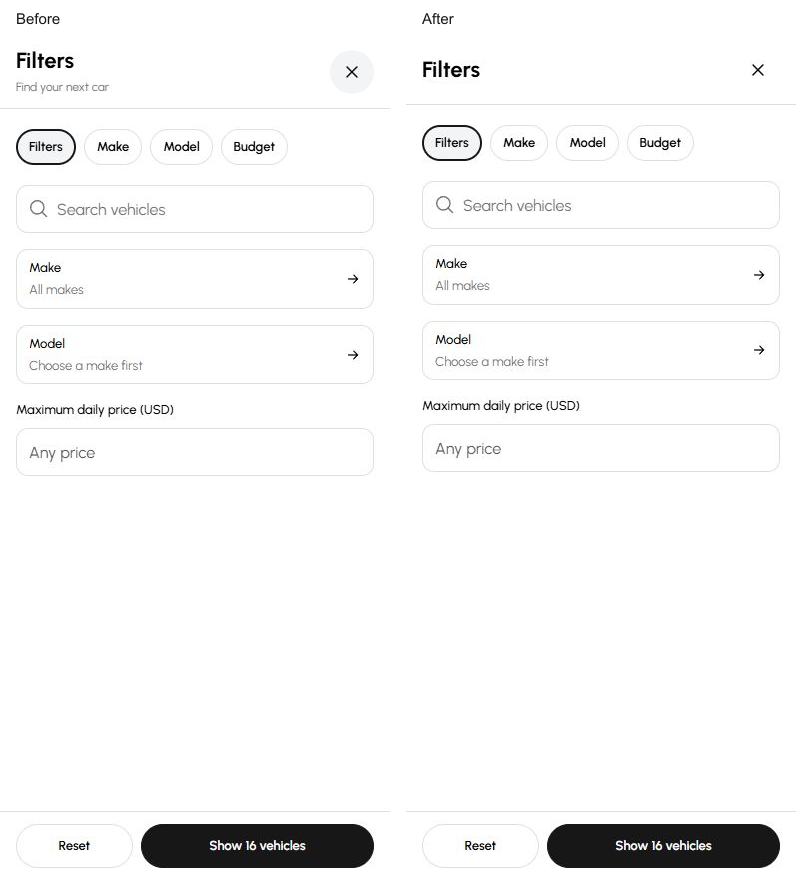
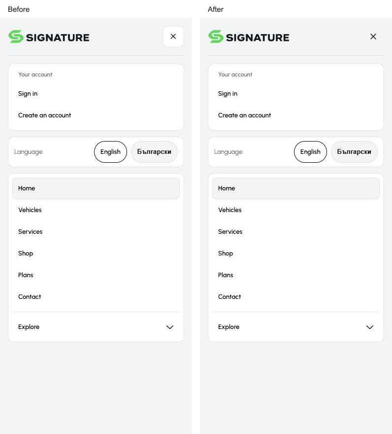
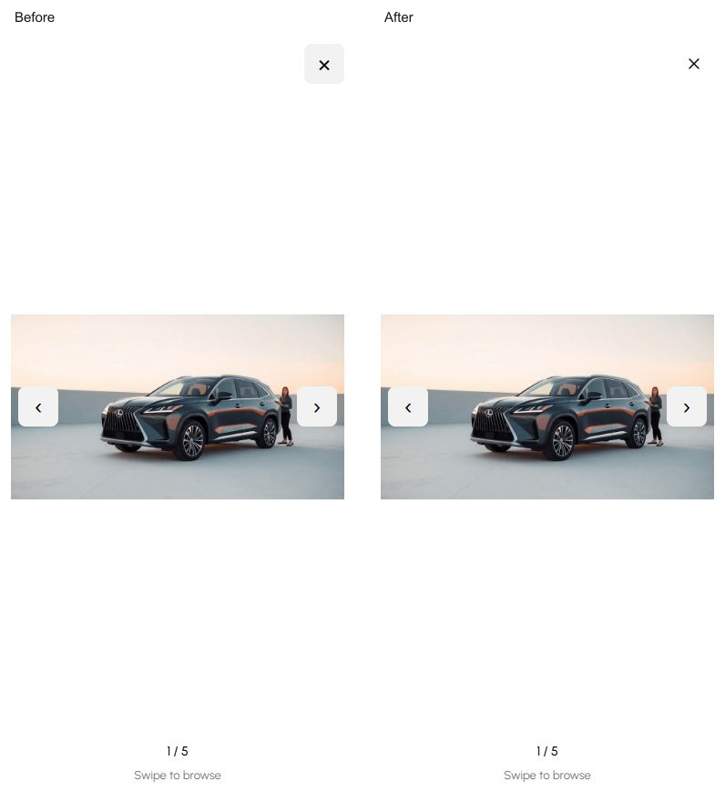

# Final mobile overlay pass — 10 October 2026

The selected mobile website retains its existing artwork, palette, typography, vehicle cards, compact pills and composition. This pass makes the overlay headers consistent and gives the header glyphs explicit centering.

## Changes

- `MobileSheet.svelte` owns a flexible title area, shared spacing and transparent 44px close/leading controls. The close glyph remains the shared 20px `MobileIcon`.
- `CatalogFilterSheet.svelte` omits the repeated “Find your next car” / product introduction beneath the title.
- `MobileLoanCard.svelte` and its `LoanCard.svelte` consumer omit the repeated calculator introduction in the mobile header. Desktop copy and the illustrative estimate note remain.
- `Header.svelte` uses the shared plain X in the phone drawer and explicit grid/block centering for the existing header controls. Browser measurements showed the original header icon centers already aligned; glyph sizes and hero surfaces are preserved.
- `PhotoViewer.svelte` uses the shared plain X on phones. Photo navigation retains its contrast surfaces, and desktop retains its existing close glyph.

All added visual rules are inside the existing phone breakpoint. Reference evidence, routes, dependencies, dealer inputs and desktop styling were not edited.

## Matched comparisons

Both sides were captured in Codex @Browser at 390 × 844 CSS pixels, in English, on the existing loopback preview. Each original screenshot is 390 × 844 pixels; the comparisons add labels and a gutter without scaling. [Provenance](provenance.json) records the state for each pair.

## Verification

- Three subagents reviewed overlay consistency, header controls and the selected mobile route/component patterns.
- Pinned Node 26.10.0: `npm run check` passes with zero Svelte errors/warnings; typography and geometry guards pass.
- Focused Prettier checks and mandatory Svelte autofixer review pass for the six edited components.
- 25 existing domain tests pass across mobile catalogue, sharing, vehicle presentation, news, calendar and asynchronous resource cleanup.
- Browser review covered Home, Vehicles, Services, Shop, Plans, Contact and the selected vehicle detail. Reviewed 320px surfaces have no page overflow; English and Bulgarian title states fit.
- Vehicle filters accept and apply a comma-decimal budget, keep invalid input in the sheet, restore opener focus and remove the applied filter. Services category selection updates the results. Product filters dismiss and return focus.
- Menu and photo-viewer Escape dismissal return focus to their openers. Photo navigation advances from photo 1 to photo 2. Close targets measure 44 × 44px.
- The seven-column calendar fits at 320px. The enquiry sheet scrolls within a 320 × 520 viewport and returns focus on dismissal. Calculator has one header title and retains its estimate note.
- No browser warnings or errors were observed in the reviewed states. Compact measurements are retained in [the browser receipt](../../.runtime/evidence/mobile-final-20261010/browser-checks.json).

The hypothesized hidden-thumbnail focus issue did not reproduce: native focus scrolling revealed the fifth photo. Imported gallery CSS already owns horizontal touch gestures, so neither area received speculative code changes.

This is completed local mobile polish on the shared, dirty Cars `main` checkout, starting at HEAD `fc267cef378316516258936ad4cac843e78df710`. Concurrent work advanced Cars to `14b3cbe71f7d84d0e16a0140467899319e00d4be`; that commit did not touch this template, and the six edited component files remained stable after validation. This pass made no Git/index mutation, deployment or production build. A full desktop pixel comparison and physical phone testing are outside this mobile pass. Only the three useful comparison captures and compact receipts are retained; intermediate captures were retired.
