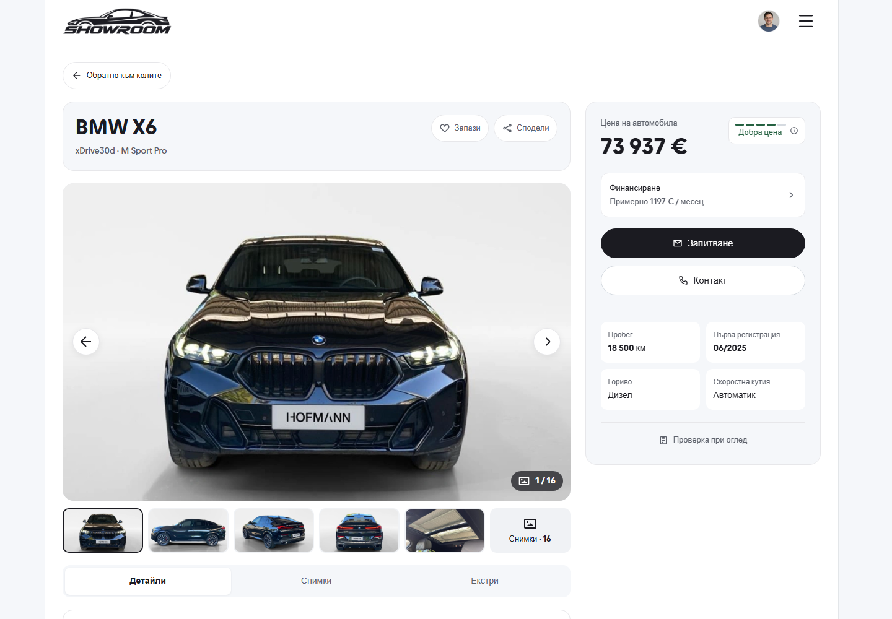

# Desktop inspection checklist button - 9 October 2026

The existing inspection-checklist link at the bottom of the desktop purchase
card is now a full-width white button with a light border, dark text and the
same pill shape as the Contact action. Its focus ring, accessible label and
vehicle-specific checklist destination are preserved. The existing local
checklist flow and login requirement are unchanged.

Only `DesktopVehicleSummary.tsx` presentation changes. The component is hidden
below 1024px; the phone UI is preserved. Both screenshots use the BMW X6 first
photo, Bulgarian, fresh storage, light theme and a 1440 x 1000 viewport.

| Before | After |
| --- | --- |
|  |  |

Node 22.20.0 lint, TypeScript, 156 domain tests, scoped Prettier and a production
build generating 124 pages passed. Frozen production browser checks cover the
white background, full card width, 44px minimum target, destination, layout,
existing dialogs, gallery, tab navigation, sticky sidebar and vehicle actions
at 1024 and 1440px in Bulgarian and English. See [checks.json](checks.json).

Matched 320px and 390px viewport images have zero changed pixels. Full-page
content below the fixed header also has zero changed pixels; the alternate
320px full-page header scroll state is recorded separately. Raw evidence and
helpers are retained in ignored `runtime/desktop-pdp-checklist-2026-10-09`.
[source-hash.json](source-hash.json) records the verified source.
