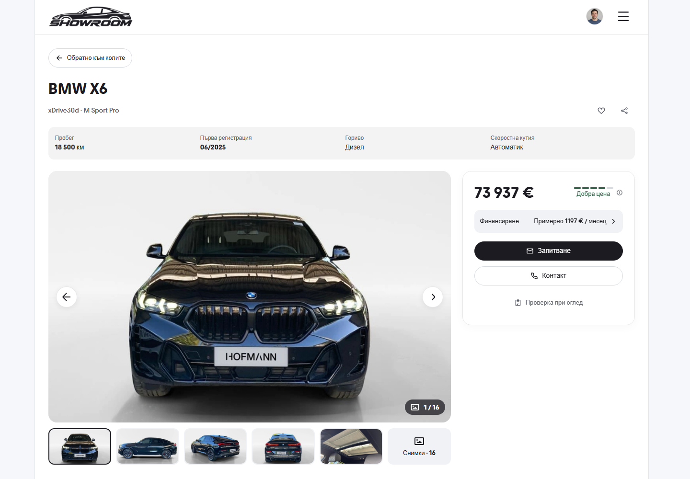
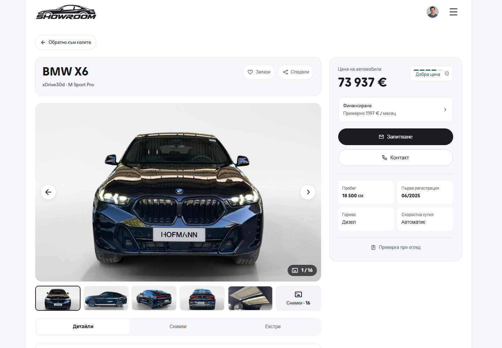

# Desktop PDP finishing pass - 9 October 2026

Review route: `/vehicle/bmw-x6`. The price-rating badge sits at the purchase
card's top-right, aligned with the Vehicle price caption. The amount remains
prominent beneath its caption. The existing explanation dialog, localized
rating and 44px target are retained.

This completes the desktop PDP polish: a gray vehicle-title panel, labeled
Save and Share controls, a white Back to cars control, a quieter header,
segmented Details / Photos / Features, a larger gallery, and a 380px purchase
card containing the existing finance, enquiry, contact and vehicle facts.
Presentation changes apply from 1024px. Native mobile composition is preserved.

The screenshots share a 1440 x 1000 viewport, Bulgarian, light theme, fresh
storage and the first BMW X6 photo. `original-before.png` records the desktop
before this PDP polish; `before.png` records the final preceding badge
placement beside the numeric amount. `after.png` is the finished production
build with the rating at the top-right.

| Original desktop | Finished desktop |
| --- | --- |
|  |  |

[Previous badge position](before.png) · [Full finished page](after-full.png) ·
[English desktop](after-en.png)

## Verification

Node 22.20.0: ESLint with zero warnings, TypeScript, all 156 domain tests,
scoped Prettier and the production build passed. The isolated build generated
124 pages without changing the normal preview's build directory.

The frozen production build passed 16 desktop layout checks and 20 interaction
checks in Chromium and WebKit at 1024, 1280, 1440 and 1920px, in Bulgarian and
English. Checks cover rating caption/right-inset alignment, overflow, control
size, dialog dismissal and focus return, saved state, gallery, segmented tabs,
keyboard navigation, section reload/back behavior, sidebar scrolling, short
viewports, enquiry/checklist navigation, longer titles and captured leasing
values. No browser errors were recorded. See [checks.json](checks.json).

Matched 320px and 390px viewport screenshots have zero changed pixels. Full-page
content below the fixed 66px header also has zero changed pixels. Full-page
screenshots sampled different fixed-header states; those differences are
recorded separately in the report. Fresh dev captures also matched both complete
mobile screenshots pixel-for-pixel.

[source-hashes.json](source-hashes.json) records all seven verified source files.
Focused helpers, raw mobile captures and build logs remain in ignored
`runtime/desktop-pdp-top-right-2026-10-09`. Local source/build evidence and hosted
verification are separate records.
