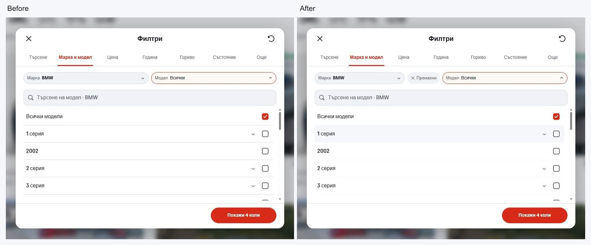

# Desktop brand and model polish

Selecting BMW opened its model list, but the remove action was only available
back in the make list. Desktop now keeps a separate **Remove** action beside
the selected Make control. It removes that make's models and variants, clears
the model search, and returns keyboard focus to the make list. Other draft
criteria stay intact; Show cars applies changes, while Escape and Back cancel.
Both the new action and the existing list removal have localized labels.

Brand rows also inherited the native button's bottom border in addition to the
showroom row divider. The broad border reset did not remove that specific
border. Desktop now removes the duplicate and uses the quiet stripe token for
brand/model dividers, with rounded row hover feedback. The 820px dialog,
seven tabs and blurred backdrop retain their reviewed layout.

Verification used the Browser plugin against the final local production preview
on `http://127.0.0.1:6474/`. [Recorded checks](browser-verification.json) cover
selection and removal during model searches, keyboard focus, applying an X6
filter, Escape/Back cancellation, preserving a EUR 50,000 minimum price during
removal, optional variants and exclusions, Bulgarian/English labels, and
700/1024/1440/1920px desktop widths including 700 by 500px.
No browser console errors were observed. ESLint, TypeScript, all 91 domain and
localization tests, and the production build passed with Node 22.20.0.

The [matched phone comparisons](mobile-comparisons.json) have zero changed
pixels for both the brand and model views at 320 and 390px. Phone row geometry,
selectors and full-screen editor stay intact. The existing showroom browser
suite's removal locator was updated for the localized action name; this pass
used focused Browser checks rather than rerunning that full suite.

| View | Before | After |
| --- | --- | --- |
| Brands, desktop | [Before](before-makes-1440.jpg) | [After](after-makes-1440.jpg) |
| Models, desktop | [Before](before-models-1440.jpg) | [After](after-models-1440.jpg) |
| Models, 320px | [Before](before-models-320.jpg) | [After](after-models-320.jpg) |
| Models, 390px | [Before](before-models-390.jpg) | [After](after-models-390.jpg) |

The preview and source checks establish this focused local correction. Dealer
release selection and hosted visual acceptance retain their separate workflow.
