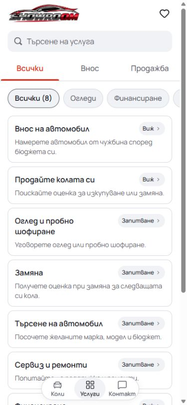
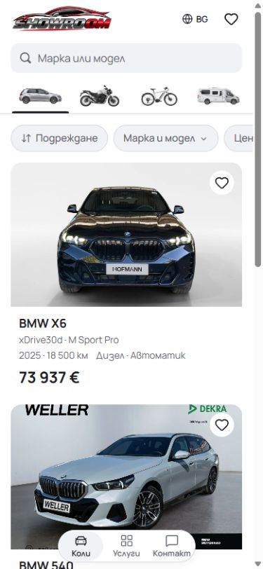
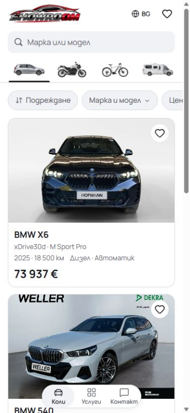
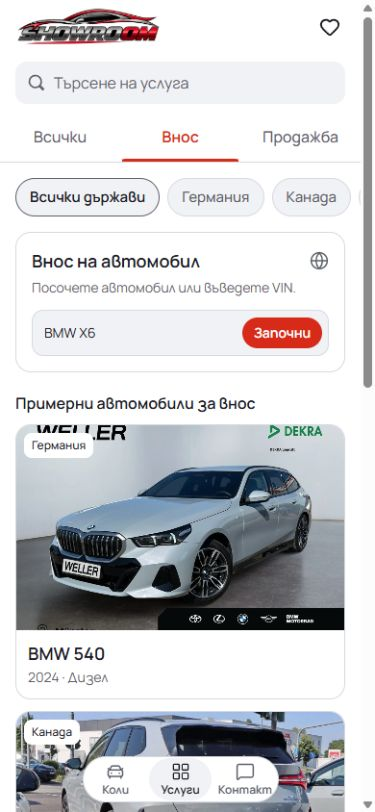
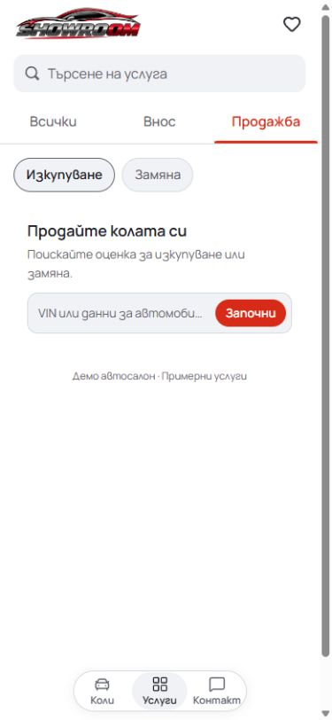
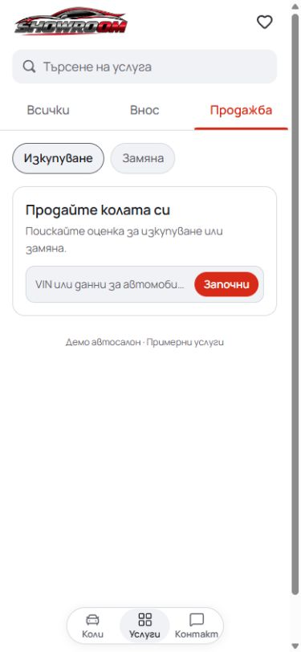
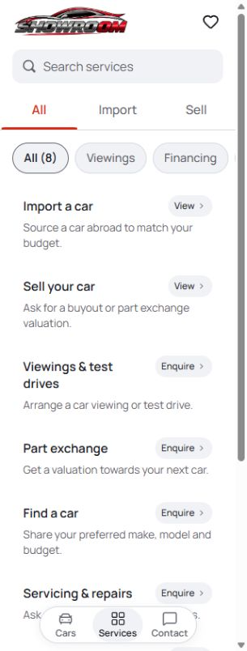
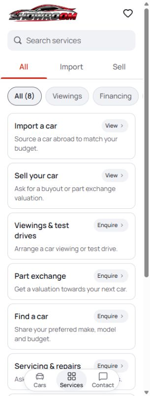
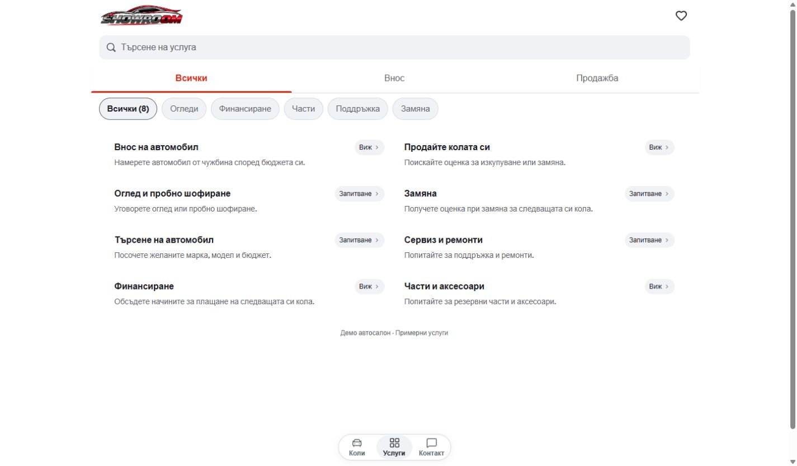
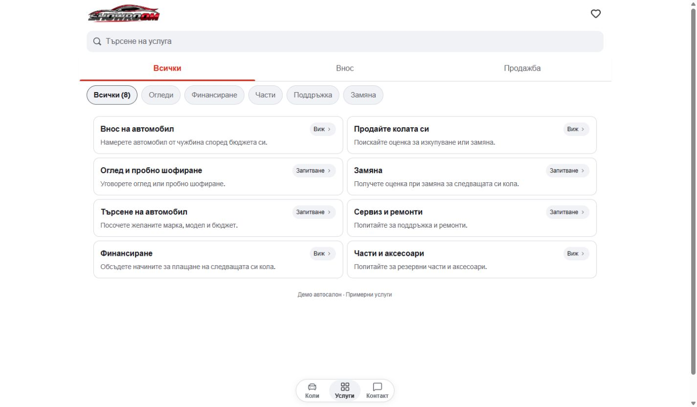

# Mobile card boundaries

Implemented and checked on 4 October 2026 (Europe/Sofia) at
[the local preview](http://127.0.0.1:6474/services).

The white canvas removed the contrast that had defined the white service and
vehicle cards. This correction gives the existing cards a thin neutral border,
so each item is visibly grouped while the header and page remain white.

## Implementation

Master: `L:/CODEX/cars/templates/mobile`, branch `main`, based on
`7a82a6333376caa8d5526c53b97c255ba1368e1f`, preserving existing local drafts.

- Service overview and detail cards, inventory/Saved cards, import examples and
  Contact panels use a 1px `colors.line` border with their existing white fill.
- Import and Sell starters share the same border in their existing base style.
  The import-only border style and conditional style application were removed.
- Existing padding, corner radii, focus behavior and link/form semantics remain.
- Existing color tokens and StyleX owners provide the change. No new components,
  dependencies, palette, shadow or theme layer were added.

This completes the grouping correction to the
[preceding white-canvas change](../mobile-surfaces-standardized-20261004/README.md).
The source commit includes that already verified change and this correction;
unrelated staged or working-tree changes are excluded.

## Validation

Node `22.20.0`, production preview on port 6474.

- `npm run check`: lint, TypeScript, 91 tests and production build passed.
- `npm run format:check`: passed.
- Existing `scripts/qa-showroom-polish.mjs`: 22 checks passed in Chromium and
  WebKit, with zero browser errors. BG/EN main routes at 320/390/1440px, enlarged
  navigation labels, focus return, cancellation, validation and draft storage passed.
- TypeScript passed again after restoring the original generated type references
  for the existing development preview.
- Eight rendered comparisons were inspected. All measured cards have a white fill
  and 1px border; all measured document canvases are white, with no horizontal overflow.
  Visible images finished loading before capture.

The eight before/after pairs have matching bitmap dimensions. Requested 390 × 844
viewports export at 375 × 812; 320 × 844 exports at 305 × 804; 1440 × 844 exports
at 1425 × 835. The in-app browser's Windows scrollbar and export scaling account
for the difference. See [dimensions](screenshot-dimensions.json),
[final DOM metrics](after/metrics.json) and [QA summary](qa-summary.json).
Captures preserved the existing user drafts and did not submit forms.

## Before and after

| Screen and requested viewport | Before | After |
| --- | --- | --- |
| Services · BG · 390px |  |  |
| Cars · BG · 390px |  |  |
| Contact · BG · 390px |  |  |
| Import · BG · 390px |  |  |
| Sell · BG · 390px |  |  |
| Financing · BG · 390px |  |  |
| Services · EN · 320px |  |  |
| Services · BG · 1440px |  |  |

## Delivery

Commit title: `Restore mobile card boundaries on the shared white canvas`.
The local preview contains the verified working copy, including pre-existing
local adaptations outside this styling change. This is shared master polish;
no hosted mirror, dealer refresh or immutable release selection was performed.
