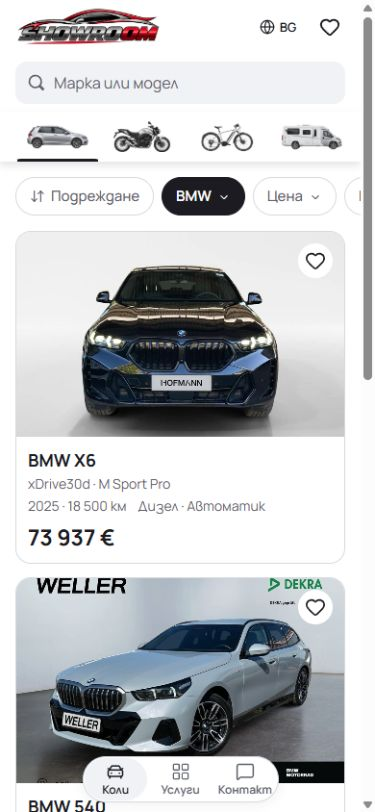
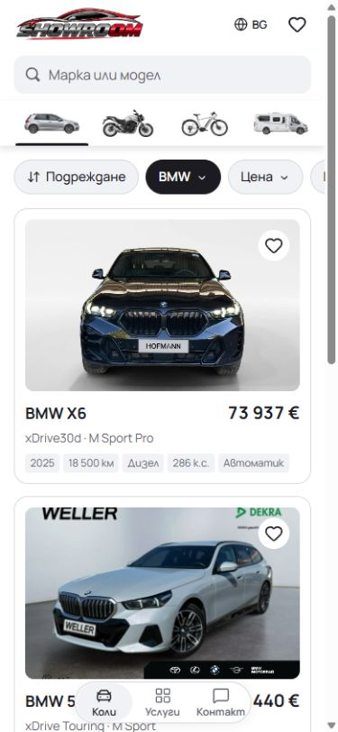
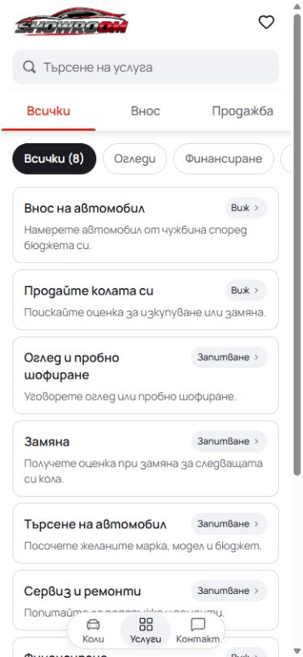
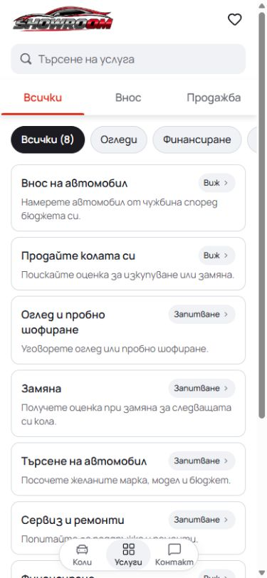
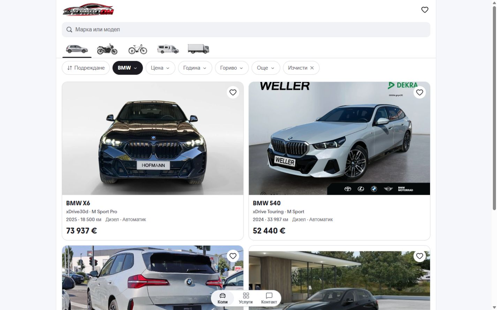
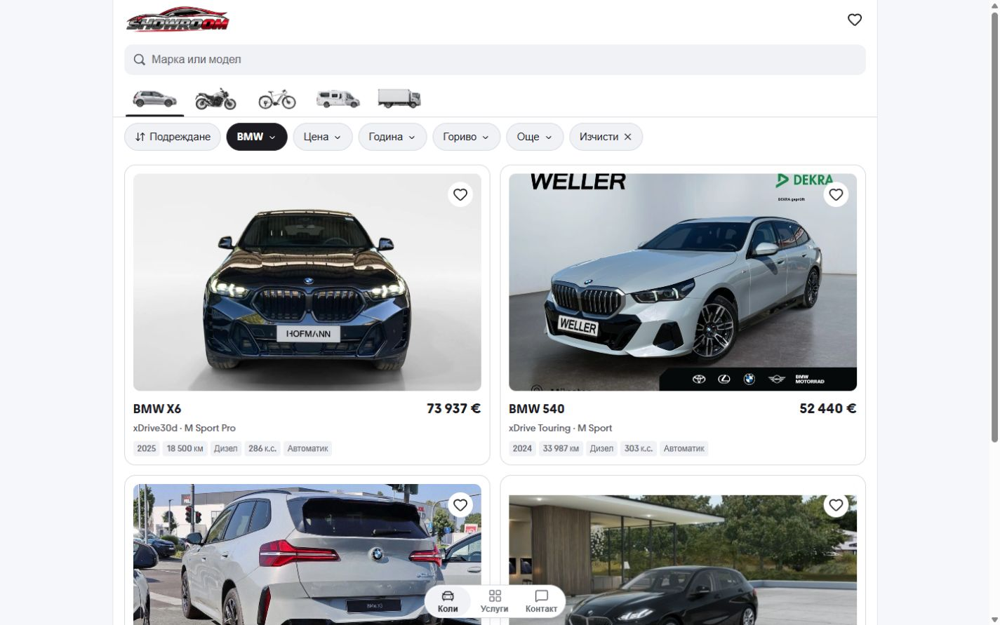

# Mobile vehicle cards and quick filters

The supplied visual reference was the inventory at `http://127.0.0.1:6427/`.
The editable implementation remains `templates/mobile`, previewed on port 6474.

Vehicle cards retain the white page token and thin neutral border. A 12px white
photo inset makes that surface visible around the grey photography. The title
and price share a wrapping row, followed by the trim and small badges for year,
mileage, fuel, power and transmission. At 390px, the first card is 318px tall,
down from 346px, while showing the additional power fact. The save action keeps
its 48px target and now belongs to the photo container.

Inactive quick filters use the existing light-grey control token and dark text.
Applied filters keep the existing near-black fill and white text. This distinguishes
the controls from their white toolbar without changing the page canvas or sticky
layout. Cars, Services and the service request steps share the same component.

## Matched comparisons

Mobile comparisons use Bulgarian at a 390 x 844 CSS viewport, with `scrollY = 0`.
The Cars comparisons retain the same BMW filter. Desktop uses 1440 x 900 pixels.

| View              | Before                                  | After                                 |
| ----------------- | --------------------------------------- | ------------------------------------- |
| Mobile inventory  |        |        |
| Services filters  |  |  |
| Desktop inventory |    |    |

[320px card layout](cards-320-after.jpg) and [supplied reference](reference.jpg)
retain the narrow-width result and design reference.

## Verification

- Node 22.20.0: ESLint, TypeScript, 91 domain/localization tests and production
  build passed. The build uses `.next-card-polish-20261004`, pointing to this
  task's generated output in the Cars runtime area on C: after L: ran out of space.
- The existing browser polish suite checks BG/EN at 320/390/1440px, sticky
  controls, filter dismissal/focus, PDP actions and local-draft behavior. Its
  inventory assertion now checks the five localized factual badges and that
  they remain readable inside a narrow card. Results are in `browser-checks.json`.
- Browser inspection confirmed independent save/remove actions, Saved card
  rendering, photo touch navigation to the correct PDP, readable related-card
  badges, and matched mobile/desktop screenshots. The temporary save was removed.
- Original dirty `next-env.d.ts` and `tsconfig.json` contents were restored
  byte-for-byte. Generated output is excluded from the source commit.

These are standalone source and local-browser checks; template release selection
and dealer publication remain separate.
