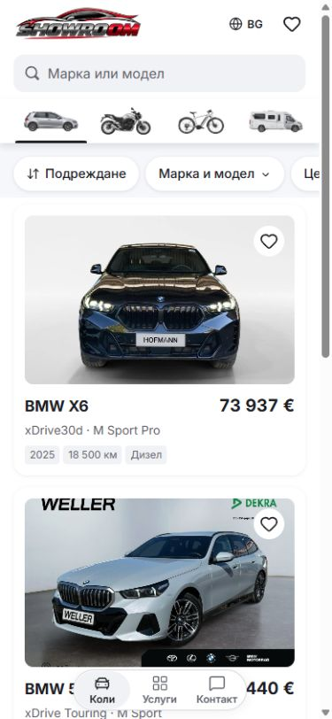
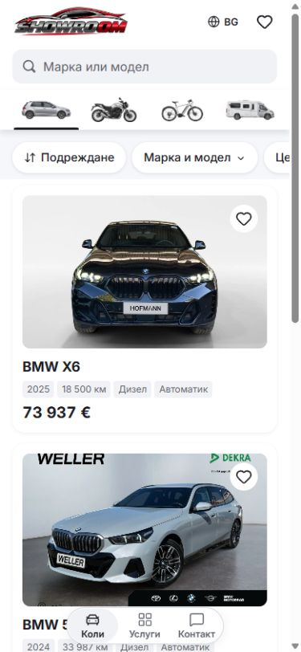
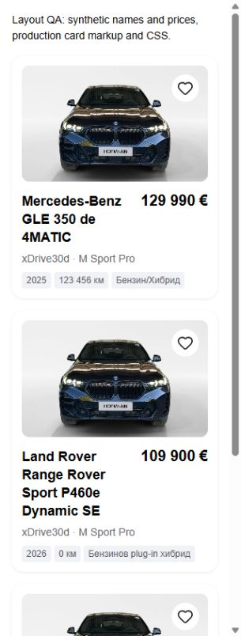
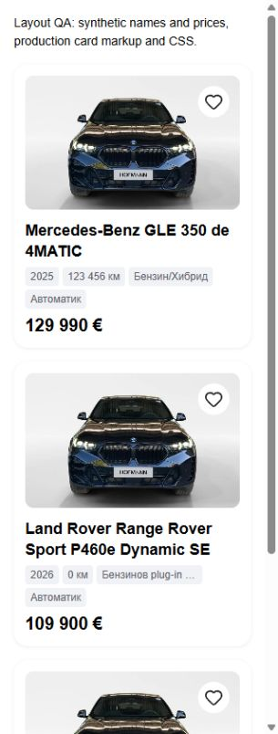

# Mobile vehicle-card hierarchy

Use a full-width model name, four spec badges, then the price on its own row.
The name wraps to two lines and uses an ellipsis for longer text. Its complete
text remains accessible in the link. The badges show year, mileage, fuel and
gearbox, wrapping to at most two rows. Trim descriptions remain on the detail
page instead of adding another text line to every card.

The normal 390px card is 2px taller than before. At 320px the badges can use a
second row; the price never competes with the name. Long badge values have an
ellipsis while retaining their full accessible text.

The component no longer needs a heading wrapper, desktop ordering rules or
full vehicle-copy localization just to choose a photo. Badges use stable field
keys. Clamping applies to the name span so the link still covers the whole
card, including its photo; the separate 48px save target remains usable.

| Before, 390 x 844 | After, 390 x 844 |
| --- | --- |
|  |  |

| Long-name fixture before, 320 x 844 | Long-name fixture after, 320 x 844 |
| --- | --- |
|  |  |

The long-name fixtures use captured production card markup and CSS with
synthetic names, prices and stats. They do not change the inventory. At 320px
the previous layout produced three, four and five title lines; the new layout
stays within two, with all four badges visible in at most two rows and the
price underneath. Equivalent 390px fixture captures and matched 1440px
screenshots are included.

ESLint, TypeScript, formatting, 95 domain/localization tests and the full
production build passed. Browser checks covered BG at 320/390/1440, English
at 320, long and unbroken names, long stats, large prices, saved cards, save
toggle isolation, opening details from the photo area, and returning to
inventory. Original saved state and locale were restored. No console errors
were observed. The accepted mobile quick-pill appearance also matched.

Only `ShowroomVehicleCard.tsx` and this evidence belong to this change. Other
writers' desktop drafts and generated configuration remain outside its scoped
commit. Local preview is port 6474; release selection and dealer publication
retain their separate acceptance requirements.
