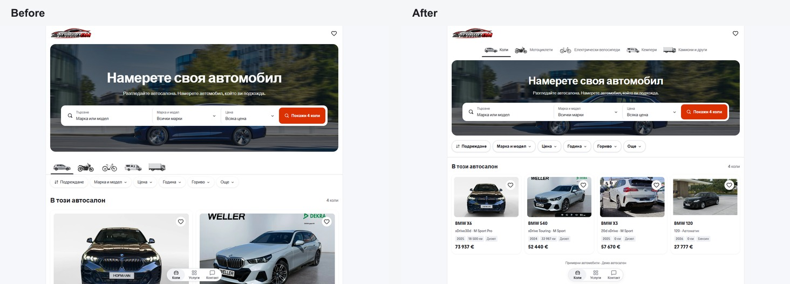
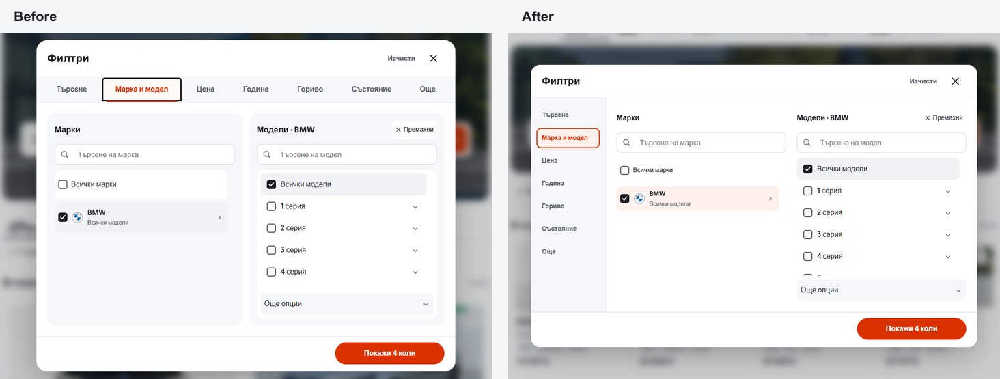

# Mobile template desktop density and filters

The desktop inventory now uses four cards per row at 1024px and wider. A 280px hero replaces the 400px banner; labeled vehicle types sit above it and 44px quick filters sit on white below it. Card photos and typography fit the narrower columns, with the price below the specifications.

The desktop filter dialog uses a 164px sidebar with seven tabs, white make/model panes, aligned range fields and a persistent action footer. Its 980px by 620px frame contracts to fit shorter windows. The sidebar supports vertical arrow-key navigation and returns focus to the invoking control when closed.

## Matched desktop screenshots

Both views use Bulgarian at 1440 by 960. Before is the current phone picker baseline at `49ff7189a0a042d3f2d2242de27d008beb66f4e3`, with these seven desktop edits removed; after is the revised source.

## Verification

- Node 22.20.0: lint, TypeScript and production build passed; 51 routes generated.
- All 95 retained domain and localization tests passed using isolated output.
- All 72 desktop checks passed in Chromium and WebKit, covering the 1024px breakpoint, four columns, compact banner, all filter tabs, real make/model and budget filtering, cancellation, clearing, keyboard behavior, focus restoration and detail/back navigation. The shortest checked desktop viewport was 1024 by 600.
- All 48 phone comparisons matched visible text, geometry, computed styles and controls at 320px and 390px in Bulgarian and English, across home, make, price, more, services and detail states. The desktop hero image was not requested on phones. Two representative source image hashes also matched. Of 24 Chromium screenshot pairs, 21 are pixel identical; three home captures differ in photo pixels. Raw captures are retained in the ignored project runtime directory.
- All 72 before/after capture states returned HTTP 200 without horizontal overflow, broken images or console errors.

The machine-readable receipt is [verification.json](verification.json). The reviewed local preview is <http://127.0.0.1:6478/>. This source revision does not update the release lock or deploy dealer sites.
