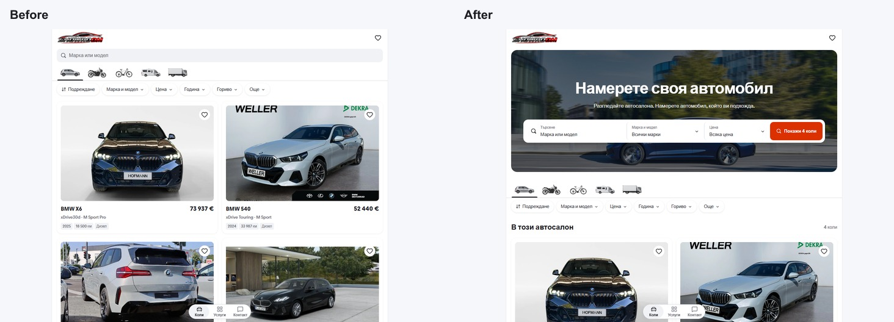
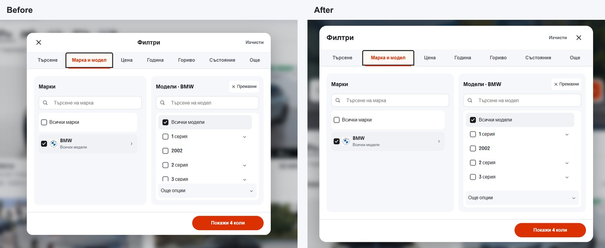

# Mobile template desktop discovery

The desktop homepage now puts its search inside a 400px photographic banner,
using the existing Modern/Boxcars reference artwork and Mobile's red accent,
rounded controls and 1100px container. Search, make/model and price open the
existing draft filter editor; the stock button scrolls to and focuses results.
The desktop filter frame is wider, with a left-aligned heading, close action on
the right, and grouped range and choice settings. These adaptations start at
1024px. Existing phone composition and filter behavior remain in place.

Review: <http://127.0.0.1:6478/>. Both Bulgarian and English are supported.

## Verification

- Node 22.20.0; lint, TypeScript, 92 domain/localization tests and the production
  build passed (51 generated routes).
- 62 Chromium/WebKit desktop checks cover 1023px, 1024px, 1280px, 1440px and
  1920px, plus a 1024x600 short viewport. They cover hero visibility and image
  requests, filtering, reload, draft cancellation, opener focus, Enter/Escape,
  the results action, details and filtered Back navigation.
- 48 phone preservation cases compare the current pre-change preview on 6474 with the
  new preview on 6478 at 320px and 390px in Bulgarian and English, across home,
  make/model, price, additional filters, Services and vehicle details, in both
  Chromium and WebKit. Element positions, styles, text, selected states and image
  paths are compared; the differing photo captures also have matching asset
  bytes. No new hero photo is requested below 1024px.
- Twenty of twenty-four Chromium phone screenshots match pixel-for-pixel. Four
  captures have differences within vehicle photos, whose paths, bytes, styles
  and geometry match. Full raw screenshot equality is not claimed. The original 6478 preview also
  predated the already-committed phone picker simplification, so that stale
  build is not the current phone baseline.
- The pre-existing generated-file changes are preserved. Source began at
  `2814c6890d88d34d75a27fb984bd7960ec00953f`; unrelated Cars work is excluded
  from this scoped change. [The receipt](verification.json) records results.

This is a source improvement and local preview. Template release selection,
owner visual acceptance and dealer deployment remain separate steps.
