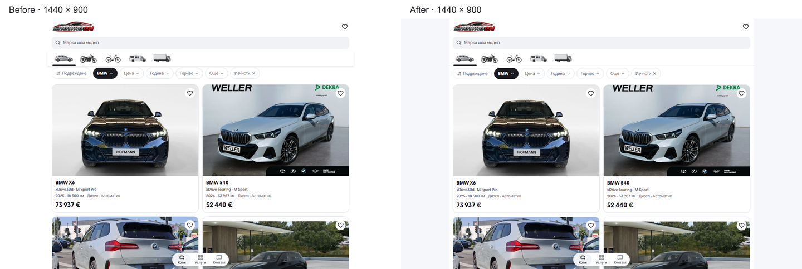

# Mobile desktop frame and tabs — 4 October 2026

The centered 1100px layout had not been removed. The shared white-canvas change
in `e0ffec6d7` made the document outside the desktop frame white too, hiding the
frame visually. The shared tab elevation in `352568414` added the mobile rail's
4px drop / 8px blur shadow at every width. Neither adjustment had a desktop boundary.

At the existing 700px breakpoint, the document now uses the shared `colors.stripe`
surround, the white app frame gets a subtle 1px edge, and tabs use a flat 1px
divider with their existing active underline. The 1100px maximum width, desktop
typography, two-column inventory and filter logic remain intact.

The source change is limited to
[layout.tsx](../../templates/mobile/src/app/layout.tsx),
[AppShell.tsx](../../templates/mobile/src/components/AppShell.tsx) and
[ShowroomTabs.tsx](../../templates/mobile/src/components/ShowroomTabs.tsx).

## Verification

- Node 22.20.0: ESLint, TypeScript, all 91 domain/localization tests and the
  production build passed. The checked production output is
  `.next-desktop-fix-20261004`, now running at `http://127.0.0.1:6474`.
- The supplied BMW URL, inventory, pinned controls, Services, Import, Contact,
  vehicle detail and filter editor rendered without overflow, broken visible
  images or browser errors. Desktop captures cover 700/1024/1440/1920px.
- Chromium and WebKit passed BG/EN category keyboard navigation, retained BMW
  filters, search Escape/focus return and sticky controls on the final 6474
  preview. Breakpoint checks include 320/390/699/700/1440/1920px.
- Matched 320px and 390px captures retain identical mobile geometry, font,
  backgrounds, tab elevation and scroll behavior. Raw image differences range
  from 0 to 205 pixels per 900px-high capture, with a maximum channel delta of
  2/255; no pixel exceeds that rendering tolerance. The 699px capture and the
  supplied BMW page at 390px are pixel-identical.
- The build's generated TypeScript references were restored to their exact
  pre-task bytes, preserving the existing local changes in those files.

[Interaction checks](verification.json), [before measurements](before-metrics.json)
and [after measurements](after-metrics.json) record the results. These establish
the local master and preview; hosted and dealer release acceptance are separate.

## Matched screenshots

Both desktop captures use the supplied BMW query, Bulgarian, a 1440 × 900 CSS
viewport and the top of the page. The comparison below scales both equally;
the linked originals retain their full resolution.

| View            | Before                          | After                          |
| --------------- | ------------------------------- | ------------------------------ |
| Desktop, 1440px | [Original](before-bmw-1440.png) | [Original](after-bmw-1440.png) |
| Mobile, 320px   | [Original](before-bmw-320.png)  | [Original](after-bmw-320.png)  |
| Mobile, 390px   | [Original](before-bmw-390.png)  | [Original](after-bmw-390.png)  |
