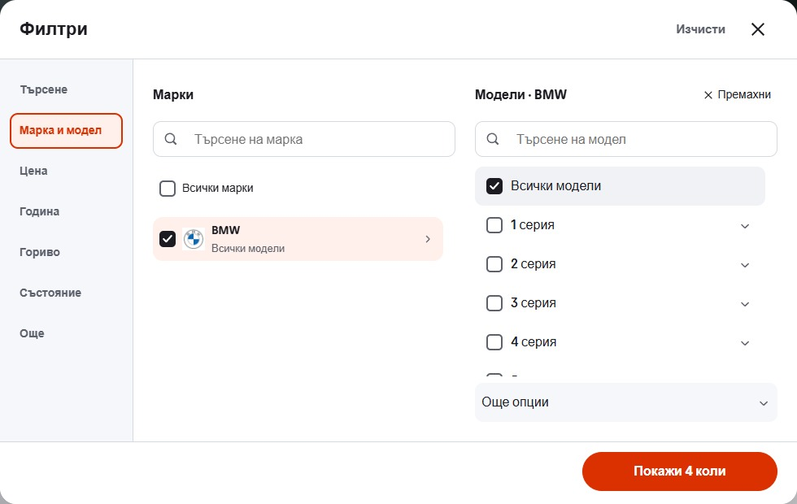

# Desktop type and quick-filter rails

The desktop now follows banner → vehicle types → quick filters. The 280px banner and four-column inventory remain. Types have a quiet divider, with the 44px quick pills in their own sticky rail below.

The inventory markup follows the same sequence as the rendered desktop. The extra flex wrapper and CSS `order` values were removed. The filter dialog retains one shared editor; named grid areas identify its heading, tabs, panel and footer. Its sidebar and field styling remain.

## Verification

- Node 22.20.0: lint, typecheck, production build and all 95 retained domain/localization tests passed. The build generated 51 routes.
- All 82 desktop checks passed in Chromium and WebKit at the 1024px breakpoint, 1280, 1440 and 1920px, plus 1024 by 600. Checks cover rail order, four compact cards, actual category selection, all seven sidebar sections, real make/model and price filtering, cancel/clear, keyboard navigation, focus restoration and detail/back behavior. The 1023px breakpoint was also checked.
- Phone comparison covered 48 states in Chromium and WebKit at 320/390px in Bulgarian and English. Thirty-eight matched exactly. Eight make views contain only the separate phone Back-button update from `ShowroomModelOptions.tsx` and its stylesheet: its horizontal position and the related parent text order changed. Those files are outside this revision. Two initial More captures differed only in tab-rail scroll offset; all four More views matched after equal scroll positioning. There were no other sampled geometry, style, content or control differences, and no console errors.
- All 16 matched desktop capture states returned HTTP 200 without overflow, broken images or console errors. The receipt includes pixel comparisons inside the unchanged filter dialog.

Before is source `9aedff510e86f767278c46a9cbd2348dad07d334` on the existing preview; after is the three-file desktop revision. Raw captures and the initial comparisons are retained under the ignored project runtime directory. [verification.json](verification.json) records the results and scoped phone comparison explicitly.

The reviewed preview is <http://127.0.0.1:6478/>. No template release selection or dealer deployment was changed.
