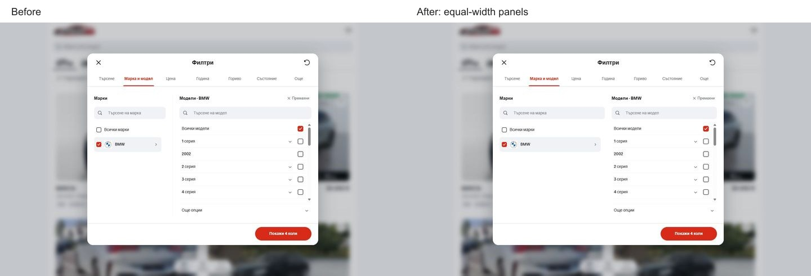

# Equal desktop Make and Model panels — 4 October 2026

The desktop layout gave Make `.85fr` and Model `1.65fr`, then added a 24px left inset and a divider to Model. At 1440px this produced 254.31px and 468.69px search fields.

The grid now has two equal columns with the same panel styling and a 24px gap. Both columns, headings, search fields and content areas measure 374px wide at 1440px. The modal remains 820 × 680px at the same position; its heading, tabs and footer retain their before coordinates. Changes live in `templates/mobile` in the canonical Cars checkout.

Validation:

- Lint, TypeScript, formatting, all 92 domain/localization tests and the Node 22 production build passed.
- 48 focused browser assertions passed: equal widths at 700/1024/1440/1920, tab visibility, searches, X6 selection, expanded settings, BMW deselection/removal, and fixed frame coordinates across all seven tabs.
- English tabs and expanded model settings also retain the fixed frame at 1024 × 500.
- At 320 × 844 and 390 × 844, the dialog, tab rail, paired selectors, search field, first five model rows and footer have identical before/after dimensions and positions.
- No browser console errors were captured.

The rebuilt preview also includes the previously committed `047063ade` brand Back/search improvements that the old 6474 build had not yet loaded. The phone copy and Back icon in those existing changes are not part of this desktop patch; phone geometry remains unchanged.

[Measured checks](verification.json) and matched screenshots are saved alongside this note. The preview remains at `http://127.0.0.1:6474/`.

