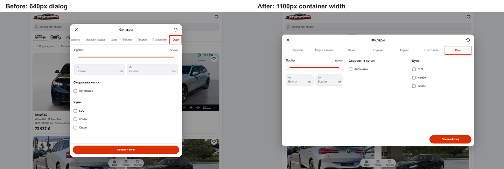

# Mobile desktop filter dialog

The showroom filter editor had a separate 640px width cap while the website
container is capped at 1100px. Its seven Bulgarian tabs required horizontal
scrolling even on a wide desktop. The More panel stacked its settings vertically.

The filter editor now shares the 1100px container cap from 700px, with 24px
viewport gutters. Seven tabs fill the available width. More places mileage,
transmission and body type in three columns from 1000px, or two columns with
mileage spanning the first row below that. Single-setting panels retain a
760px readable content cap. The dialog is at most 640px tall, shrinks for short
viewports, and keeps its 240px apply action in the fixed desktop footer.

Phones keep the original full-screen sheet, scrolling tabs, stacked fields and
full-width action. Other flow sheets and the Sort dialog retain their existing
desktop width caps.

## Validation

- ESLint and TypeScript passed; all 91 domain/localization tests passed.
- The production build passed using `.next-filter-modal-20261004` and a separate
  webpack cache. The output is running at `http://127.0.0.1:6474`.
- 32 screenshot/geometry cases cover all seven Bulgarian sections at 320/390px,
  Bulgarian Search/More at 700/1024/1440/1920px, all seven English sections at
  1440px, and Services search at 320/390/1440px. No page or dialog overflow or
  browser errors were recorded.
- All 16 mobile comparisons, including Services search, are pixel-identical.
  [Before metrics](before-metrics.json) and [after metrics](after-metrics.json)
  retain the measured dialog, tab, field and footer geometry.
- Chromium and WebKit passed Bulgarian/English keyboard tab navigation, draft
  retention across sections, real filter application, Escape with focus return,
  and browser Back cancellation. Short 700/1440 by 500 viewports retain reachable
  options and footer. Services search stays at 640px and Sort stays at 480px.
  These interactions passed on the candidate port 6476 and final port 6474.
  [Verification](verification.json) records the final preview checks.

The source changes are in `ui.tsx`, `ShowroomTabs.tsx`,
`ShowroomFilterSheet.tsx` and the template's composition documentation.
The build's generated TypeScript changes were restored to their prior state;
unrelated work was preserved. This check establishes the local preview result.
Hosted visual acceptance and dealer release selection remain separate.

## Screenshots

| View | Before | After |
| --- | --- | --- |
| Search, 1440px | [Before](before-search-bg-1440.png) | [After](after-search-bg-1440.png) |
| More, 1440px | [Before](before-more-bg-1440.png) | [After](after-more-bg-1440.png) |
| More, 320px | [Before](before-more-bg-320.png) | [After](after-more-bg-320.png) |
| More, 390px | [Before](before-more-bg-390.png) | [After](after-more-bg-390.png) |
