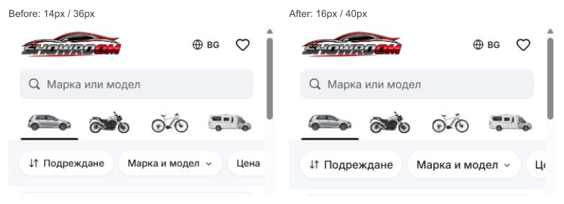

# Mobile filter readability: 16px

The local before/after comparison uses the pending 14px/36px pill treatment and the selected 16px/40px treatment. The larger labels match the existing 16px overlay tabs, fields and brand choices, with 48px pill tap areas. The apply button now also uses 16px text. The lighter 500-weight card title and 400-weight price are retained.

Source: `b6243dbc2b2ccc9a536fdab9d5d7e712891fb5de`. Publishing mirror: `0fd4796bffa08d39b4b3f3fee5125e7295299b21`. The existing [live preview](https://cars-template-mobile.vercel.app/?lang=bg) is READY at deployment `dpl_4Ex6nnB84yKSNTstU17nxL2ybNxa`, with matching Git SHA and browser measurements. The immutable source applies phone overrides to reviewed remote styling while preserving the separate pending local desktop refactor.

Validation: production build (51 pages), lint, TypeScript, formatting, 95 domain/localization tests and 12 Chromium/WebKit browser scenarios at 320, 390 and 1440px in Bulgarian and English. Local 320/390 measurements show no page overflow; hosted phone checks retain 40px faces, 48px tap areas and the lighter card weights. The shared index, existing index lock and protected generated files are preserved. See [delivery evidence](delivery.json).
