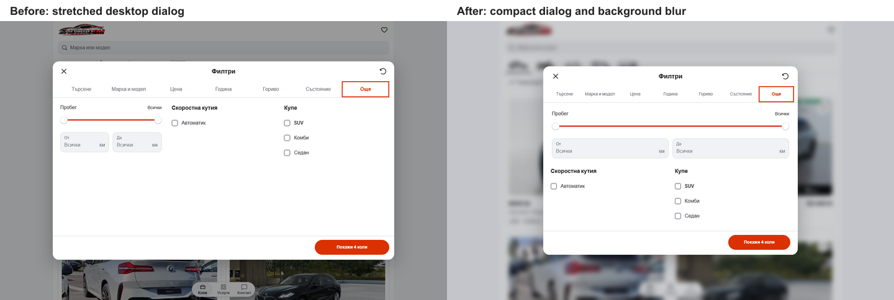

# Compact desktop filter editor

The previous container-width filter dialog was too stretched. It is now capped
at 820px and uses intrinsic content height, at most 680px or the viewport minus
48px. Price, Year, Fuel and Condition no longer sit in a large empty panel.
The dedicated make/model list retains a bounded scrolling area.

Seven compact tabs fit without horizontal scrolling from 700px. Their labels
wrap at spaces when needed. More places mileage across the first row and
transmission/body settings below in two columns. Desktop content has consistent
24px gutters and a 200px apply action in the fixed footer.

The filter dialog's native backdrop has an 8px blur and a light 22% dim on
desktop. The dialog stays sharp. Close, backdrop click, Escape, browser Back,
focus return and document scroll locking retain their existing behavior.

The phone layout remains full-screen, with scrolling tabs, stacked settings,
and a full-width action. Other dialogs retain their existing dimensions.

## Evidence

- Node 22: ESLint, TypeScript, 91 domain/localization tests and the production
  build passed. The final preview runs on `http://127.0.0.1:6474`.
- [Layout checks](layout-checks.json) cover 32 cases: all seven Bulgarian
  sections at 320/390px; Bulgarian Search/More at 700/1024/1440/1920px; all seven
  English sections at 1440px; and Services search at 320/390/1440px.
- [Browser verification](verification.json) covers Chromium and WebKit,
  keyboard tabs, cross-section drafts, filter application, Escape/focus return,
  Back cancellation, the end of the BMW model list at 700 by 500, and reachable
  footer/settings on short viewports. It also checks the actual desktop blur.
- Matched phone screenshots and geometry establish mobile preservation. Full
  raw measurements and intermediate captures remain in the task's ignored
  `runtime/mobile-filter-refine-20261004` directory.

| View | Before | After |
| --- | --- | --- |
| Search, 1440px | [Before](before-search-bg-1440.png) | [After](after-search-bg-1440.png) |
| More, 1440px | [Before](before-more-bg-1440.png) | [After](after-more-bg-1440.png) |
| More, 320px | [Before](before-more-bg-320.png) | [After](after-more-bg-320.png) |
| More, 390px | [Before](before-more-bg-390.png) | [After](after-more-bg-390.png) |

These checks establish the local result; hosted acceptance and dealer release
selection retain their separate workflow.
