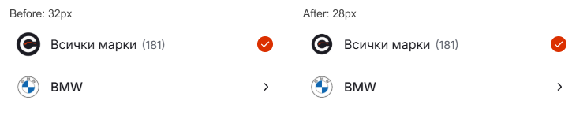

# Mobile platform logo: 28px

The Cars mark is centered at 28px inside the existing 32px alignment slot. Brand labels and selection marks retain their positions at 320px and 390px.

Source: `a45ae42e554f9e935333c5c1a963839d1a63cd4b`. Publishing mirror: `6809242ab93531e93dfa96c0f2e58b93119c7993`. The existing [live preview](https://cars-template-mobile.vercel.app/?filter=make&lang=bg) is READY at deployment `dpl_Hthc6GH126CJytuuGAmEy365bWSz`, with matching Git SHA and browser measurements.

Validation: production build (51 pages), lint, TypeScript, formatting, 95 domain/localization tests and 12 Chromium/WebKit browser scenarios at 320, 390 and 1440px in Bulgarian and English. The shared index, existing index lock and protected generated files are preserved. See [delivery evidence](delivery.json).
