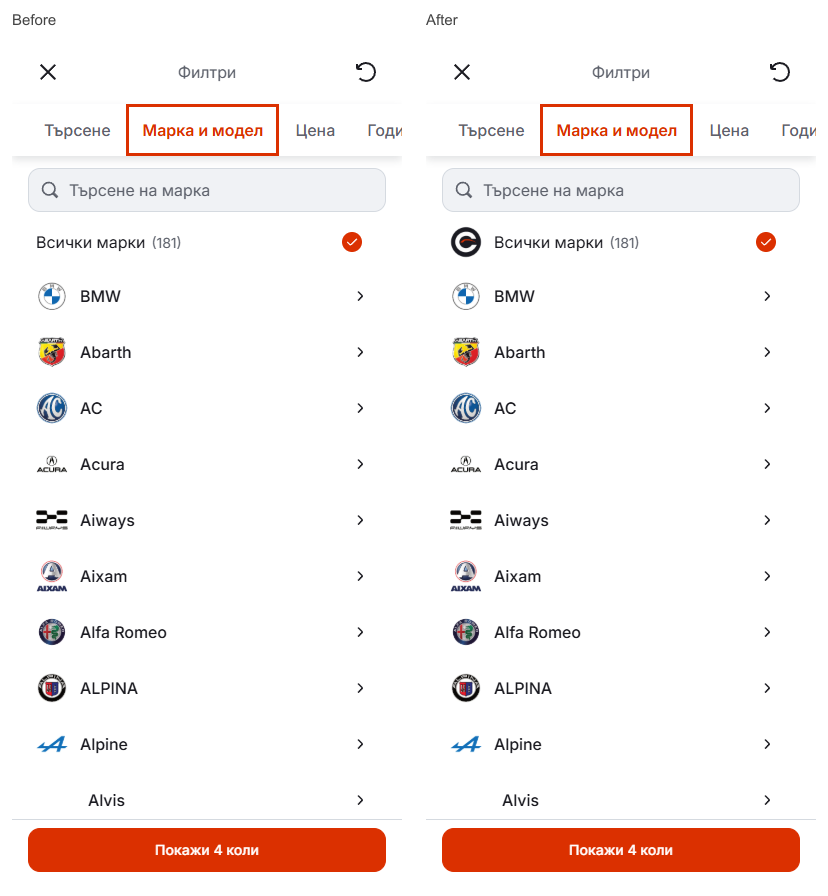

# Mobile all-brands row and local preview

The local preview was serving the earlier production build. It now runs in development mode from the canonical editable Mobile source at [6474](http://127.0.0.1:6474/?filter=make&lang=bg), with automatic refresh after source edits. Local browser checks confirmed the previous lighter card type, smaller filter heading and latest row alignment at 320/390px in BG/EN. Concurrent working-tree edits remain preserved.

The all-brands row previously omitted the 32px logo slot and used different right padding, leaving its checkmark 7px left of the disclosure arrows. The owner-requested generated Cars roundel now occupies the shared logo slot. A common 24px trailing column aligns the all-brands mark, brand arrows and model checkbox column; labels start at the same position. The count remains on one line at normal text size and can reflow when enlarged.

The original generated artwork is preserved in platform-mark-original.png. The served transparent PNG is 96px square, displayed at 32px, and 8141 bytes. It appears in the phone all-brands row; existing header artwork is retained.

Cars source: `77b31acf6e2a974b53454157bfc67b798cc59ed5`, subtree: `3f94fdb409cc35b1dff3e667699965eff39a7f9a`, digest: `d980088f16ea4e0ecfc23609a3bb8513134281b10f1af7f70f937dc2da5bf812`. Only the make-picker component/styles, existing QA expectations and new PNG changed. Publishing mirror `2edfe85a3e8c9030c7bf914889ad1ae76c87cc2f` triggered the existing standalone preview deployment `dpl_Bd4iJ2qwkNLc4tR58VKjZjZwNLCu`, now READY with matching Git metadata and the existing alias.

Node 22.20.0: lint, TypeScript, scoped formatting, 95 domain/localization tests and the 51-page production build passed. Twenty local Chromium/WebKit scenarios cover the make/model hierarchy, all-brands/logo/trailing-column alignment, focus, full-row taps, search, Reset and Apply. Eight hosted Reset/Apply scenarios and hosted make views at 320/390/1440px passed without captured errors. Four local checks cover restored card typography and 200% all-brands text. Matched desktop views retain their layout; comparison details are in desktop-comparison.json. Owner real-phone visual acceptance remains open.

The temporary exact-source QA server at 6475 was stopped. The canonical dev server at 6474 remains running. The shared Cars index, existing lock, older local HEAD `08c89d63f9e11939acd5b135ece4278252b80f43`, concurrent desktop/filter/configuration work and dealer/release state were preserved. This updates the existing standalone Mobile test preview.
