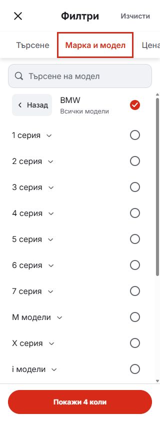
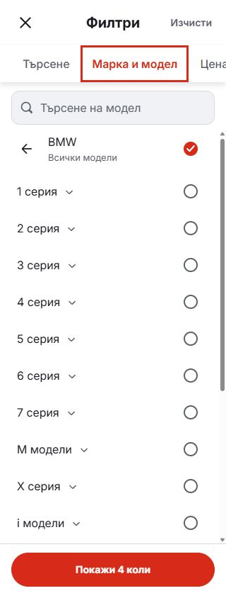

# Compact model-picker Back

The phone picker now uses the existing 20px back-arrow asset on a transparent 44 × 44px button. The visible Back text and permanent grey fill are removed, along with their unused typography and spacing styles. Pressed feedback, the localized accessible name and keyboard focus indication remain.

Back still leads the make label and preserves selections when returning to the brand list. Search remains full-width.

| Before | After |
| --- | --- |
|  |  |

Matched Bulgarian BMW captures at 320 × 844, with all models selected.

Validation: lint, typecheck, formatting, 95 domain/localization tests, production build and 12 Chromium/WebKit cases in Bulgarian/English at 320, 390 and 1440px. The rendered button dimensions and accessible name were also checked directly in the preview. Results are in [browser-verification.json](browser-verification.json).

Mobile candidate source and local preview only; no release-lock selection or dealer deployment.
