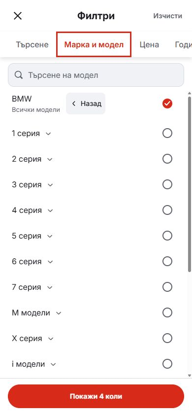
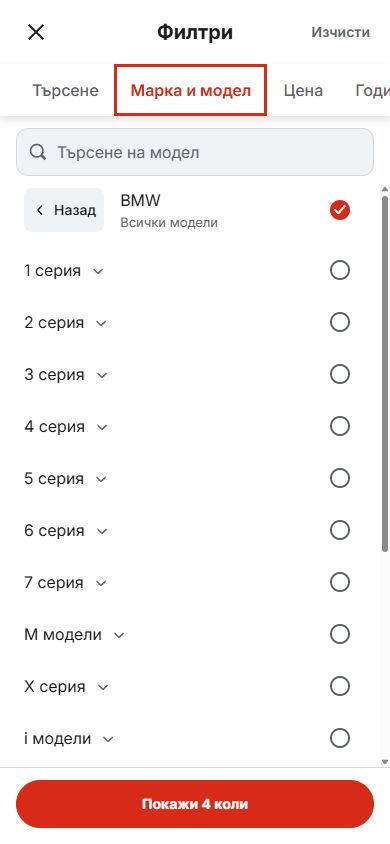

# Mobile model header: leading Back

Back now precedes the make label in the phone model picker. The make label fills the remaining row, and its selection circle stays at the trailing edge. The existing Back action preserves model selections, clears the search query and returns focus to the make row.

Search remains full-width. The button retains its localized accessible name, semantic button element and 44px minimum height. Desktop controls are unchanged.

| Before | After |
| --- | --- |
|  |  |

Both captures show the Bulgarian BMW picker with all models selected at 390 × 844. The only visual change is the leading Back position and corresponding spacing.

Validation: lint, typecheck, formatting, 95 domain/localization tests, production build and 12 Chromium/WebKit cases covering Bulgarian/English at 320, 390 and 1440px. Browser checks include the Back position, selection preservation, search width, focus restoration and draft/apply behavior. Results are in [browser-verification.json](browser-verification.json).

This updates the Mobile candidate source and local preview. It does not select a template release or deploy dealers.
