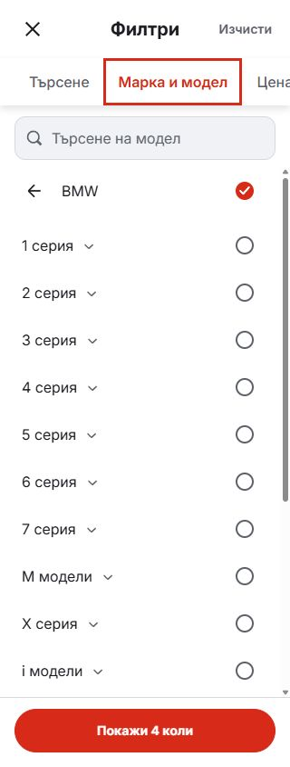

# Single-line make heading

The phone model picker now displays only the make name beside the back arrow. Removing the visible “All models” subtitle lets the make name share the arrow's vertical center. Its unused StyleX rule is removed as well.

The existing selection behavior and localized checkbox accessible name are retained. No replacement label is added to the row.

| Before | After |
| --- | --- |
|  |  |

Matched Bulgarian BMW captures at 320 × 844, with all models selected. Rendered header text and vertical centers were checked directly in the preview.

Validation: lint, typecheck, formatting, 95 domain/localization tests, production build and 12 Chromium/WebKit cases in Bulgarian/English at 320, 390 and 1440px. Results are in [browser-verification.json](browser-verification.json).

Mobile candidate source and local preview; no release-lock selection or dealer deployment.
