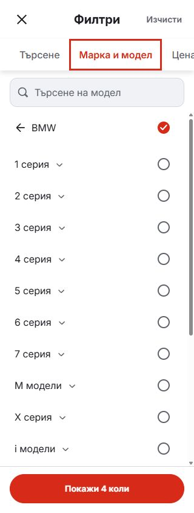
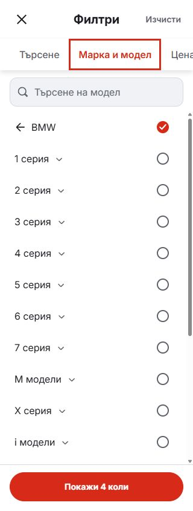

# Even model-picker row spacing

The phone BMW navigation row inherited an extra 8px bottom margin from the all-models preset style. Its center was 60px from the first model row, while subsequent rows were 52px apart.

The navigation row now uses only the shared family-row style. Removing the extra margin gives it the same spacing as the model rows below. This is a single class removal; the shared arrow/make button and selection behavior retain their previous implementation.

| Before | After |
| --- | --- |
|  |  |

Matched Bulgarian BMW captures at 320 × 844. Direct row measurements and responsive checks are recorded in [browser-verification.json](browser-verification.json).

Changed-component lint, formatting, 95 domain/localization tests, production compilation and build TypeScript checks passed. The local browser verified all 15 consecutive row offsets at 320 and 390px, no horizontal overflow, and the separate desktop picker at 1440px, with no console errors.

Mobile candidate source and local preview; no release-lock selection or dealer deployment.
