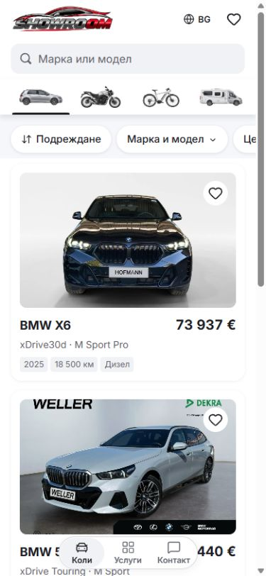

# Mobile quick-pill contrast

White pills on a white background still read as the same surface when their
shadow is reduced. Restore the earlier `0 1px 4px` pill shadow at 12% opacity
and use the existing `colors.stripe` token behind the inset quick-filter row
below 1024px. The pill faces retain their white fill and black selected state.

The header, vehicle-type rail and inventory canvas stay white. The rail keeps
its original shadow, underline, height and spacing. Desktop appearance and
flush filter rows retain their existing backgrounds.

| Before, 390 x 844 | After, 390 x 844 |
| --- | --- |
|  |  |

The previous shadow-only trial is preserved in
[the earlier comparison](../mobile-pill-under-shadow-20261005/README.md).
This follow-up adds contrast behind the pills instead of trying to make a
pure-white fill brighter through shadow adjustments.

Validation details are recorded in `browser-verification.json`. This is Mobile
source polish; release selection and dealer publication keep their existing
acceptance requirements.
