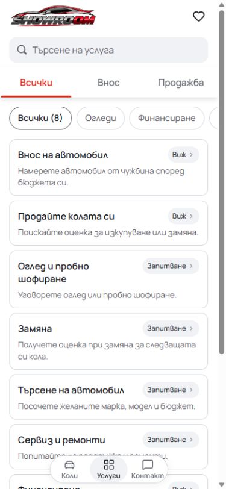
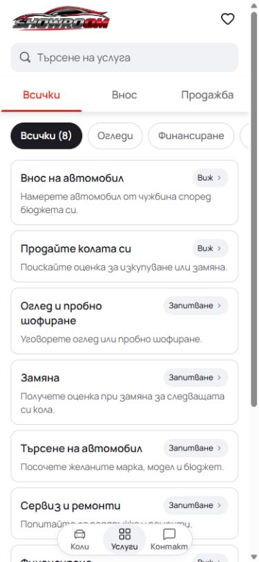

# Mobile showroom polish

The reviewed Mobile source uses a compact, labelled three-destination dock,
continuous white surfaces, neutral field focus, and a raised white tab strip.
Inactive quick-filter pills are white with thin borders; selected service filters
and applied inventory filters use the existing near-black text token with white
labels and icons. The active fill does not change pill dimensions or tab spacing.

The source also retains the completed audit fixes: grouped inventory facts,
accessible validation descriptions, Escape and focus restoration, truthful local
draft persistence feedback, and the revised vehicle summary. Product edits belong
in `templates/mobile` within Cars. `darkapoparka/cars-template-mobile` is the existing
private publishing mirror.

## Verification

- Node 22.20.0: ESLint, TypeScript, all 91 domain/localization tests, and the
  production build passed after the final active-pill change.
- Component formatting passed. Existing browser polish checks passed in Chromium
  and WebKit before the active colour change; the final focused checks verified
  selection changes, applied-price labels and icons, 48px targets, and no page
  overflow at 320, 390, and 1440 pixels, including Bulgarian and English.
- Matched before/after measurements confirmed that the active colours are the
  only changes in the service comparison; inactive pills and the tab rail match.

These are local standalone checks. This source commit does not select an immutable
dealer release or establish hosted acceptance. The selected five-design publisher
integration and release checks remain separate.

## Final visual comparisons

Both comparisons use Bulgarian at a 390 x 844 CSS viewport.

| White pill trial: before                       | White pill trial: after                         |
| ---------------------------------------------- | ----------------------------------------------- |
|  |  |

| Active pill: before                                | Active pill: after                            |
| -------------------------------------------------- | --------------------------------------------- |
|  |  |
