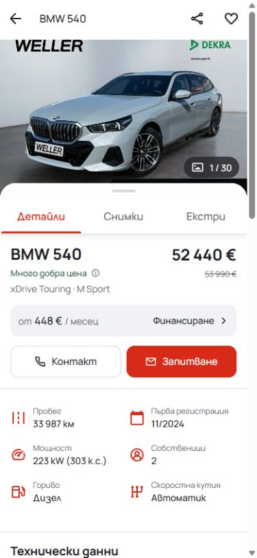
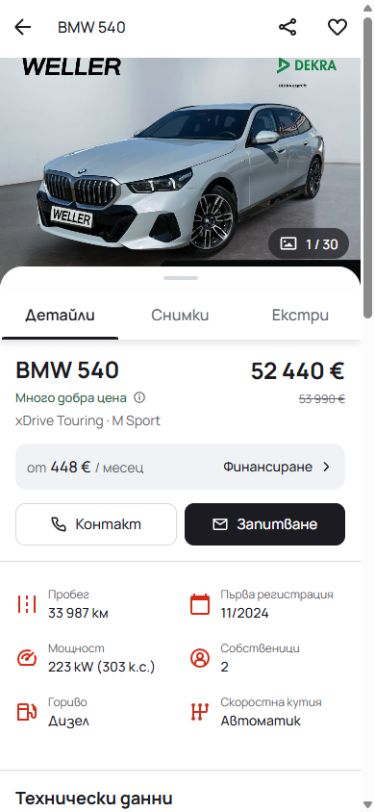
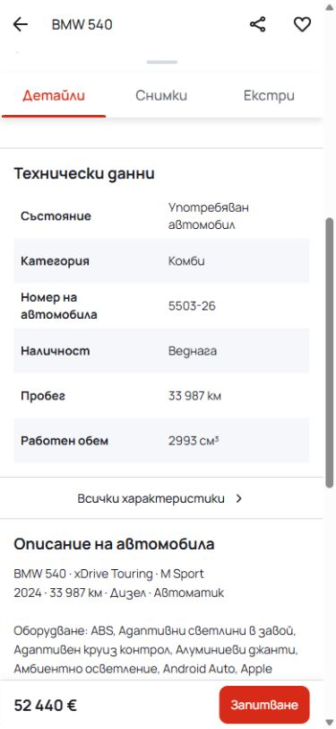
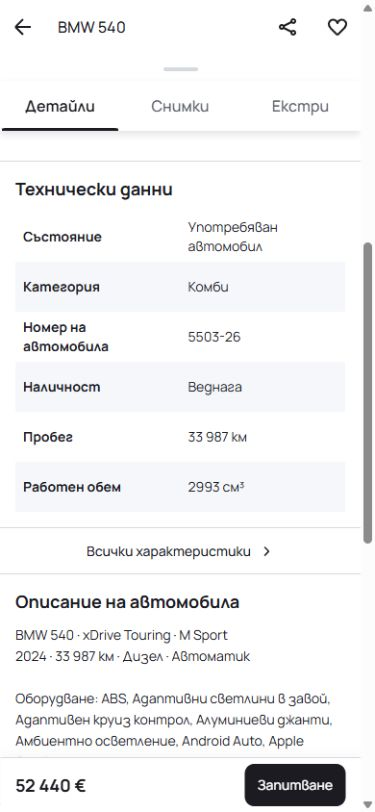
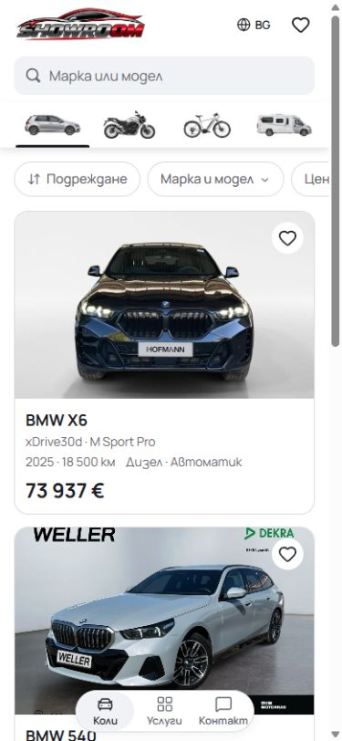
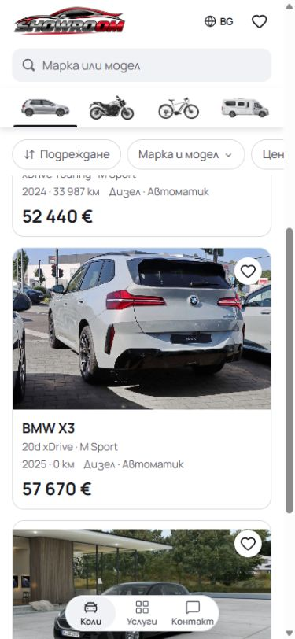
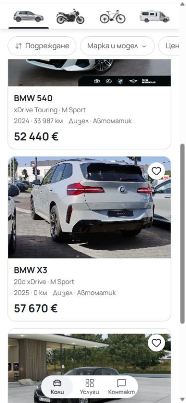
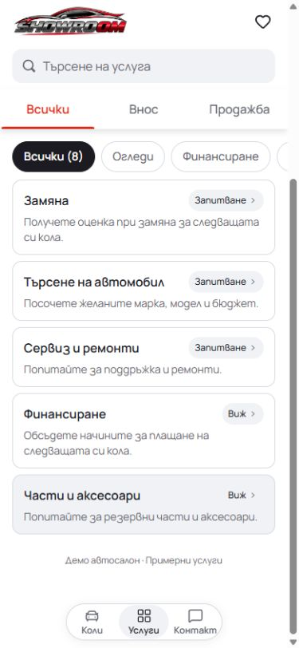
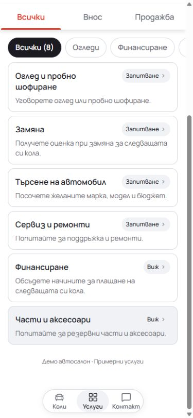

# Mobile browsing and enquiry polish

Cars and Services keep the logo and search in normal page flow. Only the category
tabs and quick-filter pills stay sticky, using native CSS. At 390 x 844 pixels,
the pinned area falls from 232px to 124px; the initial controls still end at the
same 232px position. The raised white tab rail retains its existing shadow.

The PDP retains its sticky Back/title header and information tabs. Details,
Photos and Features use neutral selected labels and underlines. Both enquiry
actions use the existing near-black text token with white text. The inline
Contact/Enquire row has 44px mobile targets, down from 48px; the fixed enquiry
target retains its existing 44px height. Larger-screen actions remain 48px.
The enquiry link keeps its vehicle context and a visible outside focus ring.

## Verification

- Node 22.20.0: ESLint, TypeScript, 91 domain/localization tests and a production
  build passed. The local production output is `.next-scroll-pdp-20261004`.
- Chromium and WebKit passed all 28 grouped polish checks. These include BG/EN
  rendering at 320/390/1440px, mobile sticky controls, filter dismissal with
  preserved scroll/focus, PDP keyboard tabs and enquiry targets, and the existing
  local-draft and validation regressions. No browser errors were recorded.
- The original local `next-env.d.ts` and `tsconfig.json` contents were restored
  byte-for-byte after the build; generated preview references are excluded from
  the product commit.
- These are local checks of the standalone source, separate from hosted and
  dealer release acceptance.

[Browser checks](browser-checks.json), [before measurements](before-metrics.json),
and [after measurements](after-metrics.json) retain the evidence.

## Matched comparisons

All screenshots use Bulgarian at a 390 x 844 CSS viewport. Cars and PDP scroll
comparisons use `scrollY = 633`; Services uses `scrollY = 306` in both captures.

| View                    | Before                                                        | After                                                       |
| ----------------------- | ------------------------------------------------------------- | ----------------------------------------------------------- |
| PDP overview            |                         |                         |
| PDP fixed enquiry       |               |               |
| Cars at the top         |             |             |
| Cars while browsing     |      |      |
| Services while browsing |  |  |
