# Mobile shared white canvas

Implemented and checked on 4 October 2026 (Europe/Sofia) at
[the local preview](http://127.0.0.1:6474/).

Cars, Services and Contact now use one continuous white page background,
including the header, sticky controls and desktop outer gutters. Light grey
identifies editable fields, filter pills and secondary actions. Existing photos,
spacing and headings provide grouping; the import starter retains its thin border.
This is the final white version after the owner rejected the intermediate grey
header/canvas direction. All `after/` captures show the final white version.

The owner subsequently identified lost card grouping on the white page. The
[card-boundary correction](../mobile-card-boundaries-20261004/README.md) adds thin
neutral borders while preserving this white canvas. Its captures show the current result.

## Source and implementation

Master: `L:/CODEX/cars/templates/mobile`, branch `main`, based on
`2c8a90cb38400b185d2c8a1de61efa379fd58a0e` with existing local work preserved.

- `colors.background` (`#ffffff`) owns page, header, cards and overlays.
- `colors.controlSurface` (`#f0f2f5`) owns fields, filter faces and secondary actions.
- `colors.stripe` remains available for small grouped content and alternating rows.
- Tab rails inherit their owning surface. Sticky containers remain opaque.
- The document canvas uses StyleX's existing shared token. The duplicate hardcoded
  HTML background and header override were removed.
- Shared inputs, Contact's textarea and numeric field containers use one field fill.

This pass changes color roles only: no new components, dependencies, navigation
behavior or control sizing. The baseline preview preceded the already committed
filter-row spacing adjustment `0d3211483`; that existing change is present in the
final build and is not part of this pass. Generated `next-env.d.ts` was returned to
its original references for the existing development preview.

## Validation

Pinned Node `22.20.0`, production build served on port 6474.

- `npm run check`: lint, TypeScript, 91 tests and production build passed.
- `npm run format:check`: passed.
- `scripts/qa-showroom-polish.mjs`: 22 checks passed, zero browser errors, Chromium
  and WebKit. Includes BG/EN routes at 320/390/1440px, enlarged dock labels,
  search cancellation/focus, specification-dialog focus, form validation and
  draft/storage behavior.
- TypeScript passed again after preserving the original generated type references.
- Rendered final pages, price controls, import form and detail were inspected.
  No document horizontal overflow was observed in the nine measured frames.
- Screenshot dimensions match within all eleven before/after pairs.

The captures use the same requested viewport and language for each pair. The
in-app browser excludes the Windows scrollbar and downscales normal-page exports:
390 × 844 produces 375 × 812 images; 320 × 844 produces 305 × 804 images;
1440 × 844 produces 1425 × 835 images. Full-screen dialogs export at 390 × 844.
See [measured dimensions](screenshot-dimensions.json),
[final DOM metrics](after/metrics.json) and [browser QA summary](qa-summary.json).
Existing user drafts were preserved; screenshot capture did not edit or submit forms.

## Before and after

| Screen and requested viewport | Before | After |
| --- | --- | --- |
| Contact · BG · 390px | 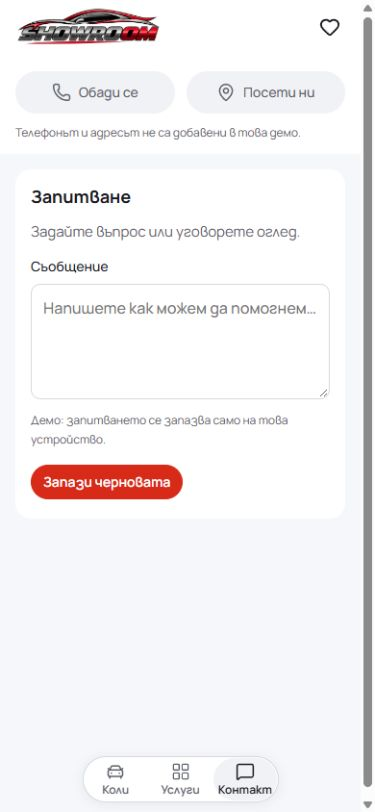 |  |
| Cars · BG · 390px |  |  |
| Services · BG · 390px |  |  |
| Price overlay · BG · 390px |  | 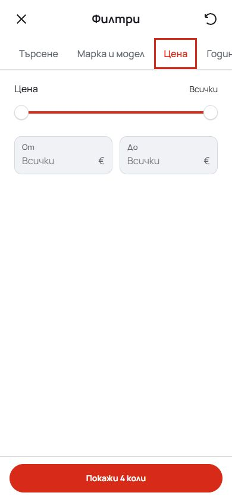 |
| Import · BG · 390px | 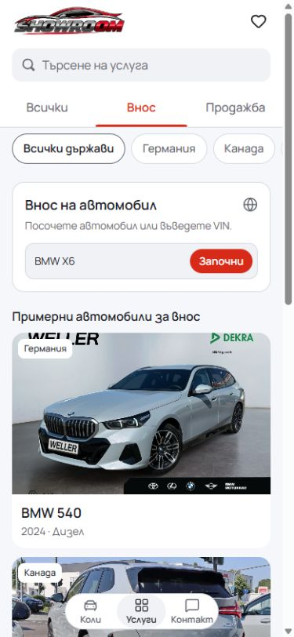 | 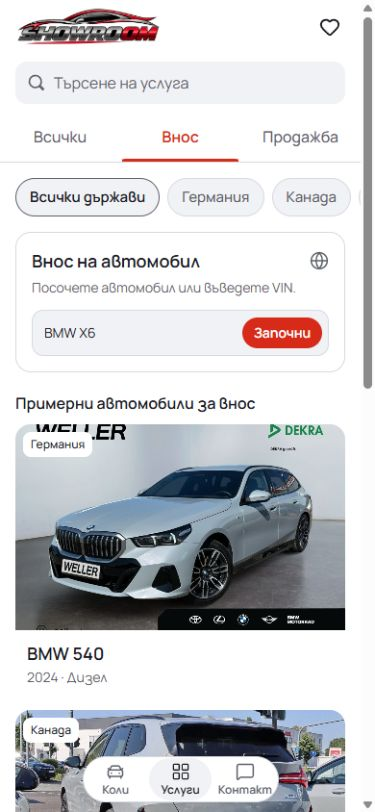 |
| Import enquiry · BG · 390px | 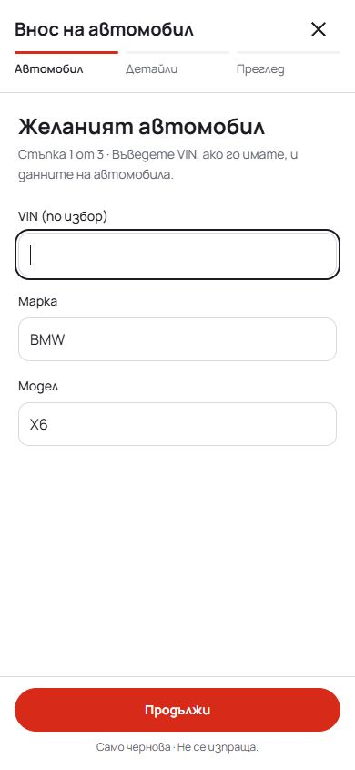 | 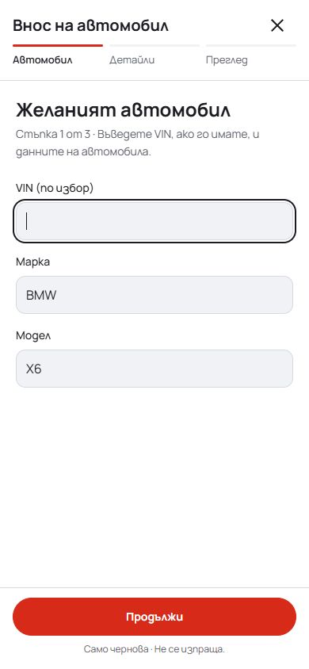 |
| Contact · EN · 320px | 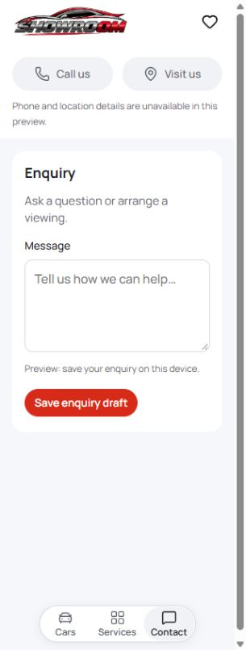 | 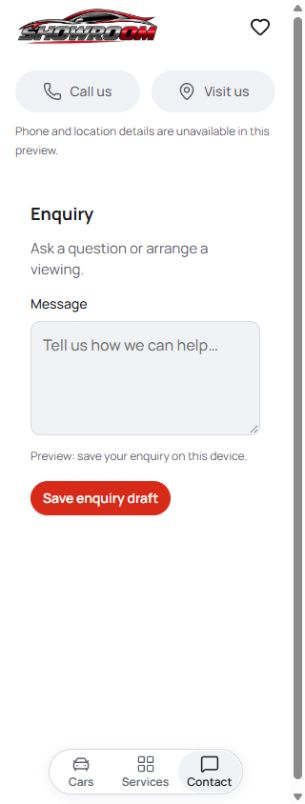 |
| Cars · EN · 320px | 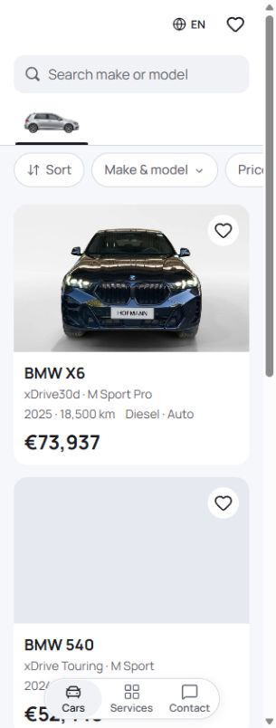 | 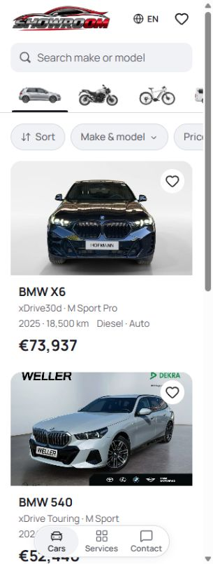 |
| Services · EN · 320px | 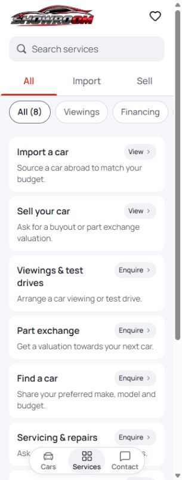 | 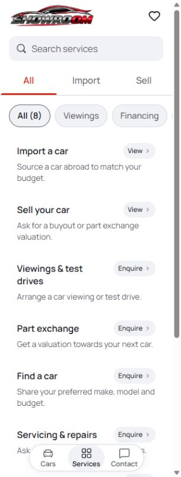 |
| Contact · BG · 1440px | 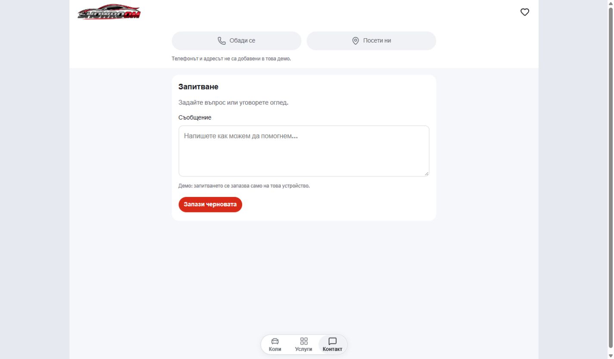 | 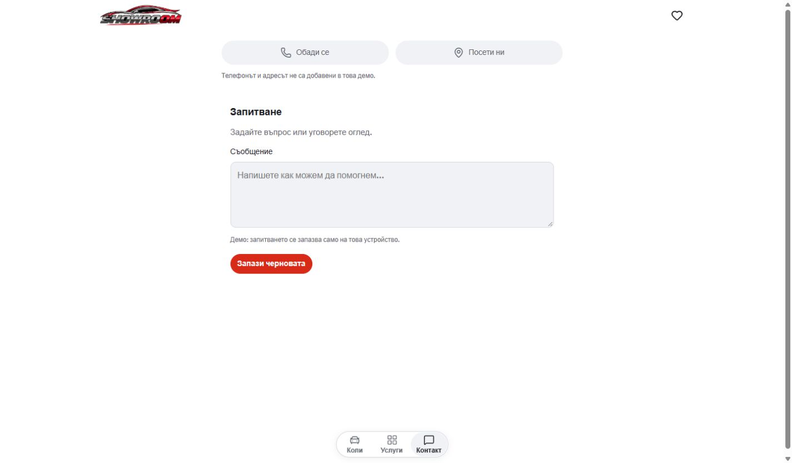 |
| Vehicle detail · BG · 390px | 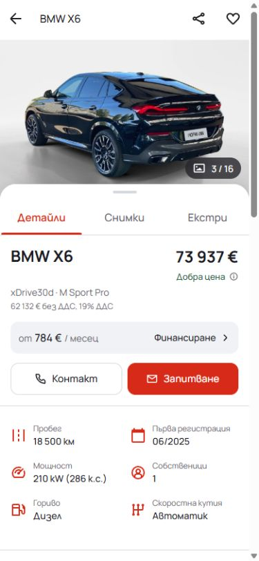 |  |

## Delivery state

The white version is running locally on port 6474. No hosted mirror, dealer copy
or immutable template release was updated by this pass.

At the end of this pass, the shared checkout's existing `.git/index.lock` prevented
safely staging and committing this change. The lock and unrelated work were left
intact. After the index became available, this change was included with the
card-boundary correction in a scoped source commit. The original surface-only
patch covering the twelve owned files remains preserved at
`runtime/mobile-surfaces-standardized-20261004/final/commit-ready.patch`; its
`git apply --cached --check` passed against the recorded HEAD. Original copies of
the twelve files and generated type references are retained under the same
runtime folder's `before-source/` for recovery. The earlier audit's
supersession note is local context in an already untracked report; avoid staging
that earlier report as part of this patch.
