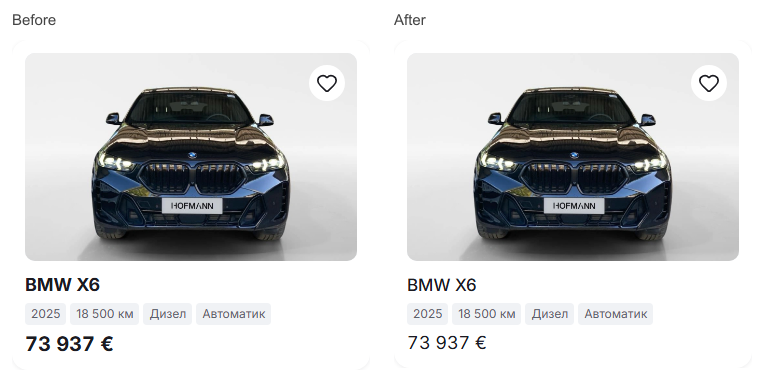
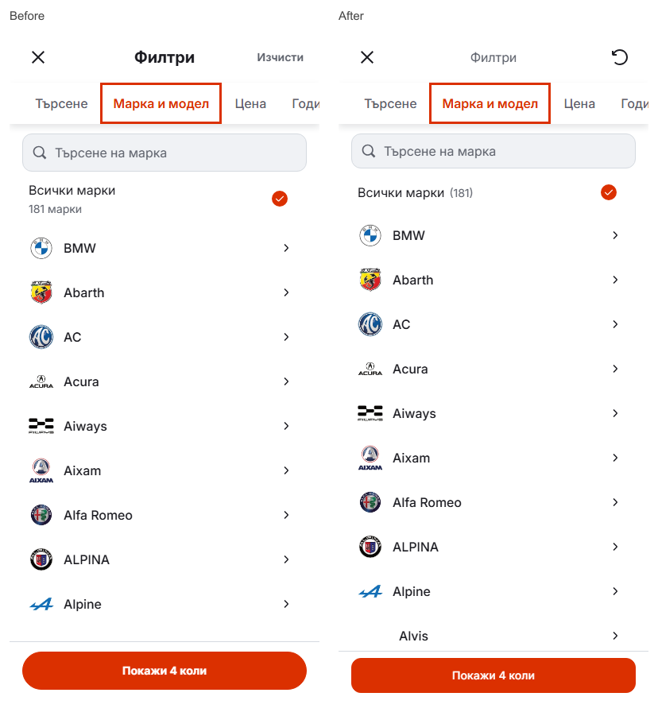

# Mobile card and filter sizing

Verified 5 October 2026 on the existing [live Mobile preview](https://cars-template-mobile.vercel.app/?filter=make&lang=bg).

At phone widths the card title changes from 18px bold to 17px medium, and the price from 20px bold to 18px regular. The filter caption becomes 16px regular. Reset becomes a 24px icon inside the same 48px target as Close, retaining its accessible name and existing reset behavior. The make picker shows **Всички марки (181)** on one row; its search field and all-makes row are 44px. The general search field was already 44px and keeps its dimensions. The apply button is 44px, medium weight, with a 12px corner radius and less surrounding vertical space.

Cars source: `9a547e0783f3ebf58646cf07a5518417f12d8b02`; template subtree: `43facb8197d8dacc1c8f044d9cf725ec9d75c2f9`; digest: `1d689f3e0cbc6730ea269b88cb4e7dae8f8f4eb69de157d6537caa43204c713c`. Only five component files and the existing search QA expectations changed. The publishing mirror `6eb83a290fbcca9d2c80201364af8a733e3d2113` binds this immutable source. Git triggered one production deployment, `dpl_74F1Nna6cuieodXiejEE3oMK4m81`, now READY, with matching Git metadata and the existing alias.

Node 22.20.0: lint, TypeScript, scoped formatting, 95 domain/localization tests and the 51-page production build passed. Twenty local Chromium/WebKit scenarios cover search draft/apply, make/model selection, keyboard focus, single-row count, Reset and Apply in BG/EN at 320/390px, with desktop search/make flows at 1440px. Eight hosted Chromium/WebKit Reset/Apply scenarios and nine hosted card/make/search views passed without captured browser errors.

Matched desktop captures show no changed pixels for the card or make overlay. The search overlay differs only at 13 antialiasing pixels by 1/255; no visible desktop change was found. Owner real-phone visual acceptance remains open.

The shared Cars index and its existing lock remain unchanged. The occupied checkout retains HEAD `08c89d63f9e11939acd5b135ece4278252b80f43`; the scoped source and evidence commits use separate indexes based on fetched main and non-force pushes. Concurrent desktop/filter, generated configuration, other template and dealer edits were excluded. The temporary exact-source QA server at 6475 was stopped; the working preview at 6474 remains running. This is the existing standalone test preview, with release locks and dealer deployment state unchanged.
