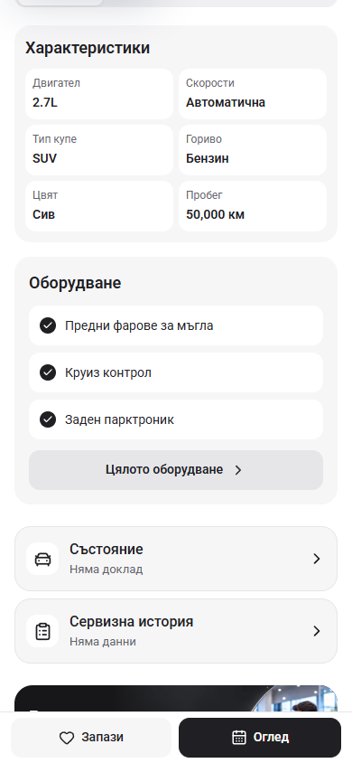
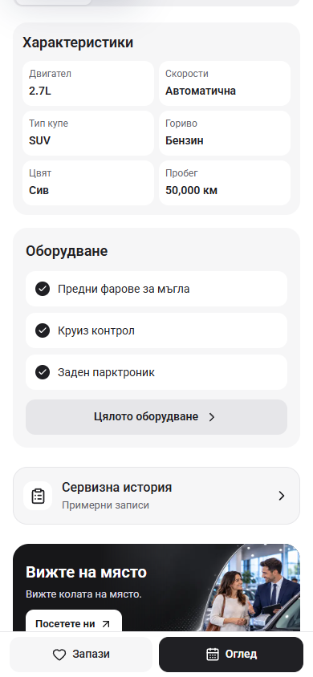
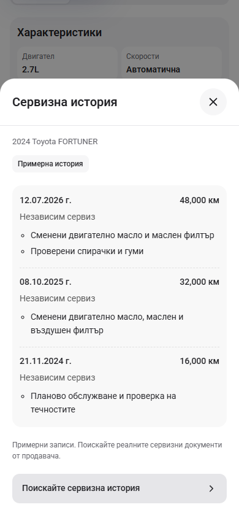

# Service history preview

The empty “Състояние” row has been removed from the current preview. An available, approved inspection report retains its reader and is labelled “Доклад от проверка”; the section navigation follows the same availability rule.

The Fortuner now has one Service History button opening three fictional service visits. Each visit shows its date, mileage, workshop and work performed. “Примерни записи” on the button and “Примерна история” inside the reader identify the sample data. Dates and kilometre labels follow the selected locale. The request action prepares an editable service-document enquiry.

Samples are restricted to the Fortuner in template mode. Provided records take precedence, other cars retain the missing-data state, and dealer mode receives no sample fallback. The reference approval setting remains disabled.

## Comparison

| Before | After |
| --- | --- |
|  |  |
|  |  |

Screenshots were captured before editing and after verification at 390 × 844, using the same route and section scroll position.

## Local Cars24 reference

The preserved source at `L:/inspiration/cars24` is running with Node 22.20.0 at <http://127.0.0.1:6484/cars/2024-toyota-fortuner-exr>. Its “Car Condition” opens an inspection checklist for exterior, engine/transmission, steering/brakes, electrical systems, interior and tyres. Its service section lists dates, mileage and service centres.

See [condition section](cars24-condition-390.png), [service section](cars24-history-390.png) and [inspection checklist](cars24-inspection-390.png).

A [carVertical report](https://www.carvertical.com/report) provides VIN-based vehicle history. Such a supplied report could have its own document link; this revision adds no provider badge, lookup or report claim.

## Verification

- `npm run check` passed with Node 22.20.0: ESLint, TypeScript and the optimized webpack build, including 407 generated pages. All eight source hashes match the final checked files; see [check result](check-result.json).
- Chromium passed at 320 × 740, 390 × 844 and 1440 × 1000 in Bulgarian and English. All three visits and four work entries render. Escape/Back return focus; background scroll is locked and Tab remains in the dialog.
- At 320 × 480 with doubled text, the reader scrolls, Close remains visible and the enquiry action is reachable. Both locales preserve the service-history request context and footer reserve. A second car retains the missing-document state. See [browser checks](browser-check.json).
- Data checks confirm supplied records override samples, dealer mode and unknown cars get no examples, Bulgarian dates/units render, and empty states inherit no reference defaults. See [data checks](data-check.json).
- The reference repository remains clean at `4b357aa96212b2b85629e6ff95dd503eb94f5907`. Next-generated reference metadata was restored. Existing App configuration changes and unrelated work were preserved. Recovery snapshots remain byte-identical with a non-source extension.

App preview: <http://127.0.0.1:6483/bg/cars/2024-toyota-fortuner-exr>
