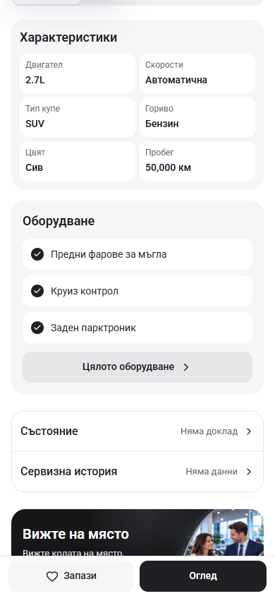
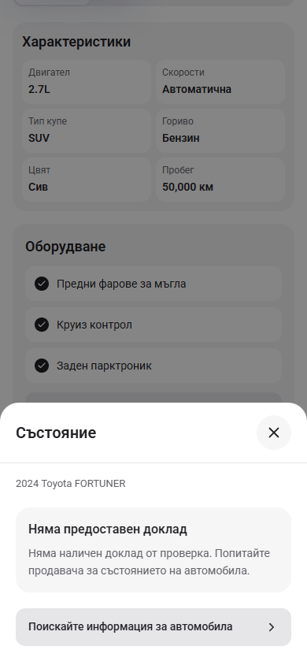
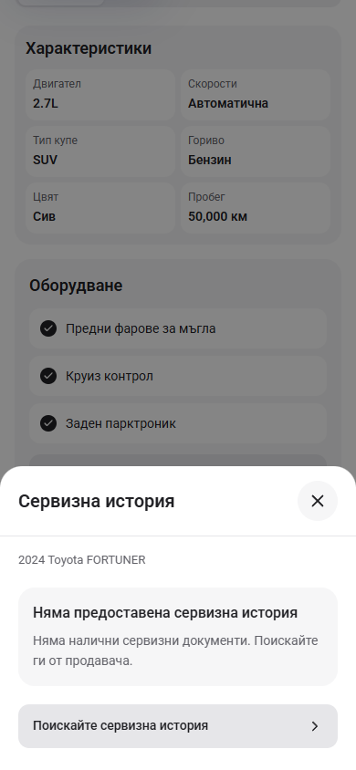

# PDP condition and service history

The two document rows are now separate, full-width buttons with an icon, status and chevron. Each opens a readable sheet instead of jumping directly into a generic enquiry. The Viewing action now has an 18px calendar icon beside its label, matching the Save icon size on mobile and desktop.

The sheet keeps its close button visible while long content scrolls. Supplied, approved inspection data reuses the existing checkpoint renderer with all groups initially expanded. Service visits retain their dates, mileage and workshop details. Requests include the selected document type in the editable enquiry draft.

This preview's reference approval remains disabled. The current car therefore shows the missing-document state and an enquiry action. No inspection result or complete service history is asserted for this car.

## Screenshots

| Original rows | Updated buttons |
| --- | --- |
|  |  |

| Condition sheet | Service history sheet |
| --- | --- |
|  |  |

Both comparison screenshots use a 390 × 844 viewport and the same section scroll position. The original comparison replays the saved pre-change PDP and below-fold files in this checkout; the final files were restored byte-for-byte and their hashes match the checked source.

## Verification

- Node 22.20.0: `npm run check` passed, including ESLint, TypeScript and the optimized webpack build (407 generated pages). The isolated build output preserves the running preview. All eight source hashes remained unchanged during the check and match the restored final files; see [check result](check-result.json).
- Chromium: both sheets at 320 × 740, 390 × 844 and 1440 × 1000; Escape, browser Back, return focus, background scroll lock, Tab containment, request transition and Viewing action passed. No horizontal clipping or browser errors; see [browser checks](browser-check.json).
- Bulgarian and English at 320 × 480 with doubled text: close control stays visible, body scrolls, request button is reachable, and the measured footer reserve covers the enlarged action bar.
- Static content checks with the retained Fortuner fixture rendered both service visits and all 62 inspection checkpoints. Missing data did not fall back to captured service records. This checks record content separately from the browser's unapproved, empty state; see [record content checks](record-content-check.json).
- The original `L:/cars-app` reference remains clean at `4b357aa96212b2b85629e6ff95dd503eb94f5907`. The pre-existing `next-env.d.ts` contents and unrelated changes remain preserved.

Preview: <http://127.0.0.1:6483/bg/cars/2024-toyota-fortuner-exr>

This change is local App template work. Template release selection and dealer deployment remain separate work.
