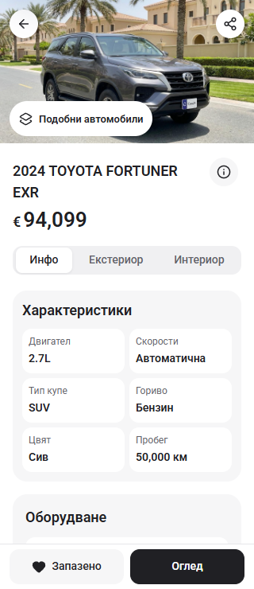
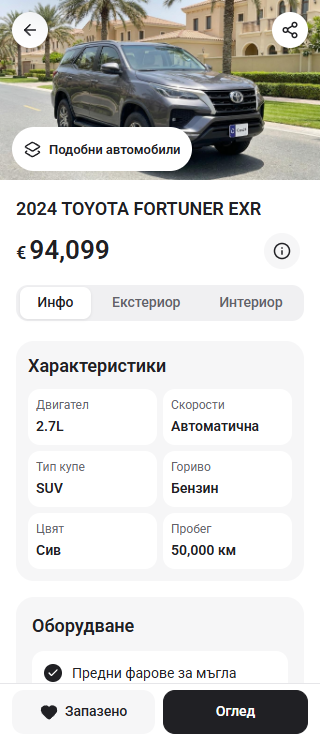
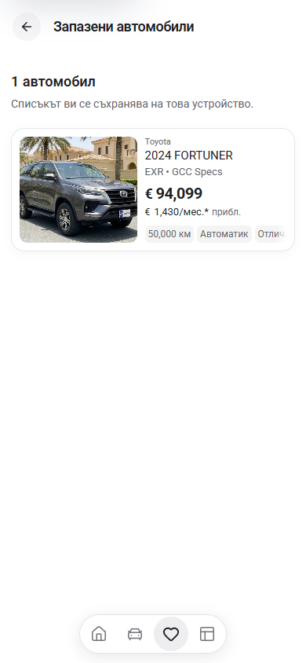
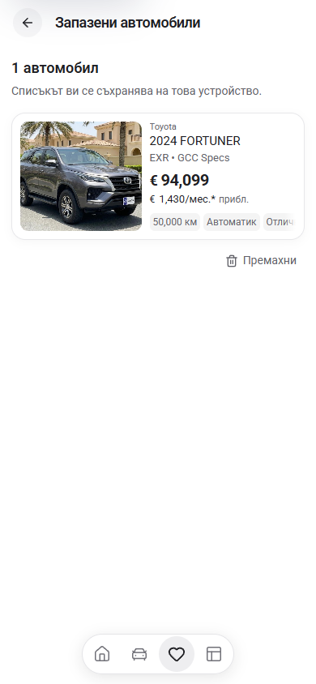
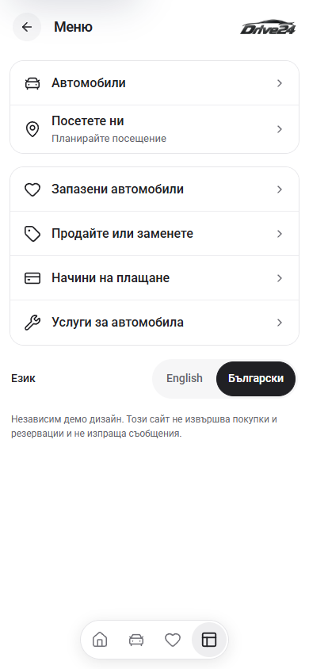
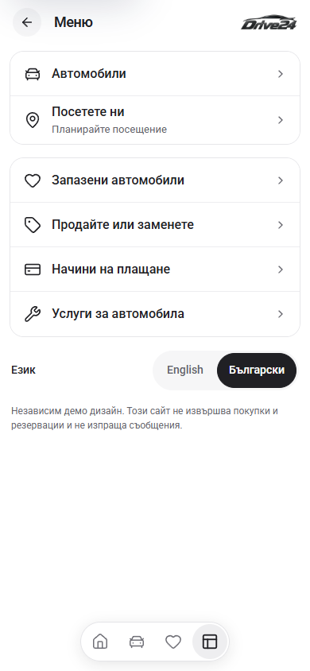

# PDP, Saved and More — final local review

Reviewed the preserved Cars24 detail and menu captures, then tested the maintained App candidate on `http://127.0.0.1:6483`. Home and Cars retain the accepted composition from the preceding pass.

## What changed

- **PDP:** moved price information beside the price. The 320px Fortuner title now fits on one line. The Save icon keeps its size with enlarged text, and the fixed action bar reserves its measured height plus 16px below the content. PDP and cards now use the same saved-state store.
- **Saved:** added a separate, 44px-high mobile Remove action below each card. The empty state explains that cars are saved from their detail page. The header is 56px at normal phone text size and grows for wrapped titles. The first card at 390px moves from y=163 to y=139. Removing a car preserves keyboard focus on the next item or Explore cars.
- **More:** retained the dealer menu and logo, reduced its phone header from 68px to 56px, and let the language choices wrap within the page when text grows.
- **Back:** a detail opened from Saved returns to Saved, including after a reload. Cars still restores its filters, sort order, URL and scroll position. Direct detail entry falls back to Cars.
- **Storage errors:** a failed save/remove shows a localized error and preserves the stored list. A removal explicitly removes the car rather than toggling a stale selection back on.

## Before and after

The same retained Fortuner fixture is used in both columns.

| PDP at 320px — before | After |
| --- | --- |
|  |  |

| Saved at 390px — before | After |
| --- | --- |
|  |  |

| More at 390px — before | After |
| --- | --- |
|  |  |

[PDP before at 390px](before-pdp-390.png) · [PDP after at 390px](after-pdp-390.png)

## Verification

- `npm run check` passed using Node 22.20.0: ESLint, TypeScript and the webpack production build; 407 pages generated. [Build result](check-result.json). The isolated build output lives on C:; the original `next-env.d.ts` and `tsconfig.json` bytes were restored.
- All three routes passed at 320×740, 390×844, 768×1024 and 1440×1000. Each also passed a 320px browser stress check with computed font sizes doubled. No viewport overflow, clipped primary controls or broken visible images were observed. [Layout measurements](layout-check.json).
- Saved: two cars saved through the PDP, persistence across reload, Saved → PDP → Back after reload, removal of each car, empty-state instructions and keyboard focus after removal. English language navigation also preserved the shortlist and return route.
- PDP: price sheet, gallery, viewing sheet and enquiry draft opened; Escape restored focus and body scrolling. Viewing was also checked at 320×480. The enquiry correctly remains an unsent draft.
- Quota failures on both Saved and PDP preserved the saved car and showed an error. The PDP error dismissed correctly, then the same removal succeeded when storage was available.
- Cars regression: nine Toyota results, price ascending, `?brand=Toyota` and scroll y=500 survived detail navigation and a detail reload. Direct-entry Back showed the full 48-car inventory.
- More: English/Bulgarian selection updated the route, document language and selected state. Menu links use the configured internal destinations.
- The isolated browser reported zero uncaught page errors. [Interaction results](interaction-check.json).

Reference evidence: preserved `L:/inspiration/cars24/reference/2026-09-26-parity/android-detail-loaded-427.png` and `L:/inspiration/cars24/reference/cars24/19-more.png`. The original reference checkout remains clean at `4b357aa96212b2b85629e6ff95dd503eb94f5907`.

These are local browser and build results using retained reference captures. Fresh native/physical-device parity and owner acceptance of these final pages remain separate. The App is still a template candidate; no dealer refresh, template promotion or deployment is included.
