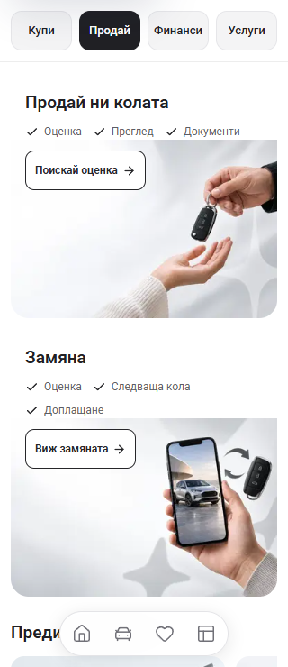
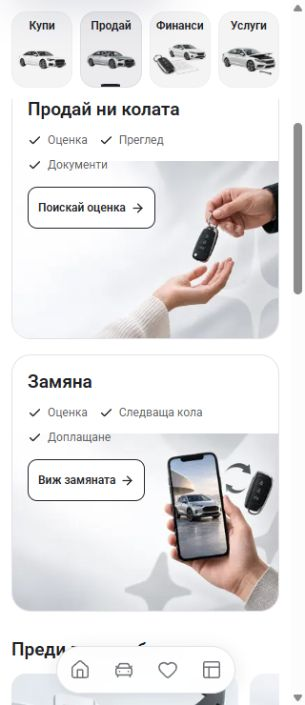
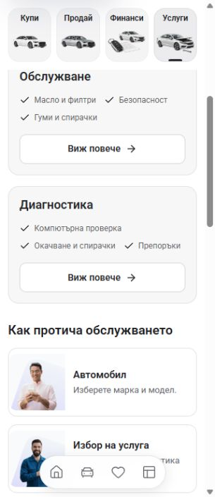

# Banner and service-card correction — 2 October 2026

The preceding mobile change detached the Sell heading and checkmarks above the image region. The service package cards also gave decorative black photo panels more space than the package information. The owner rejected both compositions.

## Source correction

- Sell uses one rounded, bordered banner. Its image fills the banner frame behind the heading, checkmarks and action. The photograph keeps `object-fit: contain` and bottom-right alignment without a subject-fading mask. The mobile action follows the checks rather than living in a separate image block. Checkmarks stay in the clear text area and wrap to two rows on phones, including 390px where the exchange list previously ran into the phone image. The frame's minimum height also responds to its font size.
- Service packages use compact neutral cards with a dark heading, three checks and one **Виж повече** button. The decorative image panel, repeated description and its unused styles are removed. The original artwork files remain preserved.
- The diagnostic check label becomes **Компютърна проверка**, avoiding repetition of the heading **Диагностика**. English uses **Advice** for the short recommendation label so its checks also fit two rows at 320px. Full package descriptions and checks remain available in their existing details sheets.
- Mobile header behavior and the Finance calculator are unchanged by this correction.

## Reference and evidence

The original Cars24 service page and the App service page were inspected in the user's existing in-app browser at a 356px viewport before the correction. Cars24 uses compact package cards with a title, checks and one action. This correction follows that hierarchy without adopting its captured inspection counts, intervals, guarantees or marketplace identity.

The retained [Sell before image](sell-before-320.png) and [Service before image](service-before-320.png) are copies of the previous change's actual 320px after captures. They show the source state at the start of this correction; they are not new after captures.

`npm run check` passed with Node 22.20.0: ESLint, TypeScript and the production build, generating 407 pages. The build used `.next-banner-card-correction-20261002`, separately from the running dev server, and restored the generated TypeScript configuration. See [build result](check-result.json) for source hashes and the unchanged-source check.

## Before and after

These are real browser captures at a nominal 320px viewport. The new in-app browser captures include its vertical scrollbar, leaving 305px of content width. The retained before captures used the previous browser's 320px content width. Images have not been composited or edited.

| Area | Before | After |
| --- | --- | --- |
| Sell |  |  |
| Services |  |  |

390px: [Sell](bg-sell-after-390.jpg), [Services](bg-service-after-390.jpg). Desktop: [Sell](bg-sell-after-1440.jpg), [Services](bg-service-after-1440.jpg). English mobile: [320px Services](en-service-after-320.jpg), [390px Services](en-service-after-390.jpg), [390px Sell](en-sell-after-390.jpg).

## Final visual and interaction verification

[Browser results](visual-checks.json) record twelve final layouts: Sell and Services, Bulgarian and English, at 320, 390 and 1440px. Text and buttons remain inside their cards, no horizontal overflow or clipped card text was found, all Sell photographs loaded, and every phone checklist uses two rows. The mobile service cards are about 175px tall.

Both service details sheets retain their full descriptions and checks, dismiss correctly and return keyboard focus to their View more button. Both Sell banner actions open the existing Sell details route, and browser Back restores Sell. No enquiries were submitted. No browser console errors were recorded.

Both local servers stopped during the session. The browser had replaced the unreachable page with a `data:` error page, which its automatic safety check refused to select. The App and reference servers were restarted with Node 22.20.0. Browser checks then used a fresh, normal HTTP preview without accessing the blocked error page or weakening the URL policy. Both servers and the affected HTTP routes were confirmed healthy.

These checks establish local browser and build behavior; physical-device testing, deployment and owner visual acceptance remain separate. Review the local App preview: [Sell](http://127.0.0.1:6483/bg/sell) and [Services](http://127.0.0.1:6483/bg/service). Port 6484 serves the retained Cars24 reference. Earlier intermediate captures remain preserved in the ignored task runtime directory.

No dealer refresh, deployment or template release was performed.
