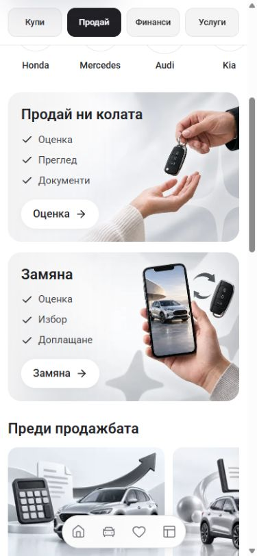
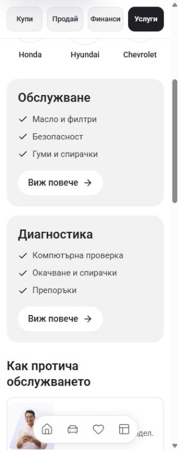
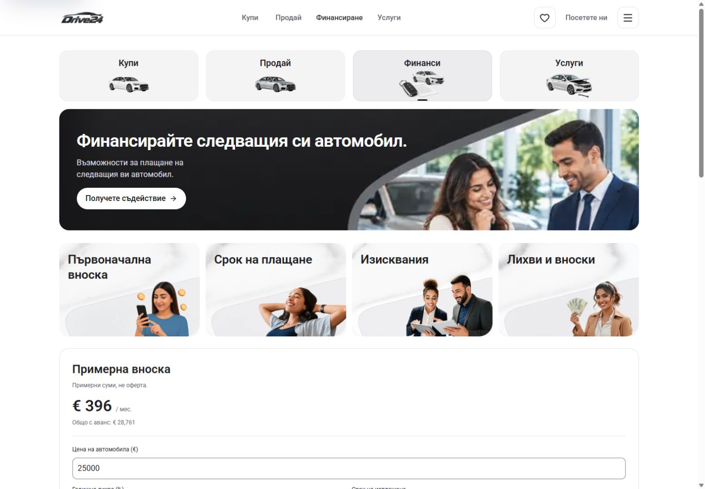

# App banner and card correction

Sell's mobile checklist placed two items beside each other in 12px text, while a forced 3:2 frame left spare space below the small outlined action. Selling and service cards now use separate checklist rows, readable 15px text and white 16px action pills without borders. Their height follows the content. Selling buttons show Оценка and Замяна while keeping descriptive accessible names.

Shared landing and Home promotional headings use 24px mobile text and 15px supporting copy. Shorter Home copy and proportional artwork keep subjects clear of the text. Desktop landing photography fills the banner with a deliberate crop; selling-card photography preserves the complete artwork. Tablet selling cards stack to accommodate the full Bulgarian checklist. Finance benefits use four compact desktop cards and two columns on phones and tablets. The existing black theme, dealer logo path and enquiry destinations remain in place.

The retained Cars24 Sell capture at `../sell-banner-continuity-2026-10-02/cars24-reference-mobile.jpg` supplied the vertical checklist and restrained card composition. This change does not claim native pixel parity or owner acceptance.

## Verification

- Node 22.20.0: `NEXT_DIST_DIR=.next-build-check npm run check` passed lint, TypeScript and the production build, including 407 generated pages. The active development output at `.next` stayed separate.
- Bulgarian and English Home, Sell, Finance and Services were checked at 320px, 390px and 1440px. Sell was also inspected at 768px; the vehicle-detail visit banner was inspected at 320px.
- The 26 retained viewport records in `verification.json` show no document overflow or broken visible images. No browser console errors were recorded.
- Sell hero and exchange actions open the existing vehicle-details draft. Service details expose the full package description and close with Escape, returning focus. Finance opens the dealer enquiry draft and closes with Escape. Home pagination selects finance and exchange promotions. The vehicle-detail visit banner opens `/bg/stores`.
- Local browser checks establish the changed presentation and interactions. Owner visual acceptance remains pending; dealer refresh and deployment are separate actions.

## Final views

