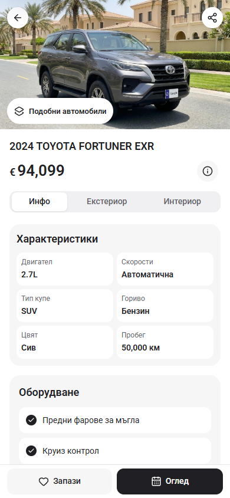
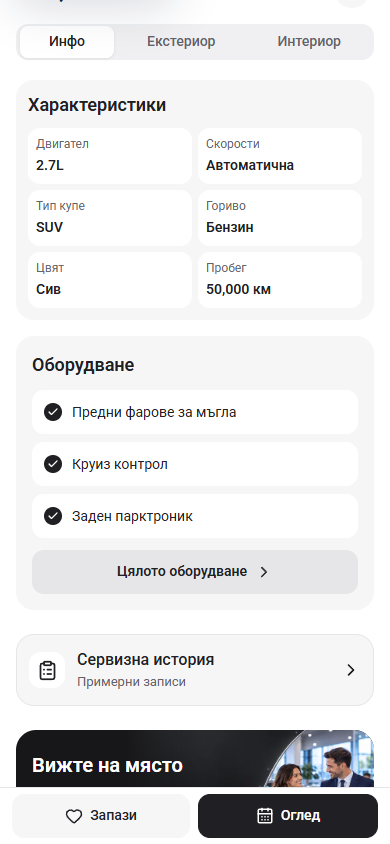
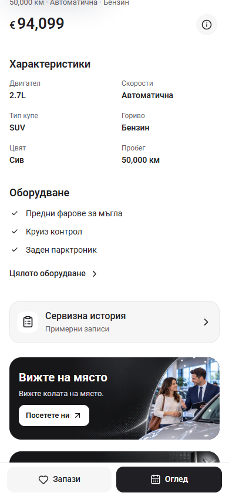
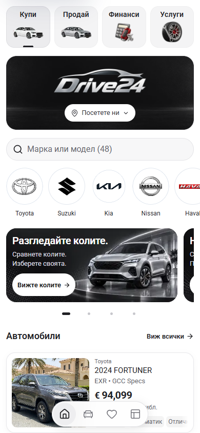
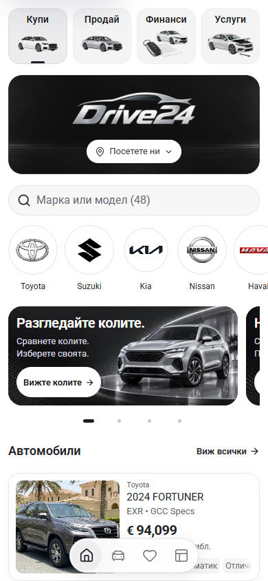

# Cars24-inspired PDP and Home polish

The PDP now uses photo-album thumbnails below the hero, a mileage/transmission/fuel summary below the title, a simple two-column specification list and unboxed equipment rows. Opening an album leaves the vehicle information on the page. Only populated albums appear; their counts match the existing photo viewer. The hero uses the same photo collection as the viewer and opens the currently displayed photo.

The normal phone hero is 8:5. Facts become one column when enlarged text needs the space. The Similar Cars action and photo counter share a row so they cannot overlap. Save/Viewing and the clearly labelled sample service-history reader retain their existing behavior.

Home's Finance and Services illustrations now follow the existing neutral automotive studio style, with shared image framing. The Finance document/key were enlarged after inspection at actual tile size. Dealer identity, contact configuration, home section order, manufacturer artwork and the car list are preserved.

## Before and after — 390 × 844

| Before | After |
| --- | --- |
|  |  |
|  |  |
|  |  |

The before captures were taken before source changes in this task. Each pair uses the same route, language and viewport. Facts captures use the same Overview anchor offset.

## Validation

- `npm run check` with Node 22.20.0 passes ESLint, TypeScript and the webpack production build; 407 pages generated. The build uses a separate output directory and preserves the pre-existing Next-generated configuration. See [checked source hashes](check-result.json).
- 19 rendered layout cases cover BG/EN Home and PDP at 320, 390 and 1440 pixels, plus 320 × 480 with doubled text and a single-photo listing. Primary elements and visible images stay within the page; the fixed action bar has enough reserved space. Enlarged facts use one column.
- 15 interaction cases cover album counts/first images, next-photo navigation, focus containment/return, Escape and browser Back, information remaining available, sample history, Viewing and return to filtered inventory. See [browser verification](browser-check.json).
- Dealer mode uses only supplied listing photos. The retained Fortuner reference album is restricted to template mode; supplied photos take precedence and other cars receive no sample album. See [data checks](data-check.json).
- The old Info/photo switcher is replaced by `VehiclePhotoAlbums`. Recovery copies remain preserved with non-source extensions; no check exclusions were added.

## Generated illustration sources

The built-in image generation tool produced these illustrative navigation assets; they do not depict actual stock or dealer facilities. Original PNGs and alpha-preserving 480 × 320 WebP derivatives are saved in the project:

- [Finance source](../../public/showroom/navigation/finance-v4.png), [Finance runtime asset](../../public/showroom/navigation/finance-v4.webp).
- [Services source](../../public/showroom/navigation/service-v3.png), [Services runtime asset](../../public/showroom/navigation/service-v3.webp).
- [Exact generation and refinement prompts](../../public/showroom/navigation/PROMPTS.md).

App preview: <http://127.0.0.1:6483/bg/cars/2024-toyota-fortuner-exr>. Preserved Cars24 comparison: <http://127.0.0.1:6484/cars/2024-toyota-fortuner-exr>.
