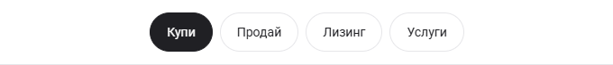
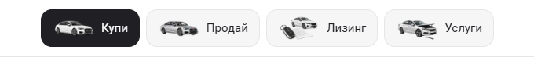

# Desktop header artwork preview — 5 October 2026

The owner asked to see the shared desktop navigation with the original service illustrations beside slightly larger labels. The existing Buy / Sell / Leasing / Services routes now use 48px buttons, regular 15px labels, soft 14px corners and the original artwork from `showroom.services[].image`. The charcoal active state remains. The shared header stays 73px tall, with the configured logo and Saved/Call/Menu controls in their existing positions.

The four pictures are decorative (`alt=""`, hidden from accessibility names), rendered through AppImage and the existing mounted asset boundary. No artwork was generated, altered or replaced. Phone/tablet navigation and the desktop banner, search, filter and vehicle compositions are retained.

This is a local source preview for owner review, not an immutable template release or dealer deployment. Before captures are App at Cars HEAD `68f7c6005122e4617646cd7bfbb8747ddfec5da7`; after captures use the header-artwork candidate. Both phases use matched routes, dimensions, locale, reduced motion and dismissed welcome state.

## Header detail

Before:

After:

## Matched screens

| View | Before | After |
| --- | --- | --- |
| BG Home, 1440 × 1000 | [Before](home-bg-1440-before.png) | [After](home-bg-1440-after.png) |
| BG Home, 1100 × 1000 | [Before](home-bg-1100-before.png) | [After](home-bg-1100-after.png) |
| EN Home, 1100 × 1000 | [Before](home-en-1100-before.png) | [After](home-en-1100-after.png) |
| BG Home, 1099 × 900 | [Before](home-bg-1099-before.png) | [After](home-bg-1099-after.png) |
| BG Home, 390 × 844 | [Before](home-bg-390-before.png) | [After](home-bg-390-after.png) |
| BG Home, 320 × 844 | [Before](home-bg-320-before.png) | [After](home-bg-320-after.png) |

Capture metadata: [before](before-capture.json), [after](after-capture.json).

## Verification

[21 focused checks](verification.json) passed: three exact phone/tablet screenshot and visible-text/geometry comparisons, three desktop checks preserving content below the header, twelve keyboard-navigation/active-state/artwork/header-fit checks across all four journeys in BG at 1100/1440px and EN at 1100px, and three layout checks reserving room for the optional configured Call control without inventing a destination. Header artwork loads in all tested desktop states, the links retain their text names and 48px targets, and no document overflow or browser errors were observed.

[Preservation results](preservation.json) record zero changed pixels at 320, 390 and 1099px. All twelve full screenshots are free from visible broken images, overflow and browser errors. The main page content below the header retains its text and measured geometry in all three desktop capture cases.

Final `npm run check` passed on Node 22.20.0: ESLint, TypeScript and the production webpack build with 407 generated pages. The build used the isolated `.next-build-check` directory; `next-env.d.ts` was restored to its exact preimage. See [the check receipt](check.txt).
