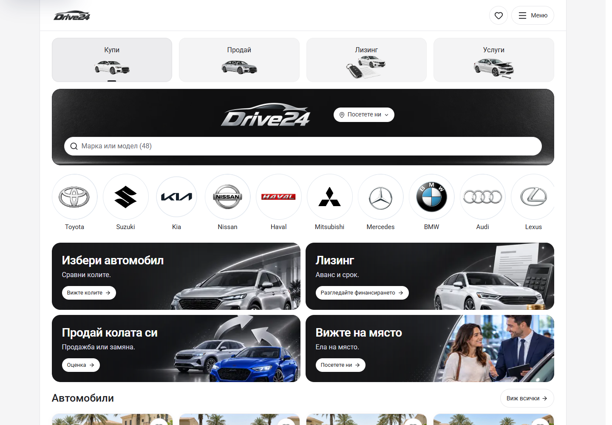
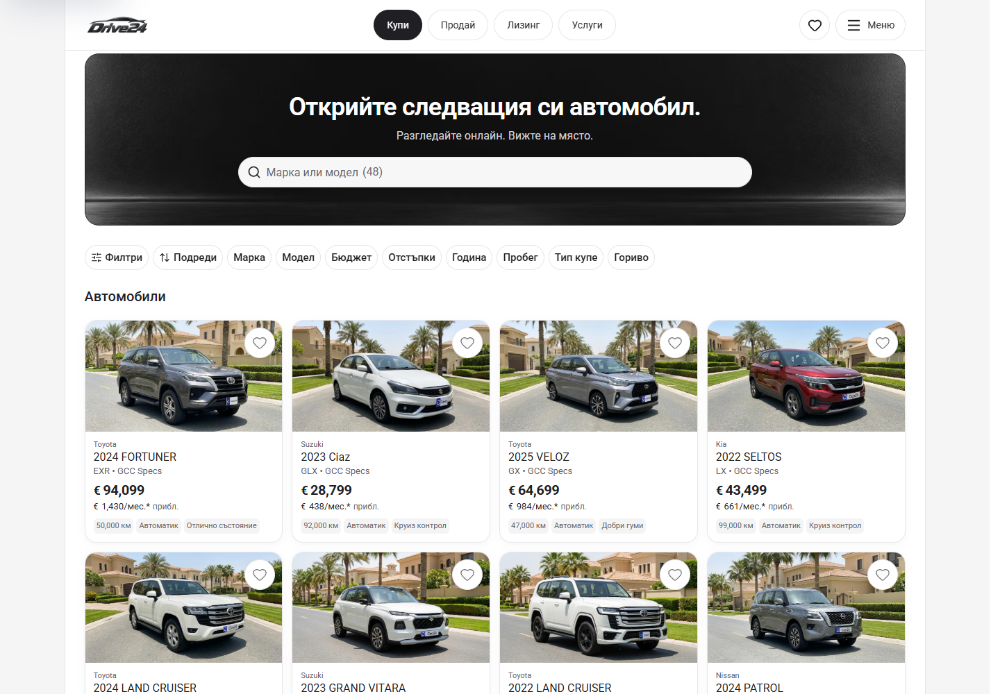
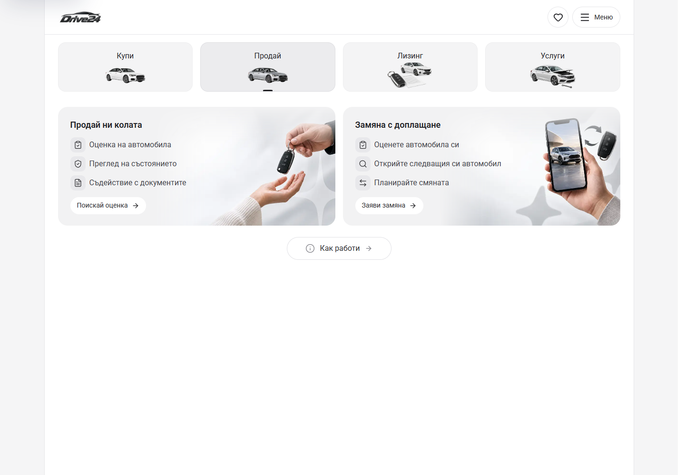
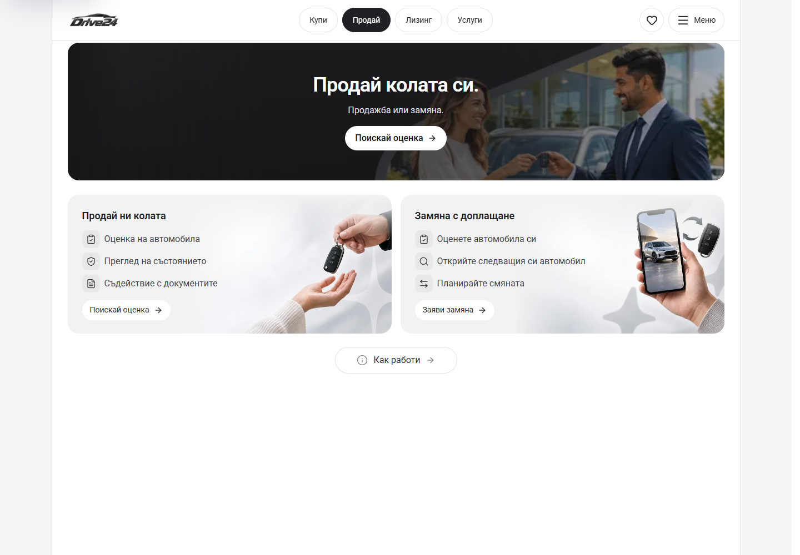

# Desktop journeys and direct Buy inventory — 5 October 2026

The owner requested visible Buy / Sell / Leasing / Services navigation and a simpler desktop discovery sequence. From 1100px, the shared white logo header now carries four button-shaped journey links, an active state and the retained Saved, configured Call and Menu controls. The existing square shell, top alignment and hidden desktop dock remain intact.

Buy starts with a centered 248px banner containing its title, one line of supporting text and live stock search. The dealer logo remains in the header. The Home make circles, promotional service cards and extra recent/collection sections remain available on phone/tablet; desktop moves directly from the banner to quick filter/sort pills and a four-column photo-first inventory. Search, counts, filters, sorting, empty/reset states and restored detail-page return state reuse InventoryClient. Desktop inventory mounts only while the viewport is at least 1100px, so the existing narrow Home owns its controls and history behavior. The skip link selects the visible main landmark.

Sell adds a matching banner with its existing valuation action above the retained sale and trade-in cards. Leasing and Services center their existing title, supporting line and CTA in the same banner dimensions. Existing artwork and enquiry/calculator/service journeys are retained. The desktop-only Sell artwork loads lazily so its hidden phone/tablet banner does not preload an extra image.

Reference: [Turo's homepage](https://turo.com/) places its primary search with the hero and follows it with discovery controls and vehicle results. This implementation uses the App's existing dealer identity, cards, artwork and interaction owners.

Preview: `http://127.0.0.1:6483/bg`. These are local source/browser results; owner visual acceptance, immutable template release selection and dealer deployment remain separate.

## Matched screenshots

Before is Cars App at HEAD `dfd85eeda429f3f64de40484d0a0576ef4f0712d`. After is the desktop journey candidate. Both phases use matched routes, viewports, locale, reduced motion and dismissed welcome state. All 52 captures have no document overflow, visible broken images or browser errors.

| Main page, BG, 1440 × 1000 | Before | After |
| --- | --- | --- |
| Buy | [Before](home-1440-before.png) | [After](home-1440-after.png) |
| Sell | [Before](sell-1440-before.png) | [After](sell-1440-after.png) |
| Leasing | [Before](finance-1440-before.png) | [After](finance-1440-after.png) |
| Services | [Before](service-1440-before.png) | [After](service-1440-after.png) |

| Other desktop views | Before | After |
| --- | --- | --- |
| Cars, BG, 1440 × 1000 | [Before](cars-1440-before.png) | [After](cars-1440-after.png) |
| PDP, BG, 1440 × 1000 | [Before](pdp-1440-before.png) | [After](pdp-1440-after.png) |
| Buy, EN, 1100 × 1000 | [Before](home-en-1100-before.png) | [After](home-en-1100-after.png) |
| Sell, EN, 1100 × 1000 | [Before](sell-en-1100-before.png) | [After](sell-en-1100-after.png) |
| Leasing, EN, 1100 × 1000 | [Before](finance-en-1100-before.png) | [After](finance-en-1100-after.png) |
| Services, EN, 1100 × 1000 | [Before](service-en-1100-before.png) | [After](service-en-1100-after.png) |

| Buy before | Buy after |
| --- | --- |
|  |  |

| Sell before | Sell after |
| --- | --- |
|  |  |

## Preservation evidence

[16 phone/tablet comparisons](preservation.json) cover all four main pages in BG at 320, 390 and 1099px, plus EN at 390px. Visible heading/control text and element geometry match. Banner-container textContent is excluded from text comparison because it includes the newly hidden desktop title; its geometry and individual visible headings/controls are checked separately.

Pixel differences outside photographed content are zero above a one-channel tolerance. Reference photograph boxes and three unchanged generated photograph regions are excluded for browser image decoding variance. The latter regions are recorded in [preservation-photo-boxes.json](preservation-photo-boxes.json); observed differences lie within the Services catalogue photos at 320/390px and the first import-car photo at 390px. Home, Sell, all 1099px captures and all EN phone captures match exactly outside photographed content.

Capture metadata: [before](before-capture.json), [after](after-capture.json).

## Verification

[90 focused browser checks](verification.json) passed without browser errors: 36 shared-shell/navigation checks across 18 routes in both locales, 32 main-banner/layout checks at 1100, 1280, 1440 and 1920px in BG/EN, and 22 interaction checks. The latter cover live stock search and actual counts, all eight quick-filter categories, filter application/focus restoration, sorting, empty/reset states, PDP Back after a detail reload, the visible-main skip link, resizing between desktop and mobile, Sell draft continuity, the illustrative Leasing calculator, and Services navigation.

The 16 matched phone/tablet preservation comparisons above passed. No inventory, dealer identity, approved image assets, publishing configuration or release lock was changed.

Final `npm run check` passed on Node 22.20.0: ESLint, TypeScript and the production webpack build, including 407 generated pages. The build used the isolated `.next-build-check` directory, and the generated `next-env.d.ts` was restored to its exact preimage afterward. See [the check receipt](check.txt).
