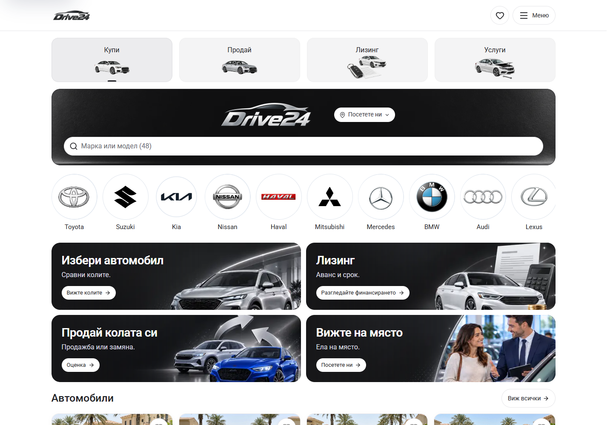
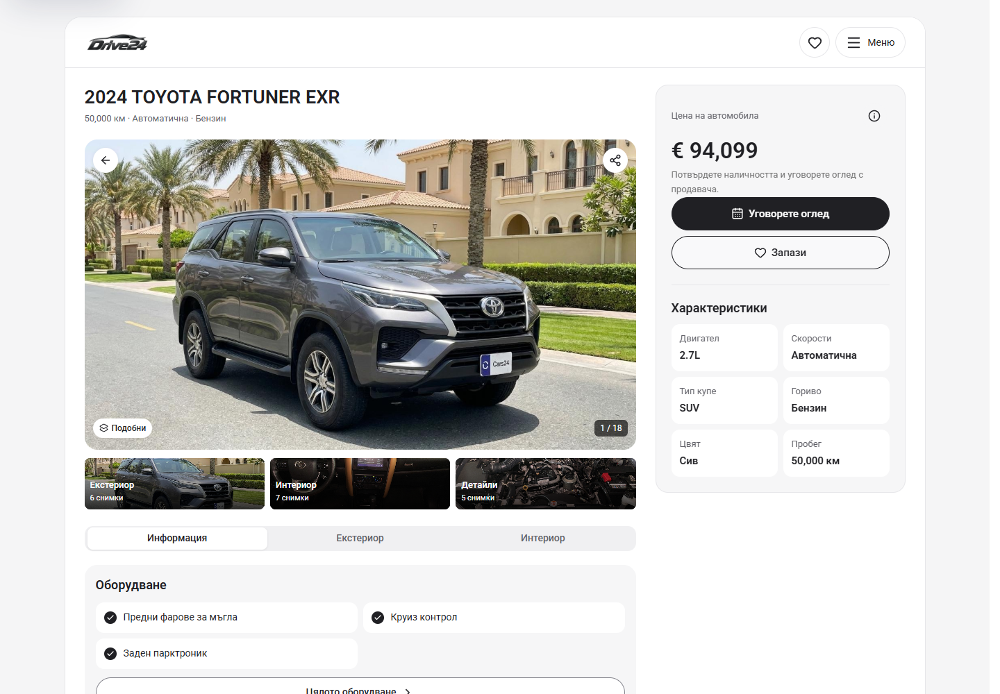
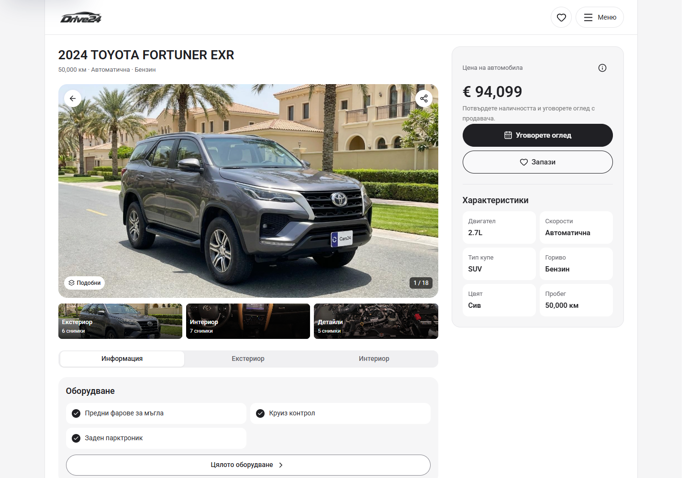

# Shared desktop shell — 5 October 2026

The owner requested the same shell across the entire App, reaching the top of the desktop viewport with square outer edges. From 1100px, AppShell now encloses the existing dealer header and every route in one white column, up to 1240px wide, with quiet grey side gutters. There is no outer rounding, top gap or bottom margin. The header keeps the configured logo and Saved, configured Call and Menu buttons. The desktop dock remains hidden.

Home, Cars, Saved, Sell, Finance, Services, Menu, Stores and vehicle detail journeys share this boundary. Existing cards, artwork, copy and controls keep their composition. Vehicle specifications remain below the price and viewing controls in the right PDP column. A shared inset token aligns fixed vehicle-section navigation and gallery/inspection action bars with the inside edges of the column. Phone and tablet layouts are preserved.

Preview: `http://127.0.0.1:6483/bg`. These are local source and browser results. Owner visual acceptance, template release selection and dealer deployment remain separate.

## Matched screenshots

Before is the local PDP-only rounded shell candidate immediately before this correction, based on Cars HEAD `4a60675574ec1d312c82df8d6caed3cd954a12e8` plus its uncommitted PDP changes. After is the shared square shell candidate. Both phases use matched routes, locales, viewports, scroll targets, reduced motion and dismissed welcome state. Saved captures use the same one-vehicle fixture in their isolated browser contexts.

| Desktop view | Before | After |
| --- | --- | --- |
| Home, BG, 1440 × 1000 | [Before](home-1440-before.png) | [After](home-1440-after.png) |
| Cars, BG, 1440 × 1000 | [Before](cars-1440-before.png) | [After](cars-1440-after.png) |
| Saved, BG, 1440 × 1000 | [Before](saved-1440-before.png) | [After](saved-1440-after.png) |
| Sell, BG, 1440 × 1000 | [Before](sell-1440-before.png) | [After](sell-1440-after.png) |
| Finance, BG, 1440 × 1000 | [Before](finance-1440-before.png) | [After](finance-1440-after.png) |
| Services, BG, 1440 × 1000 | [Before](service-1440-before.png) | [After](service-1440-after.png) |
| Menu, BG, 1440 × 1000 | [Before](menu-1440-before.png) | [After](menu-1440-after.png) |
| Stores, BG, 1440 × 1000 | [Before](stores-1440-before.png) | [After](stores-1440-after.png) |
| PDP, BG, 1440 × 1000 | [Before](pdp-1440-before.png) | [After](pdp-1440-after.png) |
| PDP details, BG, 1440 × 1000 | [Before](pdp-details-1440-before.png) | [After](pdp-details-1440-after.png) |
| Equipment, BG, 1440 × 1000 | [Before](features-1440-before.png) | [After](features-1440-after.png) |
| Gallery, BG, 1440 × 1000 | [Before](gallery-1440-before.png) | [After](gallery-1440-after.png) |
| Home, EN, 1280 × 1000 | [Before](home-en-1280-before.png) | [After](home-en-1280-after.png) |

| Home before | Home after |
| --- | --- |
|  |  |

| PDP before | PDP after |
| --- | --- |
|  |  |

## Verification

- `npm run check` passed with Node 22.20.0 and isolated `.next-build-check`: ESLint, TypeScript and production build completed, including 407/407 generated pages. See [build receipt](check.txt). The exact pre-build `next-env.d.ts` contents were restored.
- [63 focused route and interaction checks](verification.json) passed without browser errors: all 18 route types in BG and EN at 1440px; Home and Cars at 1100, 1399, 1400 and 1920px; PDP hierarchy, unique title/price/specifications and short-screen sidebar/section-navigation behavior in both locales at 1100, 1280, 1440 and 1920px; skip-link focus, albums, photo zoom, keyboard tabs, price information, sample service records, viewing drafts, Saved, equipment search, gallery categories, filtered Back and Menu/Home navigation. The route checks assert the shell and header begin at the viewport top, retain square edges, hide the desktop dock and align fixed gallery/inspection bars with the common column.
- [19 phone/tablet preservation comparisons](preservation.json) cover Home, Cars, PDP, Saved, Sell, Finance, Services and Menu at 320px and 390px, plus Home, Cars and PDP at 1099px. Visible element geometry and text match. Pixel differences outside reference photograph boxes are zero above a one-channel tolerance; photo boxes are excluded because browser decoding varies.
- All 64 before/after captures have no document overflow, visible broken images or browser errors. See [before-capture.json](before-capture.json) and [after-capture.json](after-capture.json).

Earlier [separate PDP shell](../pdp-shell-2026-10-05/README.md) and [PDP header/right-column correction](../pdp-shell-correction-2026-10-05/README.md) evidence remains preserved. The shared shell supersedes their outer frame geometry.
