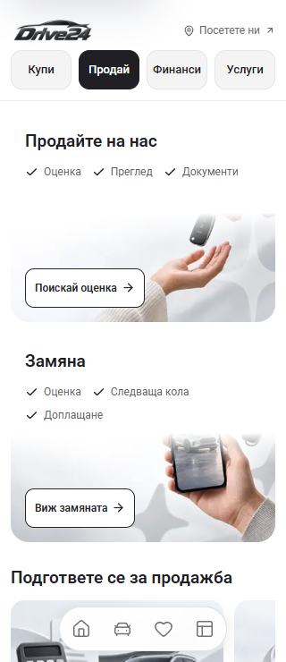
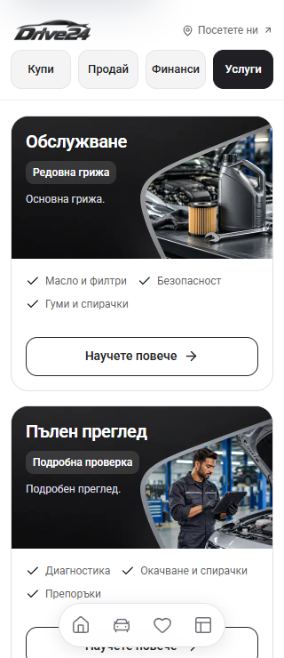
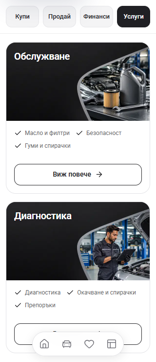
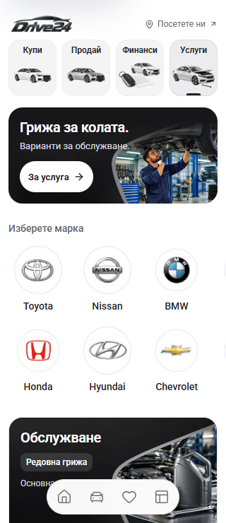
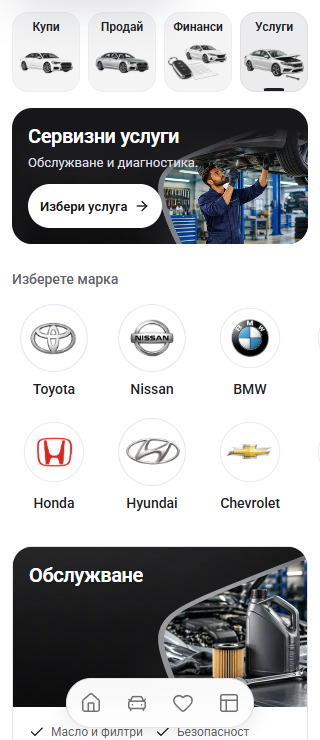
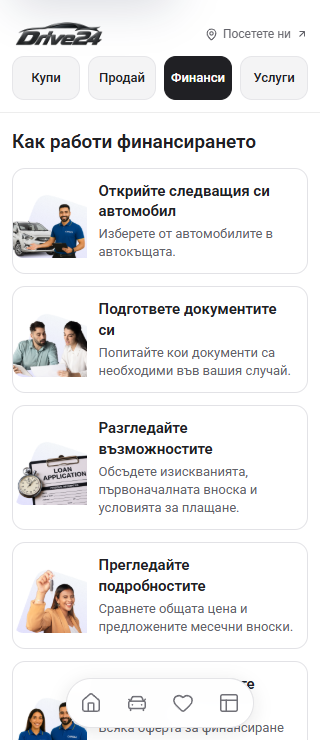
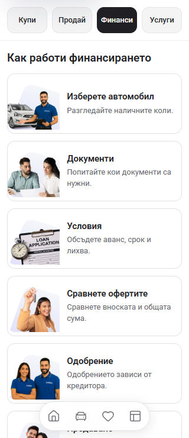

# Sell, Finance and Services mobile review — 2 October 2026

All four mobile landing pages now use the same service-tab header. Buy retains the dealer logo and verified contact actions in its dealer banner. Sell, Finance and Services no longer repeat the identity row above their tabs. The desktop dealer header remains in place.

## What changed

- Sell cards give text and checkmarks their own space above the complete photograph. The old gradient mask faded through the hands and phone; it has been removed. The original 3:2 artwork remains proportional, with a short action in the clear left side of the image.
- Service cards use the names **Обслужване** and **Диагностика**, concise checkmarks, and **Виж повече**. Repetitive labels such as “Редовна грижа / Основна грижа” are removed. The details sheet retains the full package description and checks.
- Sell, Service and Finance process cards use shorter headings and descriptions. Every normal-size heading fits on one line at 320px in both Bulgarian and English. Illustrations use their natural square proportions and are larger on narrow screens.
- Finance prompts use **Попитай ни**. Finance benefit artwork preserves its proportions rather than stretching people. The existing calculator and payment terms remain intact.
- Selling guide labels use **Оценка**, **Сервизна история** and **Снимки**, with their full descriptions available on activation.

## Before and after at 320px

These are original browser captures from the local App server at `http://127.0.0.1:6483`. Before captures were taken before this change. The reference Cars24 checkout and its assets were not edited.

| Area | Before | After |
| --- | --- | --- |
| Sell cards |  |  |
| Service cards |  |  |
| Services header |  |  |
| Finance process |  |  |

Additional comparisons: [Sell at 390px](sell-methods-390-after.png), [Services at 390px](service-packages-390-after.png), [Finance calculator at 320px](finance-budget-320-after.png), [Buy identity](buy-top-320-after.png).

Desktop captures: [Sell](bg-sell-desktop-after.png), [Finance](bg-finance-desktop-after.png), [Services](bg-service-desktop-after.png). The matching English captures are retained in this directory.

Enlarged text at 320px: [Sell](sell-text200-after-320.png), [Finance](finance-text200-after-320.png), [Services](service-text200-after-320.png). These double the rendered font sizes as a layout stress check; they are not a physical-device accessibility certification.

## Verification

- `npm run check` passed using Node 22.20.0: ESLint, TypeScript and the production build, generating 407 pages. The build used a separate output directory and did not change the six reviewed source files. See [build result](check-result.json).
- [Browser verification](verification.json) passed 21 layouts: Sell, Finance and Services in BG/EN at 320, 390 and 1440px, plus three Bulgarian layouts with doubled font sizes. No document overflow or clipped text was found. Checkmarks occupy at most two rows on normal-size mobile layouts.
- Visible images, including every process illustration after scrolling into view, completed loading with a nonzero natural width. Sell media sits below its text on mobile and retains the source image ratio. See [before image measurements](before-images.json) and [after image measurements](after-images.json).
- Six interaction groups passed: Buy identity and all four headers; calculator editing, seven terms, zero interest, bounds and keyboard controls; enquiry-sheet dismissal and focus return; both service details; selected-make navigation and Back; the shared calculator in the PDP payment sheet.
- No enquiries were sent. This records local browser and build results; deployment and owner visual acceptance remain separate.

Existing screenshots and unrelated work remain preserved. No dealer refresh or template release was performed.
