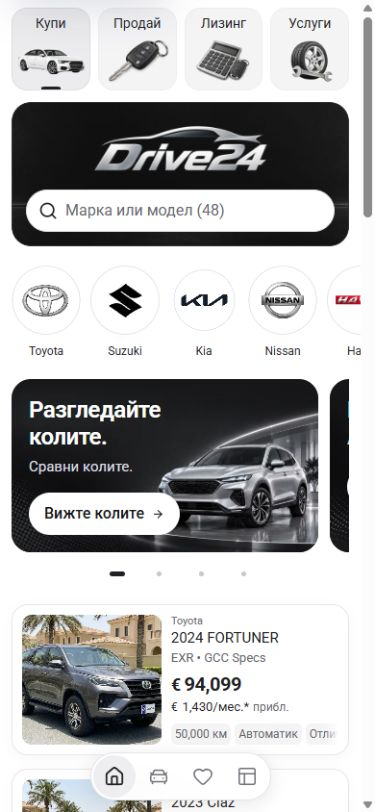
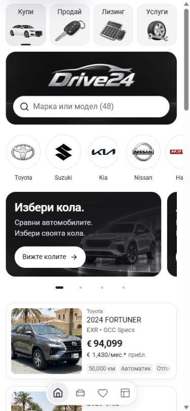

# Home promotional carousel

The four mobile promotions below the manufacturer strip now share one title line, two supporting-copy lines and a white action underneath. Previously the title width was restricted to 75% of the card, so Buy and Sell wrapped while the other promotions stayed on one line. The supporting sentences also had inconsistent line counts.

Short mobile titles now use the full inner width. Each locale supplies two concise copy lines; their translation keys use normalized whitespace while the translated values retain the line break. Mobile CTA labels use the configured locale font at regular 14px/20px, with a 16px arrow and the existing 44px target. The shared image fade keeps the expanded text readable over the retained artwork. Link destinations, pagination and desktop copy remain intact.

## Matched comparison

Both frames use Bulgarian, a 390 × 844 viewport, the first slide and top-of-page scroll position. The browser's 15px scrollbar leaves a 375px layout viewport.

| Before | After |
| --- | --- |
|  |  |

Final [finance](after/bg-slide-2-390.jpg), [Sell](after/bg-slide-3-390.jpg) and [visit](after/bg-slide-4-390.jpg) frames show the other slides. Matched 320px and 1440px frames and final English phone frames are also retained.

## Verification

All 18 focused browser checks passed; [exact checks](verification.json) and [final geometry](after/geometry.json) record the evidence.

- Every card has one actual title line and two actual copy lines in Bulgarian and English at 320px and 390px. Text ranges measure the line counts rather than inferring them from the reserved height.
- All four cards are 174px high. Their 44px actions share a 112px top offset and regular 14px/20px type. Text and actions fit inside each card without ellipsis, clipping or shrinking.
- Pagination selects Finance, Sell and Visit. All four card links reach their respective Cars, Finance, Sell and Stores routes through keyboard activation.
- The final phone layouts have no document overflow. At 768px every action remains inside its card. At 1440px all card geometry, text and typography match the captured desktop baseline exactly.
- No new browser runtime errors were recorded. Two normal development Fast Refresh reload warnings occurred during edits.

The final `npm run check` passed on Node 22.20.0: ESLint, TypeScript and the Next 16.3.6 production build, including all 407 generated pages. `NEXT_DIST_DIR=.next-build-check` kept the check separate from the running 6483 development output. Generated `next-env.d.ts` imports were restored to the original development paths afterwards.

## Source scope

Work began on Cars main at `4dda36907d127b28f0249505d5a79a109ebe9dd5`. Main subsequently advanced to the already-pushed Import theme commit `990f79fc52e1bfd8b4c10bbcc2331e5bc96c93e6`; the workspace doctor fetched and confirmed no ahead/behind drift before integration. The pre-existing shared Git index lock was preserved and later cleared. Scoped integration includes this carousel and the preceding mobile dealer-panel work, while retaining the unrelated filter-pill changes in the working tree.

These are local template results. Dealer deployment and owner visual acceptance remain separate.
