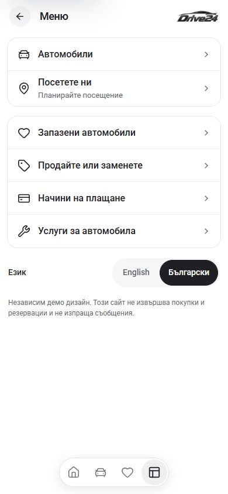
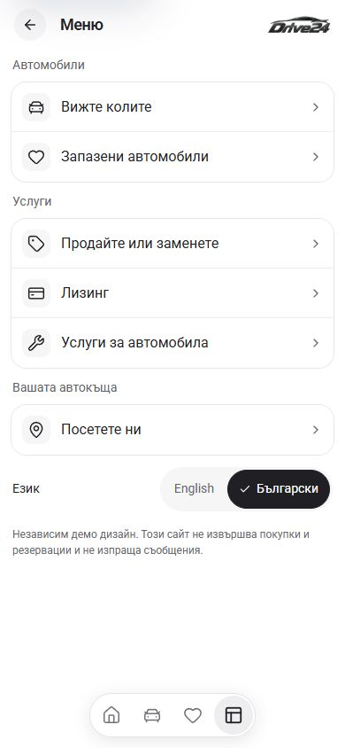

# Menu polish — 4 October 2026

**Latest correction:** The language selector is centered at the bottom of the menu, above the existing dock clearance. Its text is 13px, the visual rail is 36px and the selected pill is 32px, while the links retain 44px hit targets. The visible Language heading and independent-preview notice have been removed from this menu. The footer uses normal flow and a minimum viewport height so shorter screens and longer contact lists can scroll. See [footer source/build status](FOOTER.md). Browser verification of this latest change is pending; the screenshots below show the earlier passes.

The local App menu now groups cars and saved cars together, selling/finance/services together, and the showroom visit with any configured phone/email links. Quiet visible headings make the groups easier to scan. The finance link uses the same localized label as the service tab: Лизинг in Bulgarian.

Rows use the shared regular 16px text, 32px neutral icon tiles, at least 56px targets and a visible inset keyboard-focus outline. All menu options now use a single label, including the showroom visit; address and visit information remain on the destination page. The fixture's six rows measured 56px in the text-only pass. Groups have 12px spacing. The language selector retains its 44px targets and a decorative checkmark on the active language. The configured proportional dealer logo and localized destinations remain intact. Empty dealer contact configuration produces no invented phone or email links.

| Bulgarian, 390px viewport | |
| --- | --- |
| Before grouping | After the text-only pass, before the footer correction |
|  |  |

Additional retained views: [Bulgarian at 320px](after-bg-320.png), [English at 390px](after-en-390.png), [desktop before](before-bg-1440.png), [desktop after](after-bg-1440.png).

The initial grouping pass is retained in those additional views. The latest [text-only before](before-text-only-bg-390.png) and [text-only after](after-text-only-bg-390.png) show the showroom row changing from 66px to 56px while preserving the current icon size.

## Verification

- The initial grouping pass had 18 passing browser assertions; see [verification.json](verification.json).
- The subsequent text-only refinement passed nine focused checks; see [text-only-verification.json](text-only-verification.json). These confirm uniform 56px rows, single-line labels in BG/EN at 320px, 390px and desktop, the existing icon dimensions, keyboard focus, the visit destination and a clean console. `npm run check` passed again after this refinement, with all 407 generated pages.
- The optional `MenuItem.location` type field remains compatible with retained source snapshots; the current menu no longer renders a location subtitle.
- Bulgarian and English at 320px and 390px: no horizontal overflow, single-line row labels, language controls fit, correct locale fonts, loaded configured logo and 44px language targets.
- English at 820px, plus Bulgarian and English at 1440px: intact centered menu, readable labels and working language controls.
- Activated all six menu destinations: Cars, Saved, Sell, Finance, Services and showroom. Confirmed keyboard activation of Saved, the inset focus outline, return through the dock and switching locale in both directions.
- No console warnings or errors recorded during this pass.
- `npm run check` passed on Node 22.20.0: ESLint, TypeScript and production webpack build, including all 407 generated pages. Used `.next-build-check` to preserve the live 6483 preview; restored generated `next-env.d.ts` imports to the live dev types afterward.
- `git diff --check` passed for the changed menu source and documentation.

## Source and delivery boundary

Canonical source is `L:/CODEX/cars/templates/app` on Cars main, based on `6c92fdc2758d5d5b985a9c8a9004c7bb969d313a`. This pass changes `app/[locale]/more/page.tsx`, the menu configuration in `lib/showroom.ts` and the current contract in `TEMPLATE.md`. Earlier local Leasing, country-flag and spacing work remains preserved.

The original local check was blocked from committing by the pre-existing zero-byte Cars index lock, last written at 03:08:06 Sofia time on 4 October. The subsequent preview-publication request confirmed the unchanged lock was orphaned and preserved it with the previous index before recovering normal scoped commits; see [the footer record](FOOTER.md). Template release selection and dealer refreshes remain separate from publishing the standalone preview.
