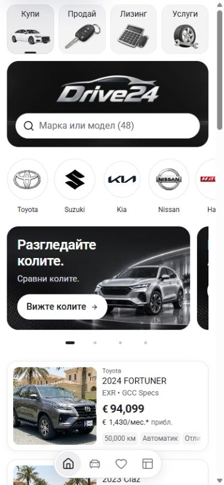
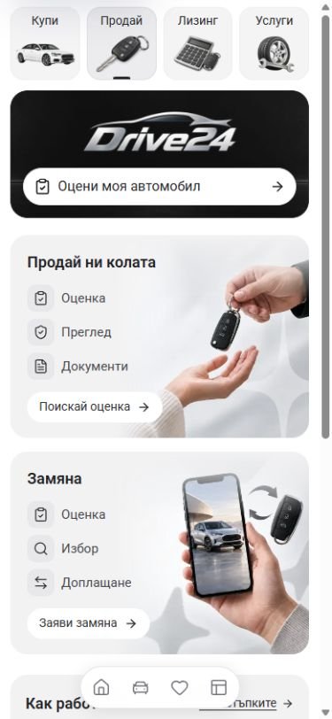
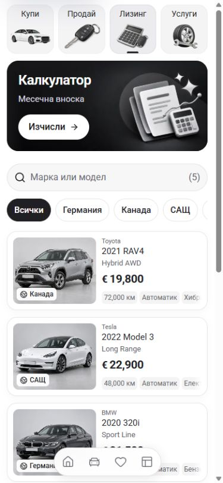
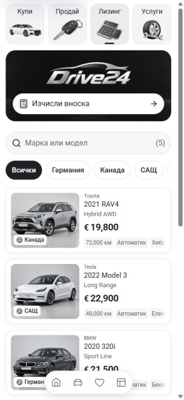
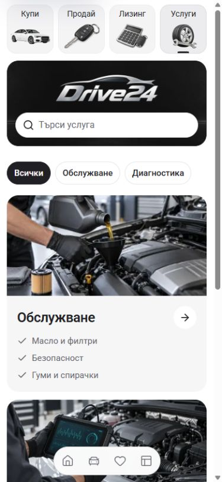

# Shared mobile dealer panel

Buy, Sell, Leasing and Services now share the centered Drive24 panel beneath the illustrated service tabs. Each panel has one white control that serves the selected page: stock search, car valuation, payment calculation or service search. Sell retains its grey illustrated cards and guidance; Services retains its photographic cards and category filters. Existing desktop layouts remain intact.

The shared component reads the original dark dealer logo through `DealerBrand`. No replacement identity, assets or business claims were introduced. Valuation and service actions still prepare enquiries; the finance calculator still shows illustrative estimates.

## Matched phone comparison

Screenshots use the same 390 × 844 viewport, top-of-page scroll position and Bulgarian locale. The browser has a 15px scrollbar, leaving a 375px content viewport.

| Page | Before | After |
| --- | --- | --- |
| Buy |  |  |
| Sell |  |  |
| Leasing |  |  |
| Services |  |  |

## Verification

`npm run check` passed with Node 22.20.0 and `NEXT_DIST_DIR=.next-build-check`, preserving the existing development output. ESLint, TypeScript and the 407-page production build completed successfully. The generated `next-env.d.ts` imports were returned to their existing development paths after the check.

All 34 focused browser checks passed. [Exact results and geometry](verification.json) record the following:

- All four pages at 320px and 390px in Bulgarian, plus all four English pages at 320px: 150px panel height, top at 106px, centered proportional 204 × 68 logo, 44px control, one accessible page heading and no document overflow.
- Keyboard activation of Buy search and the Sell/Leasing controls. Sale and exchange selection, Sell Escape/Back dismissal, calculator output update, and focus returning to the correct header control.
- The Sell drawer fits the 320px viewport. Existing process guidance still opens its three-step drawer, and scrolling retains the 52px compact service header.
- Services search matches translated service content. Query and category combine, persist in the URL and restore from a shared URL. Clear retains the category and input focus; empty reset restores both cards. Moving between phone and desktop search placements preserves query state and results.
- A service card opens the existing enquiry draft with its category prefilled.
- At 1440px, the previous banner, search and first-card geometry matches the [desktop baseline](before/geometry.json) on all four pages. Matched desktop screenshots and the 320px BG/EN screenshots are retained in the before/after directories.

The browser recorded no new runtime errors. One normal development Fast Refresh reload warning occurred during component edits. `layoutImagesLoaded` measurements include horizontally offscreen carousel images that may still be loading; `viewportArtworkLoaded` checks use images intersecting the visible viewport and passed on all final 390px captures.

## Source boundary

Work began on existing Cars main at `fac3f0889256aa443a9aba6a8d8c8811028e61e1`, reusing the running 6483 development server. Existing quick-filter pill changes in `FilterPill`, `ImportCountryPicker`, `ServiceCatalogue`, `TEMPLATE.md` and their evidence were preserved. A commit must stage the overlapping catalogue and template documentation only for this panel/search change, leaving the unrelated pill work separate. Screenshots and the build describe the local working state.

All four local routes return HTTP 200. The shared `L:/CODEX/cars/.git/index.lock` initially blocked staging, so the guard stopped without touching the index. The empty lock dated from 07:05:27 Sofia time on 3 October and was preserved. It later cleared during the Home carousel correction; the workspace doctor fetched and confirmed Cars main had no ahead/behind drift. Integration uses scoped index content for the overlapping catalogue and template documentation, preserving unrelated filter-pill work. See [the subsequent Home carousel receipt](../home-carousel-copy-2026-10-03/README.md).

This is local template implementation and verification. Template release selection, dealer deployment and owner visual acceptance remain separate.
